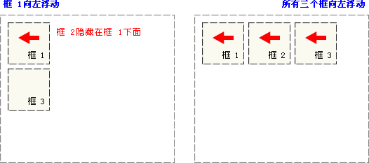

# CSS
**html：超文本标记语言     搭建网页**

**css:层叠样式表                 美化网页**

**使用方式： 行内样式，与style属性配合使用，优先级最高**

​                     **内嵌样式，一般在head中，用style标签包裹**

​                     **外联样式，写在单独文件中，用link标签引入**

​                   **内嵌和外联优先级取决于渲染的顺序**

**选择器的优先级从高到低：id选择器，class选择器，元素选择器**

**选择器： id选择器 class选择器 元素选择器  后代选择器  选择器分组 通用选择器**

**布局： div +css 布局     盒子模型**  **（内边距 padding 外边距 margin）**

**浮动 : float**  

**定位:**  **相对 ，绝对，固定**     **通过调整 top  left** 

## 一、CSS简介

### 1.1、是什么

> Cascading Style sheets,**层叠样式表**
>
> CSS可以用来为网页创建样式表，通过样式表可以对网页进行装饰。所谓层叠，可以将整个网页想象成一层一层的结构，层次高的将会覆盖层次低的，CSS可以分别为网页的各个层次设置样式。

### 1.2、能做什么

> 修饰美化html网页；
>
> 外部样式表可以提高代码复用性从而提高工作效率；
>
> html内容与样式表现分离，便于后期维护。

#### 1.2.1、为什么需要CSS

> HTML标签属性
>
> * 有些外观标签属性做不到，链接样式，行距等
> * HTML标签属性不能实现代码和设计的分离
> * 对于网站的整体风格设计会出现代码冗余
>
> CSS样式
>
> * 能实现HTML标签属性的所有功能  ，指的是外观
> * 能实现代码和设计的分离，方便团队开发
> * 适用于网站的整体风格设计

### 1.3、基础语法

> 不能独立使用，必须结合HTML使用
>
> CSS规则由两个主要的部分构成：**选择器**，以及一条或多条**声明**
>
> - 选择器通常是用来选择需要改变样式的HTML元素。
> - 每条声明由一个属性和一个值组成。

```css
/* 这是注释 */
选择器 {
      样式名称1: 样式值1;
      样式名称2: 样式值2;
}
```

> 注意事项：
>
> - 请使用**花括号**来包围声明
> - 多个声明之间使用分号";"分开
> - css对大小不敏感，如果涉及到与html文档一起使用时，class与id名称对大小写敏感

## 二、CSS使用方式

### 2.1、行内样式   style属性

> 把CSS样式嵌入到html标签当中，类似属性的用法

```html
 <p style="color:blue; font-size:50px">This is my HTML page. </p>
```

### 2.2、内嵌样式    **style**标签

> 在head标签中使用**style标签**引入CSS   

```html
<style type=“text/css”> //告诉浏览器使用css解析器去解析
	p {
		color:red;
		font-size:50px;
	}
</style>
```

### 2.3、外联样式  **link** 标签

> 将内嵌样式单独放到一个XXX.css文件中，HTML页面通过`**<link>**`标签将.css文件引入到当前页面中
>
> link格式：
> ```html
> <link href="xxx.css文件路径" rel="stylesheet" type="text/css"/>
>```
> 用法同内嵌样式

```css
/* css文件 */
p {
	color: blue;
}

#p2 {
	color: yellow;
}
```

> html页面如下

```html
<!DOCTYPE html>
<html>
	<head>
		<meta charset="UTF-8">
		<title>外联样式</title>
        <!-- 
			rel:代表当前页面与href所指定文档的关系
            type:文件类型，告诉浏览器使用css解析器去解析
            href:css文件地址
		-->
		<link rel="stylesheet" type="text/css" href="../css/test.css" />
	</head>
	<body>
		<p>外联样式演示1</p>
		<p id="p2">外联样式演示2</p>
	</body>
</html>


```


## 三、CSS选择器  重点

### 3.1、id选择器   重点

> id选择器： 给需要修改样式的html元素添加id属性标识，在head中使用style标签引入在其中声明id选择器
>
> 格式：`#id值{属性:属性值}`  **#选择**

```html
<style type="text/css">
    #s1 {color: red;font-size: 100px}
    #s2 {color: green;font-size: 100px}
    #s3 {color: blue;font-size: 100px}
</style>

<div id="s1">hello,everyone!</div>
<div id="s2">hello,everyone!</div>
<div id="s3">hello,everyone!</div>
```

> 每一个html标签都有一个id属性，按照规范一个id只能对应一个标签。

### 3.2、class选择器 重点

> class选择器：给需要修改样式的html元素添加class属性标识，在head中使用style标签引入在其中声明class选择器
>
> 格式：.class名{属性:属性值}

```html
<style type="text/css">
    .s1 {color: purple;font-size: 100px}
    .s2 {color: pink;font-size: 100px}
    .s3 {color: yellow;font-size: 100px}
</style>

<div class="s1">hello,everyone!</div>
<div class="s1">hello,everyone!</div>
<div class="s2">hello,everyone!</div>
<div class="s3">hello,everyone!</div>
```

> 每一个html标签都有一个class属性，同一类的标签设置成相同的class。

### 3.3、元素选择器  重点

> 元素选择器：在head中使用style标签引入在其中声明元素选择器
>
> 格式：html标签{属性:属性值}

```html
<style type="text/css">
    p {color: red; border: 1px solid blue;}
</style> 

<p>11111111111</p>
<p>22222222222</p>
```

> **以上选择器的优先级从高到低：id选择器，class选择器，元素选择器**

### 3.4、属性选择器    

> 根据元素的属性及属性值来选择元素。在head中使用style标签引入在其中声明
>
> 格式为：
>
> * `htm标签[属性='属性值']{css属性:css属性值;}`
>
>  - `html标签[属性]{css属性:css属性值;}`

```html
<style type="text/css">
    input[type='text'] {
        background-color: pink;
    }
    input[type='password'] {
        background-color: yellow;
    }
    font[size] {
        color: green
    }
    a[href] {
        color: blue;
    }
</style>
<a href="a.html">超链接</a>
<form name="login" action="#" method="get">   
    <font size="3">用户名：</font>
    <input type="text" name="username" value="zhangsan"><br>
    <font size="3">密码：</font>
    <input type="password" name="password" value="123456"><br/>
    <input type="submit" value="登录">
</form>
```

### 3.5、伪类选择器

> 主要是针对a标签
>
> 语法：
>
> - 静止状态 a:link{css属性}
> - 悬浮状态 a:hover{css属性}
> - 触发状态 a:active{css属性}
> - 完成状态  a:visited{css属性}

```html
<style>
    a {
        text-decoration: none;/*删除超链接的下划线*/
    }
    /* 原始状态 */
    a:link {
        color: yellow;
    }
    /* 点击之后的状态 */
    a:visited {
        color: red;
    }
    /* 鼠标悬停上去的状态 */
    a:hover {
        color: blue;
        border: 1px solid black;
    }
    /* 点击的状态 */
    a:active {
        color: black;
    }
</style>

<a href="https://www.sina.com.cn/">新浪</a>
```

> `a:hover` 必须在 CSS 定义中的 `a:link` 和 `a:visited` 之后，才能生效。`a:active` 必须在 CSS 定义中的 `a:hover` 之后才能生效。

### 3.6 、后代选择器   重点

>  一个标签包含着另一个标签

```html
<style>
    .pclass a {
        text-decoration: none;
        color: chocolate;
    }
</style>


<p class="pclass">
    <a href="https://www.sina.com.cn">新浪</a>
</p>
<a href="https://www.baidu.com">百度</a>
```

### 3.7、选择器分组  重点

> 可以将不同选择器放在同一组，统一设置样式

```html
<style>
    #p1, a {
        color: red;
    }
</style>

<p id="p1">这是一个段落</p>
<a href="">这是一个超链接</a>
```

### 3.8、通用选择器  重点

> 选择页面上的所有的 HTML 元素          

```html
<style>
   	* {
        color: red;
    }
</style>
```

## 四、CSS属性

### 4.1、字体属性   重点

> 用于设置字体的属性，常见属性如下：
>
> * **font-size：设置文本的大小**
> * **font-family：设置字体，宋体，楷体...**
> * **font-style：指定斜体文本**
> * **font-weight：字体粗细，100~900数值、normal、bold、bolder**

```html
<style>
    #p1 {
        font-size: 30px; /* 设置文本的大小 */
        font-family: "Courier New"; /* 设置字体 宋体 楷体 */
        font-style: italic; /* 用于指定斜体文本,  normal - 文字正常显示 italic - 文本以斜体显示 */
        font-weight: 100; /* 指定字体的粗细 normal bold  */
    }
</style>

<p id="p1">hello world</p>
```

> 为了缩短代码，也可以在一个属性中指定所有单个字体属性。
>
> font 属性是以下属性的简写属性：
>
> - font-style     
> - font-variant   
> - font-weight  
> - font-size  
> - font-family   
>
> **font-size** 和 **font-family** 的值是必需的。如果缺少其他值之一，则会使用其默认值。

```html
<style>
    #p2 {
        font: italic bold 20px "Consolas";
    }
</style>

<p id="p2">hello world</p>
```

### 4.2、文本属性

> 用于对文本进行设置，常见属性如下：
> ```css
> color：设置文本颜色，十六进制、表示颜色的英文单词；**  **重点**
> text-indent：缩进元素中文本的首行，5px缩进5像素、20%缩进父容器宽度的百分之二十；
> text-decoration：文本的装饰线
> none：没有下划线
> underline：下划线
> overline：在句子上划线符号
> line-through：删除线
> text-align：文本水平对齐方式
> left：左对齐
> right：右对齐
> center：居中
> ord-spacing：单词之间的间隔
> line-height：设置文本的行高     
> line-height和height 高度一致即可垂直居中
> text-shadow：设置阴影及模糊效果，四个取值依次是： 水平偏移、垂直偏移、模糊值、阴影颜色
>  ```
>  
```html
<style>
    #p1 {
        color: blue;
        text-decoration: underline;
        text-align: center;
        text-shadow: 20px 2px 2px red;
    }
</style>

<p id="p1">这是一个段落</p>
```

### 4.3、背景属性

> 用于对背景进行设置，常见属性如下：
>
> * **background-color**：设置背景色，十六进制、表示颜色的英文单词； **重点**
> * **background-image**：设置背景图片，url('图片路径')；   **重点**
> * **background-repeat：**设置背景图的平铺方向，repeat-y、repeat-x、repeat、**no-repeat；**  **重点**
> * **background-attachment:fixed;**  **重点**
> * background-size：规定背景图像的尺寸；
> * background-position：改变图像在背景中的位置，top、bottom、left、right、center。

```html
<style>
    body {
        background-color: red;
        background-image: url("./img/pic1.jpg");
        background-repeat: no-repeat;
        background-size: 100px 100px;
        background-attachment:fixed;   // scroll
        background-position: bottom center;
    }
</style>
```

### 4.4、列表属性

> 用于对列表进行设置，常见属性如下：
>
> * list-style-type：改变列表的标识类型，none、disc（默认值）、circle、square、decimal（数字）、lower-latin（小写字母）；
> * **list-style-image：用图像表示标识，url("图片地址")；** **重点**
> * list-style-position：标识出现在列表项内容之外还是内部，  inside、outside

```html
<style>
    #ul1 {
        list-style-type: lower-latin;
    }

    #ul2 {
        list-style-image: url("img/eg_arrow.gif");
    }

    #ul3 {
        list-style-position: inside;
    }

    #ul4 {
        list-style-position: outside;
    }
</style>

<ul id="ul1">
    <li>JavaSE</li>
    <li>JavaWeb</li>
    <li>SSM</li>
</ul>

<ul id="ul2">
    <li>JavaSE</li>
    <li>JavaWeb</li>
    <li>SSM</li>
</ul>

<ul id="ul3">
    <li>JavaSE</li>
    <li>JavaWeb</li>
    <li>SSM</li>
</ul>
<ul id="ul4">
    <li>JavaSE</li>
    <li>JavaWeb</li>
    <li>SSM</li>
</ul>
```

## 五、DIV+CSS布局   重点

### 5.1、HTML中元素的分类

> HTML中根据元素显示状态分为**块级（block）元素**和**内联（inline）元素**。
>
> * 块级（block）元素：块状元素独占一行，默认宽度为容器的100%
>   * p
>   * h1~h6
>   * table 
>   * **div（没有任何含义，可以将其当成一个盒子，用来包裹其他元素）** **重点**
> * 内联（inline）元素：内联元素共处一行
>   * a       超链接
>   * img    图片
>   * input    
>   * select     下拉列表
>   * **span（没有任何含义，可以将其当成一个盒子，用来包裹其他元素）** **重点**
>
> CSS中存在**display属性**，可以改变元素显示状态，display属性如下： **重点**
>
> * **block：按块显示**
> * **inline：同行显示**
> * **none：隐藏**              

```html
<style>
    #p1 {
        border: 1px solid blue;
        /* 将段落设置为内联元素 */
        display: inline;
    }

    #p2 {
        border: 1px solid red;
        /* 将段落设置为内联元素 */
        display: inline;
    }

    #a1 {
        border: 1px solid yellowgreen;
        /* 将超链接设置为块级元素 */
        display: block;
    }

    #a2 {
        border: 1px solid brown;
        /* 将超链接设置为块级元素 */
        display: block;
    }

    #p3 {
        /* 隐藏p3 */
        display: none;
    }
</style>

<body>
    <p id="p1">Java是最好的语言</p>
    <p id="p2">Java No.1</p>
    <a id="a1" href="https://www.baidu.com">百度</a>
    <a id="a2" href="https://www.sina.com.cn">新浪</a>
    <p id="p3">隐藏</p>
</body>
```

### 5.2、盒模型

#### 5.2.1、盒模型简介

   盒子模型

> 所有 HTML 元素都可以视为方框。在 CSS 中，在谈论设计和布局时，会使用术语“盒模型”或“框模型”。
>
> CSS 框模型实质上是一个包围每个 HTML 元素的框。它包括：外边距、边框、内边距以及实际的内容。下图展示了框模型： padding: 1px 2px 3px 4px 


> 对不同部分的说明：
>
> - **内容** - 框的内容，其中显示文本和图像；
> - **内边距（padding）** - 清除内容周围的区域。内边距是透明的；
> - **边框（border）** - 围绕内边距和内容的边框；
> - **外边距（margin）** - 清除边界外的区域。外边距是透明的；
> - **宽度（width）** - 内容区域的宽度；
> - **高度（height）** - 内容区域的高度
>
> 元素框的最内部分是实际的内容，直接包围内容的是内边距。
>
> 内边距呈现了元素的背景。内边距的边缘是边框。**背景应用于由内容和内边距、边框组成的区域。**
>
> 边框以外是外边距，外边距默认是透明的，因此不会遮挡其后的任何元素。
>
> 增加内边距、边框和外边距不会影响内容区域的尺寸，但是会增加元素框的总尺寸。
>
> 使用 CSS 设置元素的 width 和 height 属性时，只需设置内容区域的宽度和高度。要计算元素的完整大小，还必须把内边距、边框和外边距加起来。

#### 5.2.2、与盒模型相关的CSS属性

##### 5.2.2.1、宽度和高度

> width：设置内容的宽度
>
> height：设置内容的高度

##### 5.2.2.2、边框

> border：设置元素的边框
>
> 语法：`border: 宽度 样式 颜色`    **border: 1px solid red** **重点**
>
> 边框样式：
>
> * none 无边框
> * dotted 点状边框  .......
> * dashed 虚线边框 -------
> * solid 实线边框
>
> border-radius：创建圆角
>
> 语法：`border-radius: 圆角半径`

##### 5.2.2.3、**内边距**  重点

> padding：内容与边框之间的距离，其规则如下：
>
>  padding: 
>
> * 如果提供全部四个参数值，将按上、右、下、左的顺序作用于四边；
> * 如果只提供一个，将用于全部的四边；
> * 如果提供两个，第一个用于上、下，第二个用于左、右； 
> * 如果提供三个，第一个用于上，第二个用于左、右，第三个用于下。
>
> 除此之外，还有另外四个属性设置内边距：
>
> * **padding-top：设置元素的上内边距；重点**
> * padding-right：设置元素的右内边距；
> * padding-bottom：设置元素的下内边距；
> * **padding-left：设置元素的左内边距。重点**

##### 5.2.2.4、外边距  重点

> margin：边框与其他元素之间的距离，围绕在元素周围的空白区域，其规则如下：
>
> * 如果提供全部四个参数值，将按上、右、下、左的顺序作用于四边；
> * 如果只提供一个，将用于全部的四边；
> * 如果提供两个，第一个用于上、下，第二个用于左、右；
> * 如果提供三个，第一个用于上，第二个用于左、右，第三个用于下。
>
> 除此之外，还有另外四个属性设置外边距：
>
> * **margin-top：设置元素的上外边距；重点**
> * margin-right：设置元素的右外边距；
> * margin-bottom：设置元素的下外边距；
> * **margin-left：设置元素的左外边距。重点** 

##### 5.2.2.5、案例

```html
<style>
    * {
        margin: 0px;
        padding: 0px;
    }

    #div1 {
        border: 1px solid blue;
        height: 50px;
        width: 200px;
        background-color: red;
        margin: 20px 20px;      
        padding: 20px 20px;
        border-radius: 5px;
    }
</style>

<body>
    <div id="div1">hello world</div>
</body>
```

### 5.3、浮动属性float  重点

> 普通流定位：页面元素按照HTML元素默认的盒子模型，自上而下（block元素）或从左到右（inline元素）的排列次序。
>
> 浮动：浮动的框可以向左或向右移动，**直到它的外边缘碰到包含框或另一个浮动框的边框为止。**由于浮动框不在文档的普通流中，所以文档的普通流中的块框表现得就像浮动框不存在一样。
>
> 如下图所示，当把框 1 向右浮动时，它脱离文档流并且向右移动，直到它的右边缘碰到包含框的右边缘


> 如下图所示，当框 1 向左浮动时，它脱离文档流并且向左移动，直到它的左边缘碰到包含框的左边缘。因为它不再处于文档流中，所以它不占据空间，实际上覆盖住了框 2，使框 2 从视图中消失。
>
> 如果把所有三个框都向左移动，那么框 1 向左浮动直到碰到包含框，另外两个框向左浮动直到碰到前一个浮动框。



> 如下图所示，如果包含框太窄，无法容纳水平排列的三个浮动元素，那么其它浮动块向下移动，直到有足够的空间。如果浮动元素的高度不同，那么当它们向下移动时可能被其它浮动元素“卡住”。


```html
<style>
    .dd{width:100px; height:100px;}
    .d1{ background-color: #f00;height:120px; float: left;}
    .d2{ background-color: #0f0; float: left;}
    .d3{ background-color: #00f; float: left;}
</style>
<body>
    <div style=" width:299px;">
        <div class="dd d1"></div>
        <div class="dd d2"></div>
        <div class="dd d3"></div>	
    </div>
</body>
```

### 5.4、定位属性 重点  position （relative，absolute，fixed）

> **1不论是相对、绝对、固定，通过调整left top   以及 right bottom属性的取值，调整标签的位置**
>
> **2固定和绝对定位，固定定位是不会随着滚动条滚动，绝对定位会滚动**
>
> 相对定位(relative)：元素框偏移某个距离，元素仍保持其未定位前的形状，它原本所占的空间仍保留。、
>
> **left 和 top**  **重点 **  
>
> 

```html
<style type="text/css">
    h2.pos_left {
        position: relative;        //相对  
        left: -20px
        
    }
    h2.pos_right {
        position: relative;
        left: 20px
    }
</style>

<body>
    <h2>这是位于正常位置的标题</h2>
	<h2 class="pos_left">这个标题相对于其正常位置向左移动</h2>
	<h2 class="pos_right">这个标题相对于其正常位置向右移动</h2>
	<p>相对定位会按照元素的原始位置对该元素进行移动。</p>
	<p>样式 "left:-20px" 从元素的原始左侧位置减去 20 像素。</p>
	<p>样式 "left:20px" 向元素的原始左侧位置增加 20 像素。</p>
</body>
```

> 绝对定位(absolute)：元素框从文档流完全删除，并相对于其包含块进行定位。包含块可能是文档中的另一个元素或者是初始包含块。元素原先在正常文档流中所占的空间会关闭，就好像元素原来不存在一样。元素定位后生成一个块级框。

```html
<style type="text/css">
    h2.pos_abs {
        position: absolute;
        left: 100px;
        top: 150px
    }
</style>

<body>
    <h2 class="pos_abs">这是带有绝对定位的标题</h2>
    <p>通过绝对定位，元素可以放置到页面上的任何位置。下面的标题距离页面左侧 100px，距离页面顶部 150px。</p>
</body>
```

> 固定定位(fixed)：元素框的表现类似于将 position 设置为 absolute，不过其包含块是视窗本身。

```html
 <style>       
    #left {
        width: 200px;
        height: 200px;
        background-color: red;
        position: fixed;
        left: 0px;
        bottom: 0px;
     }
     #right {
         width: 200px;
         height: 200px;
         background-color: green;
         position: fixed;
         right: 0px;
         bottom: 0px;
     }
     #middle{
         width: 200px;
         height: 200px;
         background-color: blue;
         position: fixed;
         left: 50%;
         bottom: 50%;
     }
</style>

<body>
	<div id="left">左下</div>
    <div id="right">右下</div>
    <div id="middle">中间</div>
</body>
```

### 5.5、注册案例

```html
<!DOCTYPE html>
<html lang="en">
<head>
    <meta charset="UTF-8">
    <title>注册</title>
    <style>
        * {
            margin: 0px;
            padding: 0px;
            box-sizing: border-box;
        }

        body {
            background-image: url("./img/bg.jpeg");
            background-repeat: no-repeat;
            background-attachment:fixed;
            background-position: top center;
            padding-top: 25px;
        }

        .rg_layout {
            width: 900px;
            height: 500px;
            border: 6px solid darkgray;
            margin: auto;
            background-color: honeydew;
        }

        .rg_left {
            margin: 20px;
            /*border: 1px solid black;*/
            float: left;
        }

        .rg_left p:first-child {
            font-size: 20px;
            color: yellowgreen;
        }

        .rg_left p:last-child {
            font-size: 20px;
            color: lightslategray;
        }

        .rg_center {
            /*border: 1px solid black;*/
            float: left;
        }

        .rg_right {
            margin: 20px;
            /*border: 1px solid black;*/
            float: right;
        }

        .rg_right p a {
            color: lightslategray;
        }

        .td_left {
            width: 100px;
            text-align: right;
            height: 45px;
        }

        .td_right {
            padding-left: 50px;
        }

        #username, #password, #email, #name, #birthday, #tel, #code {
            width: 251px;
            height: 32px;
            border: 1px solid darkgray;
            border-radius: 5px;
            padding-left: 10px;
        }

        #code {
            width: 150px;
        }

        #img_code {
            height: 32px;
            vertical-align: middle;
        }

        #reg_btn {
            width: 150px;
            height: 40px;
            background-color: #0000FF;
        }
    </style>
</head>
<body>
    <div class="rg_layout">
        <div class="rg_left">
            <p>新用户注册</p>
            <p>USER REGISTER</p>
        </div>
        <div class="rg_center">
            <div class="rg_form">
                <form action="#" method="post">
                    <table>
                        <tr>
                            <td class="td_left"><label for="username">用户名</label></td>
                            <td class="td_right"><input type="text" name="username" id="username" placeholder="请输入用户名"></td>
                        </tr>
                        <tr>
                            <td class="td_left"><label for="password">密码</label></td>
                            <td class="td_right"><input type="password" name="password" id="password"></td>
                        </tr>
                        <tr>
                            <td class="td_left"><label for="email">电子邮箱</label></td>
                            <td class="td_right"><input type="email" name="email" id="email"></td>
                        </tr>
                        <tr>
                            <td class="td_left"><label for="name">姓名</label></td>
                            <td class="td_right"><input type="text" name="name" id="name"></td>
                        </tr>
                        <tr>
                            <td class="td_left"><label for="tel">手机号</label></td>
                            <td class="td_right"><input type="text" name="tel" id="tel"></td>
                        </tr>
                        <tr>
                            <td class="td_left"><label>性别</label></td>
                            <td class="td_right">
                                <input type="radio" name="gender">男
                                <input type="radio" name="gender">女
                            </td>
                        </tr>
                        <tr>
                            <td class="td_left"><label for="birthday">出生年月</label></td>
                            <td class="td_right"><input type="date" name="birthday" id="birthday"></td>
                        </tr>
                        <tr>
                            <td class="td_left"><label for="code">验证码</label></td>
                            <td class="td_right"><input type="text" name="code" id="code"></td>
                        </tr>
                        <tr>
                            <td align="center" colspan="2"><button id="reg_btn" type="submit">注册</button></td>
                        </tr>
                    </table>
                </form>
            </div>
        </div>
        <div class="rg_right">
            <p>已有帐号?<a href="#">立即注册</a></p>
        </div>
    </div>
</body>
</html>
```

​      补充案例：


