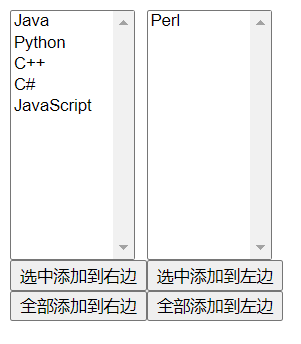
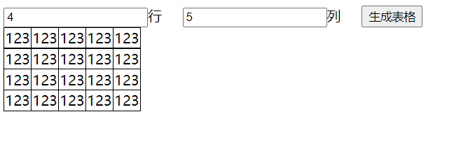

# JavaScript
**html： 构建网页**

**css： 美化网页**

**js: 添加动态效果**

* **parseInt 重点**

* **parseFloat   重点**

* **==	“值”  **    

  **=== 值和类型  重点**  

  **数组 ，求长度.length**

  * **concat()数组合并，返回一个新的数组**
  * **reverse()数组逆序**
  * **push()数组末尾添加新元素**    
  * **unshift()数组头部添加新元素** 
  * **pop()删除数组最后的元素**
  * **shift()删除数组第一个元素**

**获取html元素**

**getElememtById('元素ID值');**   

**getElementsByClassName("类名");  **

**getElementsByName('元素name值');  **

**getElementsByTagName('标签名称');  **

普通内容操作innerText 和innerHTML

表单内容操作   value

属性操作  setAttribute()和getAttribute()    用setAttribute（）改变class间接改变css样式

操作css   display :none 或 block 或 inline

事件驱动      **onclick:鼠标单击事件**  
​				 	**onfocus:获得焦点事件**
​				 	**onblur:失去焦点事件**
​		 		 	**onload:文档加载完成事件**

​                      **onchange:单选或多选按钮中常用事件** 

**单选或多选如果被选中 checked 等于true**

**下拉选择框某一项被选中 selected 等于true**

**表单校验： onsubmit    onfocus   onblur**

**正则：      [0-9]   [0-9a-zA-Z]  [\w]**         **{6} {6,} {6,10}**        /^   $/

​          **reg.test(str)**

 **location.href 当前页面的访问地址**

 **location.href="http://www.baidu.com" //页面跳转的方式！**      

**setTimeout（f(),5000）5秒后执行一次**

**setInterval(f(),5000) 每隔5秒执行一次**    

## 一、概述

### 1.1、JavaScript简介

> JavaScript一种**解释性脚本语言**，是一种动态类型、**弱类型**、基于原型继承的语言，内置支持类型。
>
> 它的解释器被称为JavaScript引擎，作为浏览器的一部分，广泛用于客户端的脚本语言，用来给HTML网页增加动态功能。
>
> 脚本语言是为了缩短传统的编写-编译-链接-运行（edit-compile-link-run）过程而创建的计算机编程语言。
>
> 一个脚本通常是解释执行而非编译。
>
> 

### 1.2、JavaScript组成部分

> ECMAScript：也叫解释器，充当翻译角色，这是JavaScript的核心部分； 6.0
>
> DOM：文档对象模型（Document Object Model），DOM赋予了JavaScript操作 HTML 的能力，即Document操作；
>
> BOM：浏览器对象模型（Browser Object Model），BOM赋予了JavaScript操作浏览器的能力，即Window操作。

### 1.3、为什么要学习JavaScript

> HTML定义了网页的内容，CSS描述了网页的布局，JavaScript为网页的添加行为，让网页具有“动”的效果，能够增加网页的功能，提升用户体验，Web开发人员必须学习的3门前端语言中的一门。

### 1.4、学习的目的

> **用于创建具有交互性较强的页面**
>
> **动态更改内容**
>
> **数据验证**

### 1.5、JavaScript与Java的关系

> 雷锋和雷峰塔的关系。

## 二、使用位置及运行说明

```javascript
console.log("在console打印。。。。");
```

### 2.1、使用位置

```html
<head>
    <script>
        JavaScript代码
    </script>
</head>


<!DOCTYPE html>
<html>
	<head>
		<meta charset="UTF-8">
		<title>JS在Head中使用</title>
		<script>
			//JavaScript在Head中运行
			//弹框
			alert("hello world");
			//在浏览器的控制台打印信息  打开控制台的快捷键 F12
			console.log("在console打印。。。。");   重点
		</script>
	</head>
	<body>
	</body>
</html>
```

> body中

```html
<body>
    <script>
        JavaScript代码
    </script>
</body>


<!DOCTYPE html>
<html>
	<head>
		<meta charset="UTF-8">
		<title>JS在body中使用</title>
	</head>
	<body>
		<script>
			alert("hello world");
		</script>
	</body>
</html>
```
```html
JavaScript文件中

将JavaScript代码单独放到一个xxx.js文件中     
类似于js的外联样式

HTML文件引用
```
```javascript
/*弹出helloworld*/
alert("hello world");
```

```html
<head>
    <script src="js路径"></script>
</head>


<!DOCTYPE html>
<html>
	<head>
		<meta charset="UTF-8">
		<title>在外部JS文件中使用</title>
		<script type="text/javascript" src="../js/test.js" >
			/*如果引入了外部JS文件，引入文件的script标签内部的代码不起作用。
			 *如果需要运行其他的JS代码，重新写一组script标签
			 */
		</script>
		<script>
			alert("*****");
		</script>
	</head>
	<body>
	</body>
</html>
```

> **嵌入HTML标签的事件中    **      类似于css中的行内样式

```html
<!DOCTYPE html>
<html>
	<head>
		<meta charset="UTF-8">
		<title>结合事件使用</title>
	</head>
	<body>
		<!--
		 	button按钮
		 	onclick：鼠标单击事件
		-->	 
		<input type="button" onclick="alert('hello wolrd');" />
	</body>
</html>
```

### 2.2、如何运行

> 1. 自动执行型
> 2. 事件驱动型：通过HTML元素事件触发执行，如按钮的onclick事件

## 三、JavaScript基础语法  重点 

### 3.1、变量

> 在JavaScript中，任何变量都用var关键字来声明，var是variable的缩写。
>
> var是声明关键字，a是变量名，语句以分号结尾。
>
> 这里值得注意的是，JavaScript中的关键字，不可以作为变量名。就像在Java中你不可以写`int int=1;`一样。

```javascript
var a;  对比java  int a
```

> JavaScript的部分关键字

```
abstract、else、instanceof、super、boolean、enum、int、switch、break、export、interface、synchronized、byte、extends、let、this、case、false、long、throw、catch、final、native、throws、char、finally、new、transient、class、float、null、true、const、for、package、try、continue、function、private、typeof、debugger、goto、protected、var、default、if、public、void、delete、implements、return、volatile、do、import、short、while、double、in、static、with
```
```
变量的有number、string、boolean、undefined（未定义）、null（空值）、object六种**
函数的话是function
在JavaScript中，当一个变量未被初始化的时候，它的值为undefined
判断是哪种数据类型：
typeof运算符 对比java  instanceof
```

```html
<!DOCTYPE html>
<html>
	<head>
		<meta charset="UTF-8">
		<title>变量</title>
		<script>
			/*
			 	1.Java定义变量
			 		数据类型 变量名 = 初始值;
			 	2.JavaScript的数据类型
			 		string 字符串
			 		number 数字
			 		boolean 布尔 true false
			 		object 对象
			 		null 空值
			 		undefined 未定义
			 	3.JavaScrpit变量定义(弱类型的编程语言)
			 		1)var 变量名 = 初始值;
			 		2)var 变量名;
			 	4.typeof 确认变量是什么类型
			 	5.变量命名规则
			 		1)字母、数字、_、$
			 		2)不能以数字开头
			 		3)区分大小写
			 * */
			//定义字符串类型变量 string
			var name = "张三";
			console.log(typeof name);
			//定义数字类型变量 number
			var age = 10;
			console.log(typeof age);
			var a;
			console.log(a);
			
		</script>
	</head>
	<body>
	</body>
</html>
```

### 3.2、运算符   

> 算数运算

| 名称   | 运算符 |
| ------ | ------ |
| 加     | +      |
| 减     | -      |
| 乘     | *      |
| 除     | /      |
| 求余   | %      |
| 赋值   | =      |
| 加等   | +=     |
| 减等   | -=     |
| 除等   | /=     |
| 乘等   | *=     |
| 求余等 | %=     |
| 自增   | ++     |
| 自减   | --     |

> 逻辑运算

| 名称 | 运算符 | 描述                                                         |
| :--: | :----: | ------------------------------------------------------------ |
|  与  |   &&   | 要求表达式左右两边的表达式同为true，整体结果才为true         |
|  或  |  \|\|  | 要求表达式左右两边的表达式只要有一个为true，整体结果就为true |
|  非  |   ！   | 将布尔值取反操作                                             |

> 关系运算

|     名称     | 运算符 |
| :----------: | :----: |
|     等于     |   ==   |
|     小于     |   <    |
|  小于或等于  |   <=   |
|     大于     |   >    |
|  大于或等于  |   >=   |
|    不等于    |   !=   |
| 值和类型相同 |  ===   |


```
==	“值”     java中String eaquls()
=== 值和类型  重点   Java中的对象==

三目运算符： ?:
数据类型转换，从网页获取的数据都是字符串，如果进行运算需要转换成相应的number类型。
parseInt 
parseFloat
```
```html
<!DOCTYPE html>
<html>
	<head>
		<meta charset="UTF-8">
		<title>运算符</title>
		<script>
			/*
			 * 几乎和Java一致
			 * ==	“值”
			 * ===	“值”和“类型”
			 */
			var a = 10;   --  number
			var b = "10";  -- string
			console.log(a == b);
			console.log(a === b);
			/*
			 	+ 
			 		1)加法运算
			 		2)如果和字符串进行+运算，就变成了字符串拼接
			 	string---->number
			 		1)parseInt()
			 		2)parseFloat()
			 * */
			var m = 100;
			console.log(a + m);
			console.log(a + b);
			//string---->number
			console.log(a + parseInt(b));
			console.log(a + parseFloat("10.5"));
		</script>
	</head>
	<body>
	</body>
</html>
```

### 3.3、控制流程

#### 3.3.1、分支结构

> if-else分支    **document.write("相等");** **重点**

```javascript
var a=1;
var b=1;
if(a==b){
    document.write("相等"); 
}else{
    document.write("不相等");
}
//很明显，运行结果是相等
//这就是if-else的结构，和Java语言是一样的。
```

> switch分支

```javascript
var a=2;
switch(a){
  case 1:
    document.write("值为1");
    break;
  case 2:
    document.write("值为2");
    break;
  case 3:
    document.write("值为3");
    break;
  default:
     document.write("值不是3也不是2也不是1");
}
```

```javascript
/*
	三种程序结构
		1)顺序结构
		2)分支结构
			if
			switch
		3)循环结构
**/
var score = 80;
/*分支结构if*/
if(score >=60) {
    console.log("及格");
} else {
    console.log("不及格");
}


/*分支结构switch 0~100*/
switch (parseInt(score/60)){
    case 1:
        console.log("及格");
        break;
    case 0:
        console.log("不及格");
        break;
}
```

#### 3.3.2、循环结构

>  **for循环**     **// 求501-999之间有多少个质数(除了1和它本身之外不能被其它数整除)笔试题  重点**

```javascript
var a=0;
for(var i=1;i<=100;i++){
    a+=i;
}
document.write(a);
//上述代码是对1~100求和。   
```

> while循环

```javascript
var a=0;
var i=1;
while(i<=100){
   a+=i;
   i++;
}
document.write(a);
//上述代码是对1~100求和。
```

> do-while循环

```javascript
var a=0;
var i=1;
do{
    a+=i;
  	i++;
}while(i<=100);
document.write(a);
//上述代码是对1~100求和。
```

> **break与continue关键字**  **重点**
>
> - **break用于结束循环 ，如果有多层循环，只能跳出最内层**  
> - **continue用于结束本次循环**
>
> 打印99乘法表

```javascript
/*
	打印99乘法表
	1 X 1 = 1
	1 X 2 = 2 2 X 2 = 4 
	1 X 3 = 3 2 X 3 = 6  3 X 3 =9
	1 X 4 = 4 2 X 4 = 8  3 X 4 =12  4 X 4 =16
**/
for(var i = 1; i <= 9; i++) {
    for(var j=1; j <= i; j++) {
        /*在网页当中输出内容*/
        document.write(j + "X" + i + "=" + j*i + "&nbsp;&nbsp;&nbsp;");
    }
    document.write("<br/>");
}
```

### 3.4、数组   重点


> 数组的定义   ，数组类型是object
>
> *  `var arr = ["123", 1, "111"];`   //js中的数组内的元素类型不限制 **重点**
> * `var arr = new Array(数组的长度);`   
> * `var arr = new Array(1, "2", "aaa");`
>
> 通过下标访问数组的元素，下标范围0~length-1
>
> 求数组长度是.length
>
> **数组的常用方法  重点**
>
> * concat()数组合并，返回一个新的数组    
> * reverse()数组逆序
> * push()数组末尾添加新元素    
> * unshift()数组头部添加新元素 
> * pop()删除数组最后的元素
> * shift()删除数组第一个元素

```html
<!DOCTYPE html>
<html>
	<head>
		<meta charset="UTF-8">
		<title>数组</title>
		<script>
			/*数组的定义 方式1*/
			var arr = ["123", 5, "100", false];
			/*数组的定义 方式2*/
			var arr1 = new Array(4);
			/*访问数组元素*/
			arr1[0] = 10;
			arr1[1] = 100;
			arr1[2] = 1000;
			arr1[3] = 10000;
			/*数组的定义 方式3*/
			var arr2 = new Array("555", 100, false);
			/*访问数组元素*/
			console.log(arr[8]);
			/*数组的遍历*/
			for(var i = 0; i < arr.length; i++) {
				console.log(arr[i]);
			}
			/*数组的合并---两个数组的合并*/
			var arr3 = arr.concat(arr1);
			console.log(arr3);
			arr.reverse();
			console.log(arr);
			/*数组末尾添加元素*/
			arr2.push("****");
			console.log(arr2);
			/*数组末尾删除元素*/
			arr2.pop();
			console.log(arr2);
		</script>
	</head>
	<body>
	</body>
</html>
```

### 3.5、自定义函数  重点

> 函数定义方式1

```java
//参数列表不用写参数类型
function 函数名(参数列表) {
    函数体
    return 返回值;
}
```

> 函数定义方式2

```javascript
var 函数名 = function(参数列表) {
    函数体
    return 返回值;
}	
```

```html
<!DOCTYPE html>
<html>
	<head>
		<meta charset="UTF-8">
		<title>自定义函数</title>
		<script>
			/*求和1*/
			function sum1(a, b) {
				return a + b;
			}
			/*求和2*/
			var sum2 = function(a, b) {
				return a + b;
			}
			
			/*函数调用*/
			var sum = sum1(1, 5);
			console.log(sum);
			var sum2 = sum2(1, 5);
			console.log(sum2)
		</script>
	</head>
	<body>
	</body>
</html>

```

### 3.6、常见弹窗函数

> **alert弹框：这是一个只能点击确定按钮的弹窗  重点**  
>
> alert方法没有返回值，也就是说如果用一个变量去接受返回值，将会得到undefined。无论你点击“确定”还是右上角的那个“X“关闭。

```javascript
alert("你好"); 
```

> **confirm弹框：这是一个可以点击确定或者取消的弹窗 重点**
>
> confirm方法与alert不同，他的返回值是boolean，当你点击“确定”时，返回true，无论你点击“取消”还是右上角的那个“X“关闭，都返回false。

```java
confirm("你好");
```

> prompt弹框：这是一个你可以输入文本内容的弹窗 **了解**
>
> - 第一个参数是提示信息，第二个参数是用户输入的默认值。
>
> - 当你点击确定的时候，返回用户输入的内容。当你点击取消或者关闭的时候，返回null。

```java
prompt("你爱学习吗？","爱");
```

### 3.7、对象  重点

> JavaScript 对象是拥有属性和方法的数据
>
> * 属性是与对象相关的值
> * 方法是能够在对象上执行的动作
>
> 定义属性
>
> * 属性名:属性值
>
> 访问属性
>
> * 对象名.属性名
>
> 定义方法
>
> ```
> 方法名:function(参数列表) {
> 	//方法体
> }
> ```
>
> 运行方法
>
> * 对象名.方法名()

```html
<!DOCTYPE html>
<html>
	<head>
		<meta charset="UTF-8">
		<title>对象</title>
		<script>
			/*定义一个表示人的对象
			 	属性  "属性名":属性值
			 	方法 "方法名":function(参数列表) {
			 			方法体
			 		}
			 * */
			var person = {
				"name":"zhangsan",
				"age":10,
				"gender":"male",
				"addr":"dxy",
				"walk":function() {    易错点 是:不是=  
					console.log("person walk.....");
				}
			};
			
			/*
			 * 1.访问对象当中的属性 
			 * 		对象名.属性名
			 * 		对象名[属性名]
			 * 2.访问对象当中的方法
			 * 		对象名.方法名()
			 * */   
			console.log(person["age"]);  person.age
			person.walk();
		</script>
	</head>
	<body>
	</body>
</html>
```

## 四、DOM    重点

### 4.1、DOM简介

> 当网页被加载时，浏览器会创建页面的文档对象模型（Document Object Model），DOM 模型被构造为对象的树。


> 
>
> 通过可编程的对象模型，JavaScript获得了足够的能力来创建动态的HTML
>
> * JavaScript能够改变页面中的所有HTML属性
> * JavaScript能够对页面中的所有事件做出反应
> * JavaScript能够改变页面中的所有CSS样式

### 4.2、操作元素

> document对象表示整个html文档,通过document对象可以获取到html文档中的所有内容。
>
> **document对象可以操作html页面**

#### 4.2.1、向页面输出内容

> write(输出的内容);
> 绝对不要在文档(DOM)加载完成之后使用 document.write()。这会覆盖该文档

```html
<!DOCTYPE html>
<html>
	<head>
		<meta charset="UTF-8">
		<title>向页面输出内容</title>
		<script>
			//通过document对象向页面输出内容
			document.write("hello world");
		</script>
	</head>
	<body>
	</body>
</html>

```

#### 4.2.2、获取HTML元素   重点

> **getElememtById('元素ID值');   重点**
>
> * 用的最多，必须记住
> * 该方法返回一个与那个有着给定id属性值的元素节点对应的对象
>
> **getElementsByClassName("类名");  重点**
>
> * 可返回一个对象数组，每个对象分别对应着文档里有着给定标签的一个元素。
> * 该方法也只有一个参数，该参数是标签的名字
>
> **getElementsByName('元素name值');  重点**
>
> **getElementsByTagName('标签名称');  重点**

```html
<!DOCTYPE html>
<html>
    <head>
        <meta charset="UTF-8">
        <title>获取HTML元素</title>
        <script>
            /*
			 	获取HTML元素的方式
			 		1)document.getElementById("元素的id值); 最重要
			 		2)document.getElementsByClassName("元素的类名)
			 		3)document.getELementsByName("元素属性name的值")
			 		4)document.getElementsByTagName(元素的标签名称);
			 * */
            //document.getElementById("元素的id值)获取html元素
            var p1 = document.getElementById("p1");
            console.log(p1);
            /*
			 	目前存在的问题：getElementById("p1")返回null，没有按照预期获取到html元素
			 	原因：浏览器解析html文件按照从上到下的方式解析，没有解析到想要操作的元素就运行了JS代码
			 	如何解决：
			 		1)讲JavaScript代码放到网页的最下面，待整个网页元素都被加载后再运行JavaScript代码
			 		2)借助事件，待整个网页元素都被加载后再运行JavaScript代码。
			 			|----为body添加onload事件：当文档加载完成时运行脚本
			 					|----在body中添加onload事件，为onload事件绑定函数，这样整个body加载完成时就会触发onload事件
			 			|----为window对象添加onload事件
			 * */
            //			window.onload = function test1() {
            //				//document.getElementById("元素的id值)获取html元素
            //				p1 = document.getElementById("p1");
            //				console.log(p1);
            //			}
            function test() {
                //document.getElementById("元素的id值)获取html元素
                p1 = document.getElementById("p1");
                console.log(p1);
                //document.getElementsByClassName("元素的类名")获取html元素
                var pclass = document.getElementsByClassName("pclass");
                //获取数组长度
                console.log(pclass.length);
                //遍历数组
                for(var index = 0; index < pclass.length; index++) {
                    console.log(pclass[index]);
                }
                //document.getElementsByName("元素的name值")
                var hname = document.getElementsByName("hname");
                console.log(hname.length);
                for(var index = 0; index < hname.length; index++) {
                    console.log(hname[index]);
                }
                //document.getElementsByTagName("元素的标签名称");
                var pall = document.getElementsByTagName("p");
                console.log(pall.length);
                for(var index = 0; index < pall.length; index++) {
                    console.log(pall[index]);
                }
            }
        </script>
    </head>
    <body onload="test()">
        <p id="p1">段落1</p>
        <p class="pclass">段落2</p>
        <p class="pclass">段落3</p>
        <h3 class="pclass">三级标题</h3>
        <h3 name="hname">三级标题</h3>
        <h3 name="hname">三级标题</h3>
        <p>段落4</p>
    </body>
</html>
```

#### 4.2.3、普通元素内容操作     重点

> 获取值
>
> * var strValue = document.getElementById('元素ID值').innerText;
> * var strValue = document.getElementById('元素ID值').innerHTML; 
>
> 赋值（显示动态值）
>
> * document.getElementById('元素ID值').innerText = 动态值;
> * document.getElementById('元素ID值').innerHTML = 动态值;
>
> innerText和innerHTML
>
> * innerText:只对文本处理
> * innerHTML:可以解析HTML标签

```html
<!DOCTYPE html>
<html>
	<head>
		<meta charset="UTF-8">
		<title>普通元素内容操作</title>
		<script>
			/*
			 	普通元素内容操作
			 	1)获取元素里面的内容
			 		|---元素对象.innerText 	获取元素当中的文本信息
			 		|---元素对象.innerHTML	获取元素当中的HTML标签及标签中的内容
			 	2)设置元素里面的内容
			 		|---元素对象.innerText = "内容"
			 		|---元素对象.innerHTML = "内容"
			 * */
			//body加载完成之后运行的方法
			function init() {
				//获取元素当中的文本信息
				var txtp1 = document.getElementById("p1").innerText;
				console.log(txtp1);
				var txtdiv1 = document.getElementById("div1").innerText;
				console.log(txtdiv1);
				var htmldiv1 = document.getElementById("div1").innerHTML;
				console.log(htmldiv1);
				
				//设置元素当中的内容
				document.getElementById("p1").innerText = "**********************";
				document.getElementById("div1").innerHTML = "<h1>这是一个一级标题</h1>";
			}
		</script>
	</head>
	<body onload="init()">
		<p id="p1">这是一个段落1</p>
		<div id="div1">
			<p>这是一个段落2</p>
		</div>
	</body>
</html>
```

#### 4.2.4、表单元素内容操作  重点

> **从元素获取值：var  strValue = document.getElementById('表单元素id值').value;**
>
> **给元素赋值(显示动态值)： document.getElementById('表单元素id值').value = 动态值;**
>
> 注意：从表单元素中获取的值都是字符串类型，如需要数值计算需要进行数据类型转换
>
> * parseInt   
> * parseFloat

```html
<!DOCTYPE html>
<html>
	<head>
		<meta charset="UTF-8">
		<title>表单元素内容操作</title>
		<script>
			/*
			 	表单元素内容操作
			 	1)获取元素的内容
			 		元素对象.value
			 	2)设置元素的内容
			 		元素对象.value = "内容"
			 * */
			function init() {
				var val = document.getElementById("username").value;
				console.log(val);
				document.getElementById("username").value = "Tom";
			}
			
			function clickFun() {
				alert(document.getElementById("username").value);
			};
		</script>
	</head>
	<body onload="init()">
		<input id="username" type="text" value="****"  />
		<input id="btn" type="button" onclick="clickFun()" value="按钮" />
	</body>
</html>
```

#### 4.2.5、属性操作  重点
> 获取属性 getAttribute("属性名");
>
> 设置属性 setAttribute("属性名","属性值");

```html
<!DOCTYPE html>
<html>
	<head>
		<meta charset="UTF-8">
		<title>元素属性操作</title>
		<style>
			.pclass {
				border: 1px solid black;
				color: yellow;
				text-align: center;
			}
		</style>
		<script>
			/*
			 	元素属性操作
			 	1)获取元素的属性的值
			 		元素对象.getAttribute("属性名");
			 	2)设置元素的属性
			 		元素对象.setAttribute("属性名", "属性值");
			*/
			function init() {
				/*
				 	获取所有p元素的id属性的值并打印
				 * */
				var allp = document.getElementsByTagName("p");
				for(var index = 0; index < allp.length; index++) {
					//获取元素的属性的值
					console.log(allp[index].getAttribute("id"));
					//设置元素的属性
					allp[index].setAttribute("class", "pclass");
				}
			}
		</script>
	</head>
	<body onload="init()">
		<p id="p1">这是一个段落1</p>
		<p id="p2">这是一个段落2</p>
	</body>
</html>
```

#### 4.2.6、元素操作 重点

> **createElement()**   **重点**         
>
> * 创建元素节点
>
> **appendChild()**    **重点**     
>
> * 把新的子节点添加到指定节点
> * 如需向 HTML DOM 添加新元素,首先必须创建该元素，然后把它追加到已有的元素上
> * 新元素作为父元素的最后一个子元素进行添加
>
> **removeChild()**  **重点**
>
> * 删除子节点
>
> replaceChild() 
>
> * 替换子节点
>
> insertBefore() 
>
> * 在指定的子节点前面插入新的子节点
>
> **createTextNode()**  **重点**
>
> * 创建文本节点 


```html
<!DOCTYPE html>
<html>
	<head>
		<meta charset="UTF-8">
		<title>元素操作</title>
		<style>
			#main {
				margin: 0 auto;/*设置整个盒子居中,一定要设置宽度*/
				width: 500px;
			}
			
			p {
				text-align: center;/*设置段落中的内容居中*/
			}
			
			table {
				width: 500px;
				border-collapse: collapse;/*去除边框中间的空白区域*/
			}
			
			table, tr, td {
				border: 1px solid black;
			}
		</style>
		<script>
			//在表格中添加信息
			function addItem() {
				/*
				 	如何为表格添加信息?
				 		1.在表格中添加信息,就是添加行;
				 		2.行当中要添加单元格
				 		3.单元格中添加信息 按钮
				 	
				 	主要操作
				 		1.获取表单中的信息	document.getElementById("id").value  createTextNode()
				 		2.创建按钮	createElement()
				 		3.创建单元格,在单元格中添加相关内容 createElement() appendChild()
				 		4.创建行,在行中添加单元格 createElement() appendChiled()
				 		5.将行添加到表格中 appendChild()
				 * */
				//创建行
				var line = document.createElement("tr");
				
				//创建存放姓名的单元格
				var tdName = document.createElement("td");
				//创建一个表示姓名的文本节点
				var txtName = document.createTextNode(document.getElementById("username").value);
				//将表示姓名的文本节点添加到存放姓名的单元格中
				tdName.appendChild(txtName);
				
				//创建存放年龄的单元格
				var tdAge = document.createElement("td");
				//创建一个表示年龄的文本节点
				var txtAge = document.createTextNode(document.getElementById("age").value);
				//将表示年龄的文本节点添加到存放年龄的单元格中
				tdAge.appendChild(txtAge);
				
				//创建存放电话的单元格
				var tdTel = document.createElement("td");
				//创建一个表示电话的文本节点
				var txtTel = document.createTextNode(document.getElementById("tel").value);
				//将表示年龄的文本节点添加到存放年龄的单元格中
				tdTel.appendChild(txtTel);
				
				//创建存放删除按钮的单元格
				var tdDel = document.createElement("td");
				//创建删除按钮
				var btnDel = document.createElement("input");
				//设置按钮的属性
				btnDel.setAttribute("type", "button");
				btnDel.setAttribute("value", "删除");
				btnDel.onclick = delTem;//为删除按钮绑定单击事件
				//将删除按钮添加到存放删除按钮的单元格中
				tdDel.appendChild(btnDel);
				
				//将单元格添加到行中
				line.appendChild(tdName);
				line.appendChild(tdAge);
				line.appendChild(tdTel);
				line.appendChild(tdDel);
				
				//将行添加到表格中
				var tb = document.getElementById("tb1");
				tb.appendChild(line);
			}
			
			function delTem() {
				/*
				 	存在的问题,如何删除按钮所在的行
				 		父元素.remove(子元素);
				 		table.remove(行)
				 		如何获取table
				 		如何获取按钮所在的行
				 		this 表示调用当前方法的对象
				 * */
				var line = this.parentNode.parentNode;
				var tb = this.parentNode.parentNode.parentNode;
				tb.removeChild(line);	
			}
		</script>
	</head>
	<body>
		<div id="main">
			<div id="divform">
				<form>
					<p>
						<label>姓名</label>
						<input type="text" id="username" />
					</p>
					<p>
						<label>年龄</label>
						<input type="text" id="age" />
					</p>
					<p>
						<label>电话</label>
						<input type="text" id="tel"/>
					</p>
					<p>
						<button type="button" onclick="addItem()">添加</button>
					</p>
				</form>
			</div>
			<hr/>
			<div id="divtable">
				<table id="tb1">
					<tr>
						<td>姓名</td>
						<td>年龄</td>
						<td>电话</td>
						<td>操作</td>
					</tr>
				</table>
			</div>
		</div>
	</body>
</html>

```

> 案例：移动列表元素



```html
<!DOCTYPE html>
<html lang="en">
<head>
    <meta charset="UTF-8">
    <title>Title</title>
    <script>
        function allToLeft() {
            var selectLeft = document.getElementById("selectLeft");
            var selectRight = document.getElementById("selectRight");

            var optsRight = selectRight.getElementsByTagName("option");
            for (let i = 0; i < optsRight.length; i++) {
                selectLeft.appendChild(optsRight[i]);
                i--;
            }
        }

        function allToRight() {
            var selectLeft = document.getElementById("selectLeft");
            var selectRight = document.getElementById("selectRight");

            var optsLeft = selectLeft.getElementsByTagName("option");
            for (let i = 0; i < optsLeft.length; i++) {
                selectRight.appendChild(optsLeft[i]);
                i--;
            }
        }

        function selectedToLeft() {
            var selectLeft = document.getElementById("selectLeft");
            var selectRight = document.getElementById("selectRight");

            var optsRight = selectRight.getElementsByTagName("option");
            
            for (let i = 0; i < optsRight.length; i++) {
                if(optsRight[i].selected == true) {
                    selectLeft.appendChild(optsRight[i]);
                    i--;
                }
            }
        }

        function selectedToRight() {
            var selectLeft = document.getElementById("selectLeft");
            var selectRight = document.getElementById("selectRight");

            var optsLeft = selectLeft.getElementsByTagName("option");
            for (let i = 0; i < optsLeft.length; i++) {
                if(optsLeft[i].selected == true) {
                    selectRight.appendChild(optsLeft[i]);
                    i--;
                }
            }
        }
    </script>
</head>
<body onload="init()">
    <div id="s1" style="float:left;">
        <div>
            <select id="selectLeft" multiple="multiple" style="width:100px;height:200px;">
                <option>Java</option>
                <option>Python</option>
                <option>C++</option>
                <option>C#</option>
                <option>JavaScript</option>
            </select>
        </div>


        <div>
            <input type="button" value="选中添加到右边" onclick="selectedToRight()"/><br/>
            <input type="button" value="全部添加到右边" onclick="allToRight()"/>
        </div>
    </div>

    <div id="s2" style="float: left;">
        <div>
            <select id="selectRight" multiple="multiple" style="width:100px;height:200px;">
                <option>Perl</option>
            </select>
        </div>

        <div>
            <input type="button" value="选中添加到左边" onclick="selectedToLeft()"/><br/>
            <input type="button" value="全部添加到左边" onclick="allToLeft()"/>
        </div>
    </div>
</body>
</html>
```

> 案例：动态生成表格



```html
<!DOCTYPE html>
<html lang="en">
<head>
    <meta charset="UTF-8">
    <title>元素操作</title>
    <style>
        #tb, tr, td{
            border: 1px solid black;
        }

        #tb {
            border-collapse: collapse;
        }
    </style>
    <script>
        function generateTable(rows, cols) {
            var tb = document.getElementById("tb");
            for(var i = 0; i < rows; i++) {
                var line = document.createElement("tr");
                for(var j = 0; j < cols; j++) {
                    var txt = document.createTextNode("123");
                    var col = document.createElement("td");
                    col.appendChild(txt);
                    line.appendChild(col);
                }
                tb.appendChild(line);
            }
        }
    </script>
</head>
<body>
    <div>
        <div>
            <input type="number" id="rows" />行&nbsp;&nbsp;&nbsp;&nbsp;
            <input type="number" id="cols" />列&nbsp;&nbsp;&nbsp;&nbsp;
            <button type="button" onclick="generateTable(document.getElementById('rows').value, document.getElementById('cols').value)">生成表格</button>
        </div>
        <div>
            <table id="tb">

            </table>
        </div>
    </div>
</body>
</html
```

### 4.3、操作CSS    重点   （style.display="none"）

> HTML DOM允许JavaScript改变HTML元素的样式
>
> document.getElementById(id).style.property=新样式
>
> document.getElementById('元素的id').style.color="red"
>
> document.getElementById('元素的id').style

```html
<!DOCTYPE html>
<html>
	<head>
		<meta charset="UTF-8">
		<title>CSS操作</title>
		<style>
			#p1 {
				color: black;
				border: 1px solid black;
				background-color: blue;
			}
		</style>
		<script>
			function test() {
				//设置元素的CSS
				document.getElementById("p1").style.color = "red";
			}
		</script>
	</head>
	<body onload="test()">
		<p id="p1">这是一个段落</p>
	</body>
</html>

```

> 另一个案例

```html
<!DOCTYPE html>
<html lang="en">
<head>
    <meta charset="UTF-8">
    <title>操作CSS</title>
    <style>
        * {
            margin: 0px;
            padding: 0px;
        }

        ul {
            display: none;
            list-style-type: none;
        }

        p, li {
            border: 1px solid black;
            width: 80px;
            height: 25px;
            text-align: center;
        }

        p {
            background-color: blanchedalmond;
        }

        li {
            background-color: lightslategray;
        }

        li:hover {
            background-color: gold;
        }
    </style>
    <script>
        function chgColor() {
            document.getElementById("p1").style.color = 'blue';
        }

        function hideOrShow() {
            //判断当前状态，如果隐藏就显示，如果显示就隐藏
            if(document.getElementById("p1").style.display == 'none') {
                document.getElementById("p1").style.display = 'block';
            } else {
                document.getElementById("p1").style.display = 'none'
            }
        }

        function showUl() {
            document.getElementById("ul1").style.display = "block"
        }

        function hideUl() {
            document.getElementById("ul1").style.display = "none"
        }
    </script>
</head>
<body>
    <p id="p1" style="color: red;">11111</p>
    <button onclick="chgColor()">变色</button>
    <button onclick="hideOrShow()">隐藏/显示</button>

    <div style="width: 80px;" onmouseenter="showUl()" onmouseleave="hideUl()">
        <p>菜单</p>
        <ul id="ul1">
            <li>Java</li>
            <li>C++</li>
            <li>Python</li>
        </ul>
    </div>
</body>
</html>
```

### 4.4、事件驱动  重点

​                    

> 事件：发生在 HTML 元素上的事情
>
> HTML事件列表
>
> * onclick  鼠标点击某个对象
> * onblur  元素失去焦点
> * onfocus  元素获得焦点
> * onabord  图像加载被中断
> * ondbclick  鼠标双击某个事件
> * onkeydown  某个键盘的键被按下
> * onkeypress  某个键盘的键被按下或按住
> * onmousedown  某个鼠标按键按下
> * onkeyup  某个键盘的键被松开
> * onmousemove  鼠标被移动
> * onmouseout  鼠标从某元素移开
> * onmouseover  鼠标被移到某元素之上
> * onmouseup  某个鼠标按键被松开
>
> 在事件发生时，可以执行一些JS代码。

```html
<!DOCTYPE html>
<html>
	<head>
		<meta charset="UTF-8">
		<title>事件</title>
		<script>
			/*
			 	事件:在html上发生的事情
				 	onclick:鼠标单击事件  
				 	onfocus:获得焦点事件
				 	onblur:失去焦点事件
				 	onload:文档加载完成事件
			 	******为事件绑定函数
			 	注意:
			 		1.事件绑定的函数可以传递参数
			 		2.一个dom元素可以绑定多个事件
			 * */
			function btnClk(txt) {
				//alert(document.getElementById("username").value);
				alert(txt);
			}
			
			//onblur触发的事件 非空校验
			function blr() {
				var name = document.getElementById("username").value;
				if(name == "") {
					alert("用户名不能为空...");
				}
			}
			
			//onfocus触发的事件 清空用户名
			function fcs() {
				document.getElementById("username").value = "";
			}
		</script>
	</head>
	<body>
		<input type="text" id="username" onblur="blr()" onfocus="fcs()"/>
		<input type="button" value="按钮" onclick="btnClk(document.getElementById('username').value)" />
	</body>
</html>
```

> 全选案例

```html
<!DOCTYPE html>
<html>
	<head>
		<meta charset="UTF-8">
		<title>全选案例</title>
		<script>
			/*
			 	1.实现页面；
			 	2.确定复选框选中和没有选中如何确定
			 		dom对象当中的checked属性
			 			|----true	选中
			 			|----false	没有选中
			 	3.分析
			 		全选----将所有checkbox的checked熟悉设置为true
			 		全不选--将所有checkbox的checked熟悉设置为false
			 		反选----对checkbox当前的checked属性取反
			 * */
//			function testCheckBox() {
//				alert(document.getElementById("test").checked);
//			}

			/*
			 	购物车
			 * */
			//全选
			function checkAllFun() {
				//找出表示爱好的四个checkbox
				var hobbys = document.getElementsByClassName("hobby");
				//设置每个checkbox的checked为true
				for(var index = 0; index < hobbys.length; index++) {
					hobbys[index].checked = true;
				}
			}
			//全不选
			function checkNoFun() {
				//找出表示爱好的四个checkbox
				var hobbys = document.getElementsByClassName("hobby");
				//设置每个checkbox的checked为false
				for(var index = 0; index < hobbys.length; index++) {
					hobbys[index].checked = false;
				}
			}
			//反选
			function checkOptFun() {
				//找出表示爱好的四个checkbox
				var hobbys = document.getElementsByClassName("hobby");
				//设置每个checkbox的checked为当前checked属性取反之后的值
				for(var index = 0; index < hobbys.length; index++) {
					hobbys[index].checked = !hobbys[index].checked;
				}
			}
			/*
			 	ArrayList   size()
			 	int len = list.size();
			 	for(int index = 0; index < len; index++) {
			 		list.get(index);
			 	}
			 * 
			 * */
			//全选/全不选
			function checkAllOrNot() {
				//找出表示爱好的四个checkbox
				var hobbys = document.getElementsByClassName("hobby");
				//获取表示全选/全不选的checkbox的状态
				//var state = document.getElementById("allOrNot").checked;
				//设置每个checkbox的checked为"全选/全不选"这个复选框的状态
				for(var index = 0; index < hobbys.length; index++) {
					//hobbys[index].checked = state;
					hobbys[index].checked = document.getElementById("allOrNot").checked;
				}
			}
		</script>
	</head>
	<body>
		<form>
			<p>
				你喜欢的运动是?<input id="allOrNot" type="checkbox" onchange="checkAllOrNot()" />全选/全不选
			</p>
			<p>
				<input type="checkbox" class="hobby" />足球
				<input type="checkbox" class="hobby" />篮球
				<input type="checkbox" class="hobby" />乒乓球
				<input type="checkbox" class="hobby" />拳击
			</p>
			<p>
				<button type="button" onclick="checkAllFun()">全选</button>
				<button type="button" onclick="checkNoFun()">全不选</button>
				<button type="button" onclick="checkOptFun()">反选</button>
				<button type="submit">提交</button>
			</p>
		</form>
		<!--<input id="test" type="checkbox"  />
		<input type="button" onclick="testCheckBox()" />-->
	</body>
</html>
```

### 4.5、使用DOM操作进行表单验证

#### 4.5.1、表单验证  重点

   

> 概念：在数据被送往服务器前对 HTML 表单中的这些输入数据进行验证
>
> 常见验证类型
>
> * 非空验证    **表单的onsubmit事件（return true 表单提交 return false表单不提交）  重点**
> * 内容验证
>   * 长度验证  （正则表达式）
>   * 内容格式验证（正则表达式）
>
> 非空验证案例

```html
<!DOCTYPE html>
<html>
	<head>
		<meta charset="UTF-8">
		<title>登录</title>
		<script>
			//用户名非空校验
			function judgeUserName() {
				var username = document.getElementById("username").value;
				if(username == "") {
					document.getElementById("usernameInfo").innerText = "用户名不能为空";
					return false;
				}
				return true;
			}
			//密码非空校验
			function judgePassword() {
				var password = document.getElementById("password").value;
				if(password == "") {
					document.getElementById("passwordInfo").innerText = "密码不能为空";
					return false;
				}
				return true;
			}
			//清除信息
			function clearInfo(id) {
				document.getElementById(id).innerText = "";
			}
			//校验所有表单元素的内容
			function checkAll() {
				if(!judgeUserName()) {
					return false;
				}
				
				if(!judgePassword()) {
					return false;
				}
				return true;
			}
		</script>
	</head>
	<body>
		<!--
        	onsubmit 当表单提交时运行脚本
        -->
		<form action="http://www.baidu.com" method="get" onsubmit="return checkAll();">
			<table>
				<tr>
					<td>
						<label>账号</label>
					</td>
					<td>
						<input type="text" id="username" placeholder="请输入账号" onblur="judgeUserName()" onfocus="clearInfo('usernameInfo')" />
					</td>
					<td>
						<span id="usernameInfo"></span>
					</td>
				</tr>
				<tr>
					<td>
						<label>密码</label>
					</td>
					<td>
						<input type="password" id="password" placeholder="请输入密码" onblur="judgePassword()" onfocus="clearInfo('passwordInfo')" />
					</td>
					<td>
						<span id="passwordInfo"></span>
					</td>
				</tr>
				<tr>
					<td colspan="3">
						<button type="submit">登录</button>
					</td>
				</tr>
			</table>
		</form>
	</body>
</html>
```

#### 4.5.2、正则表达式 （重点）

> 概念：使用单个字符串来描述、匹配一系列符合某个句法规则的字符串
>
> **常用表达式：邮箱、手机号码、身份证号** 
>
> **/^正则表达式$/**
>
> 语法格式
>
> * 元字符   (内容的格式)
>
>   * `.` 匹配除换行符以外的任意字符      
>   * **`\w`匹配字母或数字或下划线**
>   * `\s`匹配任意的空白符
>   * **`\d`匹配数字**             
>   * `\b`匹配单词的开始或结束
>   * **`^`匹配字符串的开始**   
>   * **`$`匹配字符串的结束**
>
> * 重复次数    （长度）
>
>   * **`*`重复零次或更多次**         
>
>   + **`+`重复一次或更多次**     
>   + **`?`重复零次或一次**
>   + `{n}`**重复n次**
>   + `{n,}`重复n次或更多次
>   + `{n,m}`**重复n到m次**
>   + **[ ]	匹配一个字符(不管方括号中有多少内容)** 
>
> * 字符转义：如果你想查找元字符本身的话，比如你查找`.`或者`*`，就出现了问题，你没办法指定它们，因为它们会被解释成别的意思。这时你就得使用`\`来取消这些字符的特殊意义。因此，你应该使用`\`和`*`。当然，要查找`\`本身，你也得用`\\`。
>
> 如何在JavaScript中使用
>
> * var reg=表达式;
> * **reg.test(相关变量); 重点** 

```html
<!DOCTYPE html>
<html>
	<head>
		<meta charset="UTF-8">
		<title>正则表达式</title>
		<script>
			/*
			 	目前校验存在的问题
			 		用户名:6~10位字母、数字，第一个字符必须是字母
			 			1)判断长度
			 			2)判断第一个字符是否为字母
			 			3)判断每个字符是否都是字母或者数字
			 		密码：6~10位数字
			 	正则表达式:使用单个字符串来描述、匹配一系列符合某个句法规则的字符串
			 		|----理解为一个特殊字符串
			 		|----描述了一系列的规则
			 		|----正则表达式不是JavaScript特有的
			 	如何使用正则表达式
			 		var reg = 正则表达式;
			 		reg.test("被判断的字符串");
			 			|----true被判断的字符串通过了校验
			 			|----false被判断的字符串没有通过校验
			 	如何写正则表达式-----正则表达式的书写规则
			 		^	匹配字符串的开始
			 		$	匹配字符串的结尾
			 		[]	匹配一个字符(不管方括号中有多少内容)
			 		
			 		{n} 表示n位
			 		{n,} 最少n位
			 		{n,m} n~m位
			 		* 0次或多次
			 		+ 1次或多次
			 		? 0次或1次
			 		
			 		\w 字母数字下划线
			 		\d 数字
			 * */
			var reg1 = /^[0-9]$/;//0-9 单个数字
			console.log(reg1.test("a"));//false
			console.log(reg1.test("1"));//true
			console.log(reg1.test("1111"));//false
			var reg2 = /^[0-9]{6}$/;//6位数字
			console.log(reg2.test("123456777"));
			var reg3 = /^[0-9]*$/;//0次或多次
			console.log(reg3.test("h"));
			var reg4 = /^[0-9]+$/;//1次或多次
			console.log(reg4.test("1111"));
			var reg5 = /^[0-9]?$/;//0次或1次
			console.log(reg5.test("11"));
			var reg6 = /^[0-9a-zA-Z]{6,10}$/;
			console.log(reg6.test("a12345"));
			var reg7 = /^[\w]{6,10}$/;//6~10位字母数字下划线
			console.log(reg7.test("abcd_1"));
			var reg8 = /^[\d]{6,10}$/;//6~10位数字
			console.log(reg8.test("88888"));
           
		</script>
	</head>
	<body>
	</body>
</html>
```

> 使用正则表达式进行登录验证

```html
<!DOCTYPE html>
<html>
	<head>
		<meta charset="UTF-8">
		<title>登录</title>
		<script>
			/*
			 	账号：6~10位字母、数字、下划线，第一个字符必须是字母
			 		/^[a-zA-Z][\w]{5,9}$/
			 	密码：6~10位数字
			 		/^[0~9]{6}$/
			 * */
			//验证用户名
			function judgeUsername() {
				var reg = /^[a-zA-Z][\w]{5,9}$/;
				if(!reg.test(document.getElementById("username").value)) {
					document.getElementById("usernameInfo").innerText = "账号必须为6~10位字母、数字、下划线，第一个字符必须是字母";
					return false;
				}
				return true;
			}
			//验证密码
			function judgePassword() {
				var reg = /^[0-9]{6}$/;
				if(!reg.test(document.getElementById("password").value)) {
					document.getElementById("passwordInfo").innerText = "密码必须为6位数字";
					return false;
				}
				return true;
			}
			//清除信息
			function clearInfo(id) {
				document.getElementById(id).innerText = "";
			}
			//校验所有表单元素的内容
			function checkAll() {
				if(!judgeUsername()) {
					return false;
				}
				
				if(!judgePassword()) {
					return false;
				}
				return true;
			}
		</script>
	</head>
	<body>
		<form action="http://www.baidu.com" method="post" onsubmit="return checkAll();">
			<table>
				<tr>
					<td>
						<label>账号</label>
					</td>
					<td>
						<input type="text" id="username" placeholder="请输入账号"  onblur="judgeUsername()" onfocus="clearInfo('usernameInfo')"  />
					</td>
					<td>
						<span id="usernameInfo"></span>
					</td>
				</tr>
				<tr>
					<td>
						<label>密码</label>
					</td>
					<td>
						<input type="password" id="password" placeholder="请输入密码" onblur="judgePassword()" onfocus="clearInfo('passwordInfo')" />
					</td>
					<td>
						<span id="passwordInfo"></span>
					</td>
				</tr>
				<tr>
					<td colspan="3">
						<button type="submit">登录</button>
					</td>
				</tr>
			</table>
		</form>
	</body>
</html>
```

> 用户注册
>
> autofocus="autofocus"

```html
<!DOCTYPE html>
<html>
	<head>
		<meta charset="UTF-8">
		<title>用户注册</title>
		<style>
			span {
				color: red;
			}
		</style>
		<script>
			//验证用户名 6~10位字母、数字，第一位必须是字母
			function checkUsername(id, infoId) {
				var reg = /^[a-zA-Z][0-9a-zA-Z]{5,9}$/;
				var txtUsername = document.getElementById(id).value;
				if(!reg.test(txtUsername)) {
					setInfo(infoId, '用户名必须是6~10位字母、数字，第一位必须是字母');
					return false;
				}
				return true;
			}
			//验证密码 6~10位数字
			function checkPassword(id, infoId) {
				var reg = /^[0-9]{6,10}$/;
				var txtPassword = document.getElementById(id).value;
				if(!reg.test(txtPassword)) {
					setInfo(infoId, '密码必须为6~10位数字');
					return false;
				}
				return true;
			}
			//重复密码
			function checkPasswordAgain(pwd1, pwd2, infoId) {
				var txtPwd1 = document.getElementById(pwd1).value;
				var txtPwd2 = document.getElementById(pwd2).value;
				if(txtPwd1 != txtPwd2) {
					setInfo(infoId, "两次输入的密码要完全一致");
					return false;
				}
				var reg = /^[0-9]{6,10}$/;
				if(!reg.test(txtPwd2)) {
					setInfo(infoId, '重复密码必须为6~10位数字');
					return false;
				}
				return true;
			}
			//电子邮箱
			function checkEmail(id, infoId) {
				var reg = /^[\w!#$%&'*+/=?^_`{|}~-]+(?:\.[\w!#$%&'*+/=?^_`{|}~-]+)*@(?:[\w](?:[\w-]*[\w])?\.)+[\w](?:[\w-]*[\w])?$/;
				var txtEmail = document.getElementById(id).value;
				if(!reg.test(txtEmail)) {
					setInfo(infoId, "请输入正确的电子邮箱地址");
					return false;
				}
				return true;
			}
			//手机号/^[1][0-9]{10}$/
			function checkTel(id, infoId) {
				var reg = /^[0-9]{11}$/;
				var txtTel = document.getElementById(id).value;
				if(!reg.test(txtTel)) {
					setInfo(infoId, "请输入正确的手机号");
					return false;
				}
				return true;
			}
			//qq
			function checkQq(id, infoId) {
				var reg = /^[1-9][0-9]{4,}$/;
				var txtQq = document.getElementById(id).value;
				if(!reg.test(txtQq)) {
					setInfo(infoId, "请输入正确的QQ");
					return false;
				}
				return true;
			}
			//验证所有
			function checkAll() {
				if(checkUsername('username', 'usernameInfo')&checkPassword('password', 'passwordInfo')&checkPasswordAgain('password', 'passwordAgain', 'passwordAgainInfo')
					&checkEmail('email', 'emailInfo')&checkTel('tel', 'telInfo')&checkQq('qq', 'qqInfo')) {
					return true;
				}
				return false;
			}
			//设置提示信息
			function setInfo(id, info) {
				document.getElementById(id).innerText = info;
			}
			//清空信息
			function clearInfo(id) {
				document.getElementById(id).innerText = "";
			}
		</script>
	</head>
	<body>
		<form action="http://www.baidu.com" method="post" onsubmit="return checkAll();">
			<table>
				<tr>
					<td>
						<label>账号</label>
					</td>
					<td>
						<input type="text" id="username" placeholder="请输入账号" autofocus="autofocus"  onblur="checkUsername('username', 'usernameInfo')" onfocus="clearInfo('usernameInfo')" />
					</td>
					<td>
						<span id="usernameInfo"></span>
					</td>
				</tr>
				<tr>
					<td>
						<label>密码</label>
					</td>
					<td>
						<input type="password" id="password" placeholder="请输入密码" onblur="checkPassword('password', 'passwordInfo')" onfocus="clearInfo('passwordInfo')" />
					</td>
					<td>
						<span id="passwordInfo"></span>
					</td>
				</tr>
				<tr>
					<td>
						<label>重复密码</label>
					</td>
					<td>
						<input type="password" id="passwordAgain" placeholder="请重复输入密码" onblur="checkPasswordAgain('password', 'passwordAgain', 'passwordAgainInfo')" onfocus="clearInfo('passwordAgainInfo')" />
					</td>
					<td>
						<span id="passwordAgainInfo"></span>
					</td>
				</tr>
				<tr>
					<td>
						<label>邮箱</label>
					</td>
					<td>
						<input type="text" id="email" placeholder="请输入电子邮箱" onblur="checkEmail('email', 'emailInfo')" onfocus="clearInfo('emailInfo')" />
					</td>
					<td>
						<span id="emailInfo"></span>
					</td>
				</tr>
				<tr>
					<td>
						<label>手机号</label>
					</td>
					<td>
						<input type="text" id="tel" placeholder="请输入手机号" onblur="checkTel('tel', 'telInfo')" onfocus="clearInfo('telInfo')"/>
					</td>
					<td>
						<span id="telInfo"></span>
					</td>
				</tr>
				<tr>
					<td>
						<label>qq</label>
					</td>
					<td>
						<input type="text" id="qq" placeholder="请输入qq" onblur="checkQq('qq', 'qqInfo')" onfocus="clearInfo('qqInfo')"/>
					</td>
					<td>
						<span id="qqInfo"></span>
					</td>
				</tr>
				<tr>
					<td colspan="3">
						<button type="submit">注册</button>
					</td>
				</tr>
			</table>
		</form>
	</body>
	</body>
</html>
```

#### 4.5.3、JavaScript提交表单 （重点）

**onsubmit事件   onsubmit="return f();"  如果f()返回true，表单提交 ，返回false，表单不提交**

## 五、BOM


### 5.1、window

> * 所有浏览器都支持 window 对象。它表示浏览器窗口。
> * 所有 JavaScript 全局对象、函数以及变量均自动成为 window 对象的成员。
> * 全局变量是 window 对象的属性。
> * 全局函数是 window 对象的方法。
> * 甚至 HTML DOM 的 document 也是 window 对象的属性之一。
>
> 
>
> **window的尺寸**
>
> * 对于Internet Explorer、Chrome、Firefox、Opera 以及 Safari：
>
> - window.innerHeight - 浏览器窗口的内部高度(包括滚动条)
> - window.innerWidth - 浏览器窗口的内部宽度(包括滚动条)
>
> - 对于 Internet Explorer 8、7、6、5：
>
>   - document.documentElement.clientHeight
>
>   - document.documentElement.clientWidth
>
>     或者
>
>   - document.body.clientHeight
>
>   - document.body.clientWidth

```javascript
var w=window.innerWidth||document.documentElement.clientWidth||document.body.clientWidth;
var h=window.innerHeight||document.documentElement.clientHeight||document.body.clientHeight;
```

> Window Screen
>
> * 可用宽度：screen.availWidth 属性返回访问者屏幕的宽度，以像素计，减去界面特性，比如窗口任务栏。
> * 可用高度：screen.availHeight 属性返回访问者屏幕的高度，以像素计，减去界面特性，比如窗口任务栏。

```javascript
document.write("可用宽度: " + screen.availWidth);
document.write("可用高度: " + screen.availHeight);
```

> **Window Location   重点  location.href **
>
> * window.location 对象用于获得当前页面的地址 (URL)，并把浏览器重定向到新的页面。
> * window.location 对象在编写时可不使用 window 这个前缀。 一些例子：
>   * location.hostname 返回 web 主机的域名
>   * location.pathname 返回当前页面的路径和文件名
>   * location.port 返回 web 主机的端口 （80 或 443）
>   * location.protocol 返回所使用的 web 协议（http:// 或 https://）
>   * **location.href 属性返回当前页面的 URL （赋值表示跳转） **
>   * location.assign() 方法加载新的文档
>   * 有一个按钮，点击页面跳转到百度（页面加载之初，返回location.href ）

```html
<html>
<head>
<script>
function newDoc() {
    window.location.assign("http://www.baidu.com/")
}
</script>
</head>
<body>
<input type="button" value="Load new document" onclick="newDoc()">
</body>
</html>
```

> - **Window History**
>   - window.history 对象包含浏览器的历史。
>   - window.history 对象在编写时可不使用 window 这个前缀。
>     - **history.back()**  //后退
>     - **history.forward()**   //前进
>   - 一些方法示例如下：
>     - history.back() - 与在浏览器点击后退按钮相同

```html
<html>
<head>
<script>
function goBack(){
    window.history.back();
}
</script>
</head>
<body>

<input type="button" value="Back" onclick="goBack()">

</body>
</html>
```

> history.forward() - 与在浏览器中点击按钮向前相同

```html
<html>
<head>
<script>
function goForward() {
    window.history.forward()
}
</script>
</head>
<body>

<input type="button" value="Forward" onclick="goForward()">

</body>
</html>
```

> Window Navigator
>
> * window.navigator 对象在编写时可不使用 window 这个前缀。

```html
<div id="example"></div>
<script>
    txt = "<p>浏览器代号: " + navigator.appCodeName + "</p>";
    txt+= "<p>浏览器名称: " + navigator.appName + "</p>";
    txt+= "<p>浏览器版本: " + navigator.appVersion + "</p>";
    txt+= "<p>启用Cookies: " + navigator.cookieEnabled + "</p>";
    txt+= "<p>硬件平台: " + navigator.platform + "</p>";
    txt+= "<p>用户代理: " + navigator.userAgent + "</p>";
    txt+= "<p>用户代理语言: " + navigator.systemLanguage + "</p>";
    document.getElementById("example").innerHTML=txt;
</script> 
```

### 5.2、JavaScript定时器  重点

> - 定义定时器：
>   - setInterval('调用函数',毫秒时间)：每间隔固定毫秒值就执行一次函数   （页面钟表）
>   - setTimeout('调用函数',毫秒时间)：在固定时间之后执行一次调用函数   
> - 关闭定时器：
>   - clearInterval(定时器名称)
>   - clearTimeout(定时器名称)

```html
<!DOCTYPE html>
<html lang="en">
<head>
    <meta charset="UTF-8">
    <title>操作CSS</title>
    <script>
        var timeout = setTimeout(function () {
            console.log("***************");
        }, 2000);
    </script>
</head>
<body>
    <button type="button" onclick="clearTimeout(timeout)">click</button>
</body>
</html>
```

> 显示时间案例

```html
<html>
 <head>
  <title>HTML示例</title>
  <style type="text/css">

  </style>
 </head>
 <body>
	<div id="times">

	</div>
	<script type="text/javascript">
		function getD1() {
			//当前时间
			var date = new Date();
			//格式化
			var d1 = date.toLocaleString();
			//获取div
			var div1 = document.getElementById("times");
			div1.innerHTML = d1;
		}

		//使用定时器实现每一秒写一次时间
		setInterval("getD1();",1000);
		
	</script>

 </body>
</html>
```

