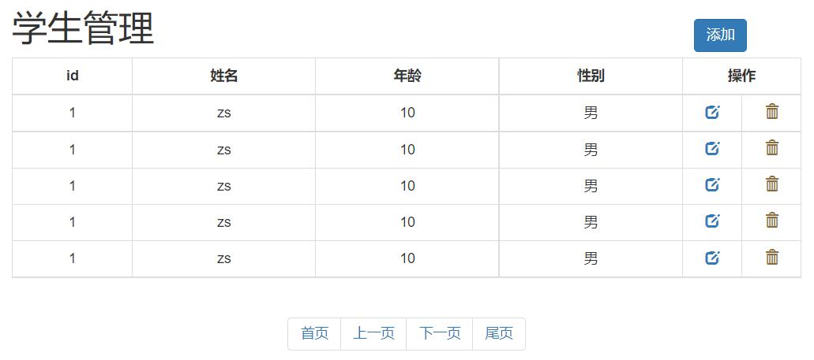

# BootStrap
**validate做表单校验**

**Bootstrap  ：页面布局和美化**


## 一、validate插件

### 1.1、validate插件概述

> 为了更好地实现人机交互，使用jQuery封装库中的validate插件，在用户填写表单时，可以快速地对用户填写的数据进行验证，并做出反馈。
>
> Validation拥有如下特点：
>
> -  内置验证规则： 拥有必填、数字、Email、URL和信用卡号码等19类内置验证规则；
> -  自定义验证规则： 可以很方便地自定义验证规则；
> -  简单强大的验证信息提示： 默认了验证信息提示，并提供自定义覆盖默认的提示信息的功能；
> -  实时验证： 可能通过keyup或blur事件触发验证，而不仅仅在表单提交的时候验证。

### 1.2、validate插件入门

> 使用步骤：
>
> 1. 导入jQuery文件；
> 2. 导入validate.js；
> 3. 导入messages_zh.js，用于显示中文提示；
> 4. 使用`$("选择器").validate()`进行校验；
> 5. 在validate中编写校验规则

```html
<!DOCTYPE html>
<html lang="en">
<head>
    <meta charset="UTF-8">
    <title>登录校验</title>
    <style>
        label[class='error'] {
            color: #ff0000;
        }
    </style>
    <script src="js/jquery-3.4.1.min.js"></script>
    <script src="js/jquery.validate.min.js"></script>
    <script src="js/messages_zh.min.js"></script>
    <script>
        $(function () {
            $('#fm').validate({
                rules: {
                    username: {
                        required: true,
                    },
                    password: {
                        required: true
                    }
                },
                messages: {
                    username: '请输入用户名',
                    password: '请输入密码'
                }
            })
        })
    </script>
</head>
<body>
    <form id="fm" action="https://www.baidu.com">
        <p>
            <label>账号</label>
            <input type="text" name="username"/>
        </p>
        <p>
            <label>密码</label>
            <input type="password" name="password"/>
        </p>
        <p>
            <button type="submit">登录</button>
        </p>
    </form>
</body>
</html>


```

**1使用注意点：核心方法 表单的.validate()**
 **2传参是对象{}，rules:{} ,rules中的规则定义属性是对象，名字要和标签的name属性一致,messages:{}，属性是字符串**


### 1.3、validate插件校验规则

| 属性                     | 描述                                                         |
| ------------------------ | ------------------------------------------------------------ |
| **required:true**        | **必输字段**                                                 |
| `remote:"test.action"`   | 使用ajax方法调用check.action验证输入值                       |
| **`email:true`**         | 必须输入正确格式的电子邮件                                   |
| **`url:true`**           | 必须输入正确格式的网址                                       |
| date:true                | 必须输入正确格式的日期 日期校验ie6出错，慎用                 |
| **`dateISO:true`**       | 必须输入正确格式的日期(ISO)，例如：2009-06-23，1998/01/22 只验证格式，不验证有效性 |
| `number:true`            | 必须输入合法的数字(负数，小数)                               |
| `digits:true`            | 必须输入整数                                                 |
| **`equalTo:"#field"`**   | **输入值必须和`#field`相同**                                 |
| **maxlength:5**          | **输入长度最多是5的字符串(汉字算一个字符)**                  |
| **`minlength:10`**       | **输入长度最小是10的字符串(汉字算一个字符)**                 |
| **`rangelength:[5,10]`** | **输入长度必须介于 5 和 10 之间的字符串(汉字算一个字符)**    |
| **`range:[5,10]`**       | **输入值必须介于 5 和 10 之间**                              |
| **`max:5`**              | **输入值不能大于5**                                          |
| **`min:10`**             | **输入值不能小于10**                                         |

```html
<!DOCTYPE html>
<html lang="en">
<head>
    <meta charset="UTF-8">
    <title>登录校验</title>
    <style>
        label[class='error'] {
            color: #ff0000;
        }
    </style>
    <script src="js/jquery-3.4.1.min.js"></script>
    <script src="js/jquery.validate.min.js"></script>
    <script src="js/messages_zh.min.js"></script>
    <script>
        $(function () {
            $('#fm').validate({
                rules: {
                    username: {
                        required: true,
                        rangelength:[6,10]
                    },
                    password: {
                        required: true,
                        rangelength:[6,10]
                    },
                    password1: {
                        required: true,
                        equalTo: "input[name='password']"
                    }
                },
                messages: {
                    username: '用户名长度必须是6~10位的字符',
                    password: '密码长度必须是6~10位的字符',
                    password1: '两次输入的密码必须相同'
                }
            })
        })
    </script>
</head>
<body>
    <form id="fm" action="https://www.baidu.com">
        <p>
            <label>账号</label>
            <input type="text" name="username"/>
        </p>
        <p>
            <label>密码</label>
            <input type="password" name="password"/>
        </p>
        <p>
            <label>重复密码</label>
            <input type="password" name="password1"/>
        </p>
        <p>
            <button type="submit">注册</button>
        </p>
    </form>
</body>
</html>
```

## 二、Bootstrap

### 2.1、Bootstrap概述

> - Bootstrap是一个用于快速开发Web应用程序和网站的前端框架。Bootstrap是基于HTML、CSS、JavaScript的。Bootstrap是由Twitter的Mark Otto和Jacob Thornton开发的。Bootstrap是2011年八月在GitHub上发布的开源产品。
> - Boostrap特点：
>   -  **移动设备优先**，自Bootstrap 3起，框架包含了贯穿于整个库的移动设备优先的样式。
>   - 浏览器支持，所有的主流浏览器都支持Bootstrap。
>   - 容易上手：只要您具备HTML和CSS的基础知识，您就可以开始学习Bootstrap。
>   - 响应式设计：Bootstrap的响应式 CSS 能够自适应于台式机、平板电脑和手机。

### 2.2、入门案例

```html
<!DOCTYPE html>
<html lang="en">
<head>
    <meta charset="UTF-8">
    <title>bootstrap起步</title>
    <link rel="stylesheet" href="css/bootstrap.css" />
    <!-- jQuery必须在bootstrap js文件的前面 -->
    <script src="js/jquery-3.4.1.min.js"></script>
    <script src="js/bootstrap.js"></script>
</head>
<body>
    <!--
        html
        css
        做网页
        一、是什么
            “框架” -- 软件的半成品
            Bootstrap -- 前端的UI框架

            中文官网：https://v3.bootcss.com/
        二、环境搭建
            在网页中引入各种资源就可以使用 --- 需要依赖jQuery
                |---1.bootstrap的css
                |---2.jQuery(2必须在3的前面)
                |---3.bootstrap的js
    -->
    <h1>标题1 hello BootStrap</h1>
</body>
</html>
```

**使用步骤：  1.引人bootstrap的css**
                     **2.引入jQuery**
                     **3.bootstrap的js**

### 2.3、栅格系统  常用

 **1 一个大div包裹 class=container 或 container-fluid**

**2 一行div  class= row**  

**3 行内布局  div class= col-md-1** 

```html
<!DOCTYPE html>
<html lang="en">
<head>
    <meta charset="UTF-8">
    <title>栅格系统</title>
    <link rel="stylesheet" href="css/bootstrap.css" />
    <!-- jQuery必须在bootstrap js文件的前面 -->
    <script src="js/jquery-3.4.1.min.js"></script>
    <script src="js/bootstrap.js"></script>
    <style>
        div[class^='col-md-'] {     
            border: 1px solid black;
        }
        
     
    </style>
</head>
<body>
    <!--
        1.布局 --- 在什么位置放特定的内容 --- 如何实现布局? div+css 栅格系统
        2.在bootstrap中布局需要container容器 -- 其他的元素都要放在这个容器中
            <div class="container"></div>   有宽度，居中，两侧留白
            <div class="container-fluid"></div>   占据整个页面
    -->
    <div class="container">
        <div class="row text-center">
             <div class="col-md-1">1</div>
             <div class="col-md-1">1</div>
             <div class="col-md-1">1</div>
             <div class="col-md-1">1</div>
             <div class="col-md-1">1</div>
             <div class="col-md-1">1</div>
             <div class="col-md-6 text-center">6</div>
        </div>
    </div>
    <!--<div class="container-fluid" style="background-color: red;">hello container-fluid</div>-->
</body>
</html>
```

> 栅格系统案例

```html
<!DOCTYPE html>
<html lang="en">
<head>
    <meta charset="UTF-8">
    <title>栅格系统</title>
    <link rel="stylesheet" href="css/bootstrap.css" />
    <!-- jQuery必须在bootstrap js文件的前面 -->
    <script src="js/jquery-3.4.1.min.js"></script>
    <script src="js/bootstrap.js"></script>
    <style>
        div[class^='col-md-'] {
            border: 1px solid black;
        }
    </style>
</head>
<body>
    <!--
        1.布局 --- 在什么位置放特定的内容 --- 如何实现布局? div+css 栅格系统
        2.在bootstrap中布局需要container容器 -- 其他的元素都要放在这个容器中
            <div class="container"></div>   有宽度，居中，两侧留白
            <div class="container-fluid"></div>   占据整个页面
    -->
    <div class="container-fluid">
        <div class="row">
             <div class="col-md-12" style="height: 100px; background-color: yellow">111</div>
        </div>
        <div class="row">
            <div class="col-md-3" style="height: 500px;">222</div>
            <div class="col-md-9" style="height: 500px;">333</div>
        </div>
        <div class="row">
            <div class="col-md-12" style="height: 100px; background-color: greenyellow;">444</div>
        </div>
    </div>
    <!--<div class="container-fluid" style="background-color: red;">hello container-fluid</div>-->
</body>
</html>
```

### 2.4、排版

```html
<!DOCTYPE html>
<html lang="en">
<head>
    <meta charset="UTF-8">
    <title>排版</title>
    <link rel="stylesheet" href="css/bootstrap.css" />
    <!-- jQuery必须在bootstrap js文件的前面 -->
    <script src="js/jquery-3.4.1.min.js"></script>
    <script src="js/bootstrap.js"></script>
</head>
<body>
    <!-- 对齐 -->
    <p class="text-left">hello html</p>
    <p class="text-center">hello css</p>
    <p class="text-right">hello js</p>
    <!-- 列表 -->
    <ul class="list-inline">
        <li><a href="">百度</a></li>
        <li><a href="">新浪</a></li>
        <li><a href="">搜狐</a></li>
    </ul>
</body>
</html>
```

### 2.5、表格  常用

```html
<!DOCTYPE html>
<html lang="en">
<head>
    <meta charset="UTF-8">
    <title>表格</title>
    <link rel="stylesheet" href="css/bootstrap.css" />
    <!-- jQuery必须在bootstrap js文件的前面 -->
    <script src="js/jquery-3.4.1.min.js"></script>
    <script src="js/bootstrap.js"></script>
</head>
<body>
    <table class="table table-striped table-bordered table-hover table-condensed">
        <tr>
            <th>id</th>
            <th>name</th>
            <th>addr</th>
        </tr>
        <tr>
            <td>1</td>
            <td>zs</td>
            <td>qd</td>
        </tr>
        <tr>
            <td>1</td>
            <td>zs</td>
            <td>qd</td>
        </tr>
        <tr class="danger">
            <td>1</td>
            <td>zs</td>
            <td>qd</td>
        </tr>
    </table>
</body>
</html>
```

### 2.6、表单  常用

.form-group 

.form-control

**1 表单  class设置为form-horizontal**

**2一组控件用一个div包裹(用户名是一组 、密码是一组)  div的class 设置为form-group**

**3 label 中class 可以设置col-md-的宽度，同时加上control-label  ，输入框用div包裹 ,div加上col-md-宽度，**

 **4在input中加上 form-control ** 

**缩进：col-md-offset-2**   

```html
<!DOCTYPE html>
<html lang="en">
<head>
    <meta charset="UTF-8">
    <title>表格</title>
    <link rel="stylesheet" href="css/bootstrap.css" />
    <!-- jQuery必须在bootstrap js文件的前面 -->
    <script src="js/jquery-3.4.1.min.js"></script>
    <script src="js/bootstrap.js"></script>
</head>
<body>
    <form class="form-horizontal">
        <div class="form-group">
            <label for="inputEmail3" class="col-sm-2 control-label">Email</label>
            <div class="col-sm-10">
                <input type="email" class="form-control" id="inputEmail3" placeholder="Email" disabled />
            </div>
        </div>
        <div class="form-group">
            <label for="inputPassword3" class="col-sm-2 control-label">Password</label>
            <div class="col-sm-10">
                <input type="password" class="form-control" id="inputPassword3" placeholder="Password">
            </div>
        </div>
        <div class="form-group">
            <div class="col-sm-offset-2 col-sm-10">
                <div class="checkbox">
                    <label>
                        <input type="checkbox"> Remember me
                    </label>
                </div>
            </div>
        </div>
        <div class="form-group">
            <div class="col-sm-offset-2 col-sm-10">
                <button type="submit" class="btn btn-default">Sign in</button>
            </div>
        </div>
    </form>
</body>
</html>
```

### 2.7、按钮  常用

```html
<!DOCTYPE html>
<html lang="en">
<head>
    <meta charset="UTF-8">
    <title>按钮</title>
    <link rel="stylesheet" href="css/bootstrap.css" />
    <!-- jQuery必须在bootstrap js文件的前面 -->
    <script src="js/jquery-3.4.1.min.js"></script>
    <script src="js/bootstrap.js"></script>
</head>
<body>
    <button type="button" class="btn btn-default">click</button>
    <button type="button" class="btn btn-danger">删除</button>
    <button type="button" class="btn btn-primary btn-xs">添加</button>
    <br/>
    <a href="https://www.baidu.com" class="btn btn-primary btn-lg">修改</a>
</body>
</html>
```

### 2.8、图像

```html
<!DOCTYPE html>
<html lang="en">
<head>
    <meta charset="UTF-8">
    <title>图像</title>
    <link rel="stylesheet" href="css/bootstrap.css" />
    <!-- jQuery必须在bootstrap js文件的前面 -->
    <script src="js/jquery-3.4.1.min.js"></script>
    <script src="js/bootstrap.js"></script>
</head>
<body>
    
    
    
</body>
</html>
```

### 2.9、图标

span

```html
<!DOCTYPE html>
<html lang="en">
<head>
    <meta charset="UTF-8">
    <title>图标</title>
    <link rel="stylesheet" href="css/bootstrap.css" />
    <!-- jQuery必须在bootstrap js文件的前面 -->
    <script src="js/jquery-3.4.1.min.js"></script>
    <script src="js/bootstrap.js"></script>
</head>
<body>
    <button type="button" class="btn btn-default"><span class="glyphicon glyphicon-search" aria-hidden="true"></span></button>
    <button type="button" class="btn btn-danger"><span style="margin-right: 5px;">删除</span><span class="glyphicon glyphicon-trash"></span></button>
    <button type="button" class="btn btn-primary btn-xs">添加</button>
</body>
</html>
```

### 2.10、模态框  常用

```html
1 <button> 标签中， data-toggle="modal" data-target="#myModal"关联按钮和模态框
2 在取消按钮或关闭X中设置，data-dismiss="modal" 用于关闭模态窗口

3 class="modal-header"，用于为模态窗口的头部设置样式。

4 class="modal-body"，用于为模态窗口的主体设置样式。

5 class="modal-footer"，用于为模态窗口的底部设置样式。
```

```html
<!DOCTYPE html>
<html lang="en">
<head>
    <meta charset="UTF-8">
    <title>模态框</title>
    <link rel="stylesheet" href="css/bootstrap.css" />
    <!-- jQuery必须在bootstrap js文件的前面 -->
    <script src="js/jquery-3.4.1.min.js"></script>
    <script src="js/bootstrap.js"></script>
</head>
<body>
    <!-- Button trigger modal -->
    <button type="button" class="btn btn-primary btn-lg" data-toggle="modal" data-target="#myModal">
        Launch demo modal
    </button>

    <!-- Modal -->
    <div class="modal fade" id="myModal" tabindex="-1" role="dialog" aria-labelledby="myModalLabel">
        <div class="modal-dialog modal-lg" role="document">
            <div class="modal-content">
                <div class="modal-header">
                    <button type="button" class="close" data-dismiss="modal" aria-label="Close"><span aria-hidden="true">&times;</span></button>
                    <h4 class="modal-title" id="myModalLabel">添加</h4>
                </div>
                <div class="modal-body">
                    <form class="form-horizontal">
                        <div class="form-group">
                            <label for="inputEmail3" class="col-sm-2 control-label">Email</label>
                            <div class="col-sm-10">
                                <input type="email" class="form-control" id="inputEmail3" placeholder="Email" disabled />
                            </div>
                        </div>
                        <div class="form-group">
                            <label for="inputPassword3" class="col-sm-2 control-label">Password</label>
                            <div class="col-sm-10">
                                <input type="password" class="form-control" id="inputPassword3" placeholder="Password">
                            </div>
                        </div>
                        <div class="form-group">
                            <div class="col-sm-offset-2 col-sm-10">
                                <div class="checkbox">
                                    <label>
                                        <input type="checkbox"> Remember me
                                    </label>
                                </div>
                            </div>
                        </div>
                        <div class="form-group">
                            <div class="col-sm-offset-2 col-sm-10">
                                <button type="submit" class="btn btn-default">Sign in</button>
                            </div>
                        </div>
                    </form>
                </div>
                <div class="modal-footer">
                    <button type="button" class="btn btn-default" data-dismiss="modal">取消</button>
                    <button type="button" class="btn btn-primary">保存</button>
                </div>
            </div>
        </div>
    </div>

</body>
</html>

```


### 2.11、案例



```html
<!DOCTYPE html>
<html lang="en">
<head>
    <meta charset="UTF-8">
    <title>test</title>
    <script src="js/jquery-3.4.1.min.js"></script>
    <script src="js/bootstrap.js"></script>
    <link rel="stylesheet" href="css/bootstrap.css" />
    <style>
        .container {
            width: 800px;
        }

        th {
            text-align: center;
        }

        .opt {
            width: 60px;
        }
    </style>
</head>
<body>
    <div class="container">
        <div class="modal fade" id="myModal" tabindex="-1" role="dialog" aria-labelledby="myModalLabel">
            <div class="modal-dialog" role="document">
                <div class="modal-content">
                    <div class="modal-header">
                        <button type="button" class="close" data-dismiss="modal" aria-label="Close"><span aria-hidden="true">&times;</span></button>
                        <h4 class="modal-title" id="myModalLabel">添加学生</h4>
                    </div>
                    <div class="modal-body">
                        <form class="form-horizontal">
                            <div class="form-group">
                                <label for="inputEmail3" class="col-sm-2 control-label">姓名</label>
                                <div class="col-sm-10">
                                    <input type="email" class="form-control" id="inputEmail3" placeholder="Email">
                                </div>
                            </div>
                            <div class="form-group">
                                <label for="inputPassword3" class="col-sm-2 control-label">年龄</label>
                                <div class="col-sm-10">
                                    <input type="password" class="form-control" id="inputPassword3" placeholder="Password">
                                </div>
                            </div>
                            <div class="form-group">
                                <label for="inputPassword3" class="col-sm-2 control-label">性别</label>
                                <div class="col-sm-10">
                                    <label>
                                        <input type="radio" name="gender" value="male" /> 男&nbsp;&nbsp;&nbsp;&nbsp;&nbsp;&nbsp;&nbsp;&nbsp;&nbsp;&nbsp;
                                        <input type="radio" name="gender" value="female" /> 女
                                    </label>
                                </div>
                            </div>
                        </form>
                    </div>
                    <div class="modal-footer">
                        <button type="button" class="btn btn-default" data-dismiss="modal">Close</button>
                        <button type="button" class="btn btn-primary">Save changes</button>
                    </div>
                </div>
            </div>
        </div>

        <div class="row">
            <h1 class="pull-left">学生管理</h1>
            <button class="btn btn-primary pull-right" style="margin-top: 30px;" data-toggle="modal" data-target="#myModal">添加学生</button>
        </div>
        <div class="row">
            <table class="table table-bordered table-hover">
                <tr>
                    <th>id</th>
                    <th>姓名</th>
                    <th>年龄</th>
                    <th>性别</th>
                    <th colspan="2">操作</th>
                </tr>
                <tr>
                    <td>1</td>
                    <td>zs</td>
                    <td>20</td>
                    <td>male</td>
                    <td class="opt text-center">
                        <a><span class="glyphicon glyphicon-edit" aria-hidden="true"></span></a>
                    </td>
                    <td class="opt text-center" >
                        <a><span class="glyphicon glyphicon-trash" aria-hidden="true"></span></a>
                    </td>
                </tr>
                <tr>
                    <td>2</td>
                    <td>ls</td>
                    <td>20</td>
                    <td>male</td>
                    <td class="opt text-center">
                        <a><span class="glyphicon glyphicon-edit" aria-hidden="true"></span></a>
                    </td>
                    <td class="opt text-center" >
                        <a><span class="glyphicon glyphicon-trash" aria-hidden="true"></span></a>
                    </td>
                </tr>
                <tr>
                    <td>3</td>
                    <td>ww</td>
                    <td>20</td>
                    <td>male</td>
                    <td class="opt text-center">
                        <a><span class="glyphicon glyphicon-edit" aria-hidden="true"></span></a>
                    </td>
                    <td class="opt text-center" >
                        <a><span class="glyphicon glyphicon-trash" aria-hidden="true"></span></a>
                    </td>
                </tr>
                <tr>
                    <td>4</td>
                    <td>zl</td>
                    <td>20</td>
                    <td>male</td>
                    <td class="opt text-center">
                        <a><span class="glyphicon glyphicon-edit" aria-hidden="true"></span></a>
                    </td>
                    <td class="opt text-center" >
                        <a><span class="glyphicon glyphicon-trash" aria-hidden="true"></span></a>
                    </td>
                </tr>
                <tr>
                    <td>5</td>
                    <td>tom</td>
                    <td>20</td>
                    <td>male</td>
                    <td class="opt text-center">
                        <a><span class="glyphicon glyphicon-edit" aria-hidden="true"></span></a>
                    </td>
                    <td class="opt text-center" >
                        <a><span class="glyphicon glyphicon-trash" aria-hidden="true"></span></a>
                    </td>
                </tr>
            </table>
        </div>
        <div class="row">
            <nav aria-label="Page navigation" class="text-center" style="margin-top: 0px;">
                <ul class="pagination">
                    <li>
                        <a href="#" aria-label="Previous">
                            <span aria-hidden="true">&laquo;</span>
                        </a>
                    </li>
                    <li><a href="#">1</a></li>
                    <li><a href="#">2</a></li>
                    <li><a href="#">3</a></li>
                    <li><a href="#">4</a></li>
                    <li><a href="#">5</a></li>
                    <li>
                        <a href="#" aria-label="Next">
                            <span aria-hidden="true">&raquo;</span>
                        </a>
                    </li>
                </ul>
            </nav>
        </div>
    </div>
</body>
</html>
```

