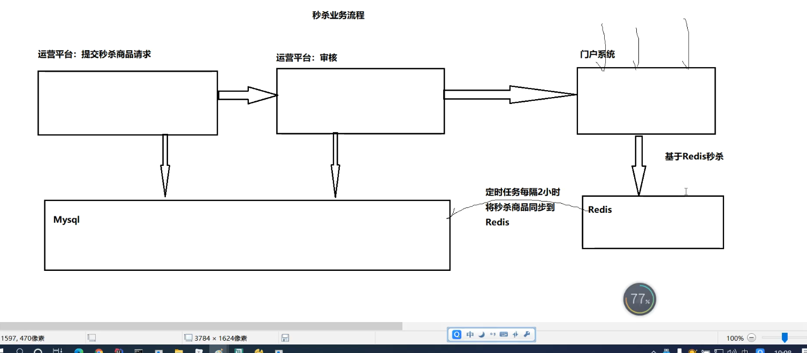
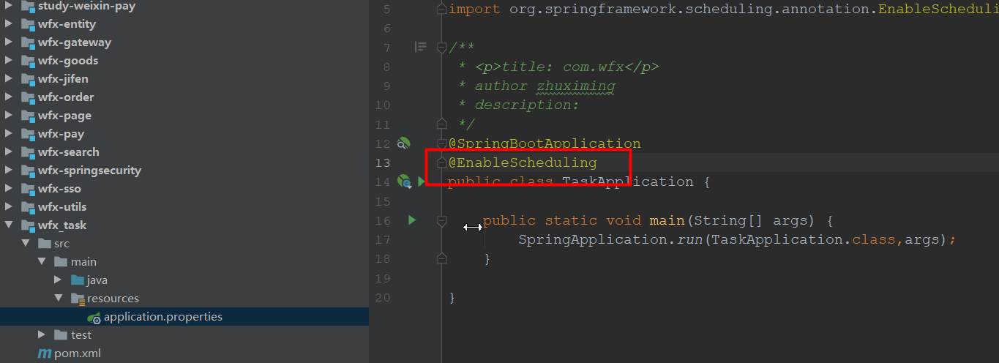
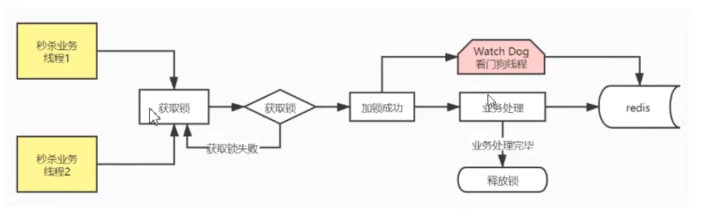

**秒杀：**

**1 定时任务 （Spring Task），每隔2小时去取可以进行秒杀的商品（商品开始秒杀时间，商品结束秒杀时间）** 

​               **当前时间     商品开始秒杀时间              商品结束秒杀时间     当前时间+2小时**

**2 取到的秒杀商品放在redis中 (hash 数据结构，KEY  [时间点]，field [goodsid],value [{goods}])**

**3 秒杀防止超买超卖，redis分布式锁（setIfAbsent）（Redisson框架 看门狗机制）**

**4 存订单 redis（hash数据结果，KEY [goodsid],field [userid],value[{order}]）**


**限流：sentinel  **

# 一：秒杀业务简介

## 1.1：限时秒杀原型


## 1.2：秒杀业务特点

```xml
1.一个用户只能买1件  
2.库存限制  
3.时间限制  
4.固定sku    
5.不走购物车，直接跳支付页  
6:并发量大    考虑极端情况，超买超卖（分布式锁）     
```


## 1.3：秒杀业务流程

```txt
1.运营平台提交秒杀商品（商品标题、原价、秒杀价、图片、介绍、库存、活动开始时间、活动的结束时间）申请
2.审核秒杀商品
3.秒杀频道页列出秒杀商品列表
4.用户抢购，下单减库存（如果库存为0或者还没到秒杀时间无法秒杀）
5.下单成功，选择物流信息，跳转支付页面（微信支付）
6.5min未支付，关闭单子退回库存
```


## 1.4：秒杀表设计

```sql
/*
Navicat MySQL Data Transfer

Source Server         : localhost
Source Server Version : 50727
Source Host           : localhost:3306
Source Database       : wfx

Target Server Type    : MYSQL
Target Server Version : 50727
File Encoding         : 65001

Date: 2020-11-15 23:12:42
*/

SET FOREIGN_KEY_CHECKS=0;

-- ----------------------------
-- Table structure for `seckill_goods`
-- ----------------------------
DROP TABLE IF EXISTS `seckill_goods`;
CREATE TABLE `seckill_goods` (
  `seckill_id` int(11) NOT NULL AUTO_INCREMENT COMMENT '主键',
  `seckill_goods_title` varchar(100) COLLATE utf8_bin DEFAULT NULL COMMENT '秒杀商品标题',
  `seckill_goods_sku` varchar(100) COLLATE utf8_bin DEFAULT NULL COMMENT '商品的sku名称',
  `price` double DEFAULT NULL COMMENT '原价',
  `seckill_price` double DEFAULT NULL COMMENT '秒杀价格',
  `seckill_starttime` datetime DEFAULT NULL COMMENT '秒杀开始时间',
  `seckill_endtime` datetime DEFAULT NULL COMMENT '秒杀结束时间',
  `seckill_count` int(11) DEFAULT NULL COMMENT '秒杀库存',
  `seckill_remaining` int(11) DEFAULT NULL COMMENT '剩余库存',
  `seckill_status` int(11) DEFAULT NULL COMMENT '审核状态：0，未审核1，审核通过2，审核不通过',
   `seckill_seller_id` varchar(100) COLLATE utf8_bin DEFAULT NULL,
  `createdate` datetime DEFAULT NULL COMMENT '添加日期',
  `updatedate` datetime DEFAULT NULL COMMENT '修改时间',
  PRIMARY KEY (`seckill_id`)
) ENGINE=InnoDB DEFAULT CHARSET=utf8 COLLATE=utf8_bin;

-- ----------------------------
-- Records of seckill_goods
-- ----------------------------

-- ----------------------------
-- Table structure for `seckill_order`
-- ----------------------------
DROP TABLE IF EXISTS `seckill_order`;
CREATE TABLE `seckill_order` (
  `seckill_order_id` varchar(100) COLLATE utf8_bin NOT NULL COMMENT '订单号(主键)',
  `seckill_goods_id` varchar(100) COLLATE utf8_bin DEFAULT NULL COMMENT '秒杀商品id',
  `seckill_money` double DEFAULT NULL COMMENT '支付金额',
  `seckill_user_id` varchar(100) COLLATE utf8_bin DEFAULT NULL,
  `seckill_seller_id` varchar(100) COLLATE utf8_bin DEFAULT NULL,
  `seckill_order_status` int(11) DEFAULT NULL COMMENT '秒杀单子状态0，未支付1，已支付',
  `seckill_paytime` datetime DEFAULT NULL COMMENT '支付时间',
  `receiver_address` varchar(200) COLLATE utf8_bin DEFAULT NULL COMMENT '收货地址',
  `receiver_mobile` varchar(20) COLLATE utf8_bin DEFAULT NULL COMMENT '联系电话',
  `receiver_name` varchar(20) COLLATE utf8_bin DEFAULT NULL COMMENT '收货人姓名',
  `createdate` datetime DEFAULT NULL,
  `updatedate` datetime DEFAULT NULL,
  PRIMARY KEY (`seckill__order_id`)
) ENGINE=InnoDB DEFAULT CHARSET=utf8 COLLATE=utf8_bin;

-- ----------------------------
-- Records of seckill_order
-- ----------------------------

```


## 1.5：秒杀业务数据存储的问题



Hash

 8-10 10-12 12-14 14-16

商品：Key:miaosha:${yyyyMMddHH}      field:${skuid}  value:${商品信息}

订单:order:${skuid}  field:${userid}         value:${order}

# 二：搭建定时服务

### 2.1：定时任务

> Spring3.0以后自主开发的定时任务工具，spring task，可以将它比作一个轻量级的Quartz，而且使用起来很简单，除spring相关的包外不需要额外的包，而且支持注解和配置文件两种形式


使用步骤：

第一步：开启定时任务




第二步：定时任务

```java
@Component
public class TaskTest {
    @Scheduled(cron = "* * * * * ?")
    public  void po(){
        System.out.println(System.currentTimeMillis());
    }
}
```


cron表达式

| 字段                     | 允许值                                 | 允许的特殊字符             |
| ------------------------ | -------------------------------------- | -------------------------- |
| 秒（Seconds）            | 0~59的整数                             | , - * /   四个字符         |
| 分（*Minutes*）          | 0~59的整数                             | , - * /   四个字符         |
| 小时（*Hours*）          | 0~23的整数                             | , - * /   四个字符         |
| 日期（*DayofMonth*）     | 1~31的整数（但是你需要考虑你月的天数） | ,- * ? / L W C   八个字符  |
| 月份（*Month*）          | 1~12的整数或者 JAN-DEC                 | , - * /   四个字符         |
| 星期（*DayofWeek*）      | 1~7的整数或者 SUN-SAT （1=SUN）        | , - * ? / L C #   八个字符 |
| 年(可选，留空)（*Year*） | 1970~2099                              | , - * /   四个字符         |

**注意事项：**

```txt
每一个域都使用数字，但还可以出现如下特殊字符，它们的含义是：
（1）*：表示匹配该域的任意值。假如在Minutes域使用*, 即表示每分钟都会触发事件。
（2）?：只能用在DayofMonth和DayofWeek两个域。它也匹配域的任意值，但实际不会。因为DayofMonth和DayofWeek会相互影响。例如想在每月的20日触发调度，不管20日到底是星期几，则只能使用如下写法： 13 13 15 20 * ?, 其中最后一位只能用？，而不能使用*，如果使用*表示不管星期几都会触发，实际上并不是这样。
（3）-：表示范围。例如在Minutes域使用5-20，表示从5分到20分钟每分钟触发一次 
（4）/：表示起始时间开始触发，然后每隔固定时间触发一次。例如在Minutes域使用5/20,则意味着5分钟触发一次，而25，45等分别触发一次. 
（5）,：表示列出枚举值。例如：在Minutes域使用5,20，则意味着在5和20分每分钟触发一次。 
（6）L：表示最后，只能出现在DayofWeek和DayofMonth域。如果在DayofWeek域使用5L,意味着在最后的一个星期四触发。 
（7）W:表示有效工作日(周一到周五),只能出现在DayofMonth域，系统将在离指定日期的最近的有效工作日触发事件。例如：在 DayofMonth使用5W，如果5日是星期六，则将在最近的工作日：星期五，即4日触发。如果5日是星期天，则在6日(周一)触发；如果5日在星期一到星期五中的一天，则就在5日触发。另外一点，W的最近寻找不会跨过月份 。
（8）LW:这两个字符可以连用，表示在某个月最后一个工作日，即最后一个星期五。 
（9）#:用于确定每个月第几个星期几，只能出现在DayofMonth域。例如在4#2，表示某月的第二个星期三。
```

示例

在线生成cron表达式：https://cron.qqe2.com/

```txt
（1）0 0 2 1 * ? *   表示在每月的1日的凌晨2点调整任务
（2）0 15 10 ? * MON-FRI   表示周一到周五每天上午10:15执行作业
（3）0 15 10 ? 6L 2002-2006   表示2002-2006年的每个月的最后一个星期五上午10:15执行作
（4）0 0 10,14,16 * * ?   每天上午10点，下午2点，4点 
（5）0 0/30 9-17 * * ?   朝九晚五工作时间内每半小时 
（6）0 0 12 ? * WED    表示每个星期三中午12点 
（7）0 0 12 * * ?   每天中午12点触发 
（8）0 15 10 ? * *    每天上午10:15触发 
（9）0 15 10 * * ?     每天上午10:15触发 
（10）0 15 10 * * ? *    每天上午10:15触发 
（11）0 15 10 * * ? 2005    2005年的每天上午10:15触发 
（12）0 * 14 * * ?     在每天下午2点到下午2:59期间的每1分钟触发 
（13）0 0/5 14 * * ?    在每天下午2点到下午2:55期间的每5分钟触发 
（14）0 0/5 14,18 * * ?     在每天下午2点到2:55期间和下午6点到6:55期间的每5分钟触发 
（15）0 0-5 14 * * ?    在每天下午2点到下午2:05期间的每1分钟触发 
（16）0 10,44 14 ? 3 WED    每年三月的星期三的下午2:10和2:44触发 
（17）0 15 10 ? * MON-FRI    周一至周五的上午10:15触发 
（18）0 15 10 15 * ?    每月15日上午10:15触发 
（19）0 15 10 L * ?    每月最后一日的上午10:15触发 
（20）0 15 10 ? * 6L    每月的最后一个星期五上午10:15触发 
（21）0 15 10 ? * 6L 2002-2005   2002年至2005年的每月的最后一个星期五上午10:15触发 
（22）0 15 10 ? * 6#3   每月的第三个星期五上午10:15触发
```

### 2.2：定期同步数据到Redis

```txt
1.获取时间区间列表，一共5个时间区间（正在开始以及即将开始）
2.遍历时间区间获取时间区间的秒杀商品信息
  要求：1.审核状态必须是seckill_status=1
  	   2.商品秒杀库存数必须seckill_count>0
       3.开始时间>=时间区间的开始时间、结束时间<=时间区间开始时间+2小时
3.放入redis  
```


```java
 @Scheduled(cron = "0/15 * * * * ?")
     public  void  loadData(){

        //获取时间区间（当前时间所处的时间区间、往后推4个）  一共5个区间
        List<Date> dateMenus = DateUtil.getDateMenus();


        dateMenus.forEach(date->{

            SimpleDateFormat format = new SimpleDateFormat("yyyyMMdd HH:mm:ss");
            SimpleDateFormat formatRedis = new SimpleDateFormat("yyyyMMddHH");
            String dateStr = format.format(date);

            //从mysql中获取时间区间符合要求的数据

            List<SeckillGoods> seckillGoodsList = secClient.loadSecData(dateStr);

            //从秒杀服务中获取秒杀商品

            BoundHashOperations<String, Object, Object> operations = redisTemplate.boundHashOps("sec:goods:" + formatRedis.format(date));


            //存放到redis中
            seckillGoodsList.forEach(seckillGoods -> {
                operations.put(seckillGoods.getSeckillId()+"", JsonUtils.toString(seckillGoods));

            });


        });


     }
```


工具类

```java
import java.text.ParseException;
import java.text.SimpleDateFormat;
import java.util.ArrayList;
import java.util.Calendar;
import java.util.Date;
import java.util.List;


public class DateUtil {

    /***
     * 从yyyy-MM-dd HH:mm格式转成yyyyMMddHH格式
     * @param dateStr
     * @return
     */
    public static String formatStr(String dateStr){
        SimpleDateFormat simpleDateFormat = new SimpleDateFormat("yyyy-MM-dd HH:mm");
        try {
            Date date = simpleDateFormat.parse(dateStr);
            simpleDateFormat = new SimpleDateFormat("yyyyMMddHH");
            return simpleDateFormat.format(date);
        } catch (ParseException e) {
            e.printStackTrace();
        }
        return null;
    }

    /***
     * 获取指定日期的凌晨      
     * @return
     */
    public static Date toDayStartHour(Date date){
        Calendar calendar = Calendar.getInstance();
        calendar.setTime(date);
        calendar.set(Calendar.HOUR_OF_DAY, 0);
        calendar.set(Calendar.MINUTE, 0);
        calendar.set(Calendar.SECOND, 0);
        calendar.set(Calendar.MILLISECOND, 0);
        Date start = calendar.getTime();
        return start;
    }


    /***
     * 时间增加N分钟
     * @param date
     * @param minutes
     * @return
     */
    public static Date addDateMinutes(Date date,int minutes){
        Calendar calendar = Calendar.getInstance();
        calendar.setTime(date);
        calendar.add(Calendar.MINUTE, minutes);// 24小时制
        date = calendar.getTime();
        return date;
    }

    /***
     * 时间递增N小时
     * @param hour
     * @return
     */
    public static Date addDateHour(Date date,int hour){
        Calendar calendar = Calendar.getInstance();
        calendar.setTime(date);
        calendar.add(Calendar.HOUR, hour);// 24小时制
        date = calendar.getTime();
        return date;
    }

    /***
     * 获取时间菜单
     * @return
     */
    public static List<Date> getDateMenus(){
        //定义一个List<Date>集合，存储所有时间段
        List<Date> dates = new ArrayList<Date>();
        //循环12次
        Date date = toDayStartHour(new Date()); //凌晨
        for (int i = 0; i <12 ; i++) {
            //每次递增2小时,将每次递增的时间存入到List<Date>集合中
            dates.add(addDateHour(date,i*2));
        }

        //判断当前时间属于哪个时间范围
        Date now = new Date();
        for (Date cdate : dates) {
            //开始时间<=当前时间<开始时间+2小时
            if(cdate.getTime()<=now.getTime() && now.getTime()<addDateHour(cdate,2).getTime()){
                now = cdate;
                break;
            }
        }

        //当前需要显示的时间菜单
        List<Date> dateMenus = new ArrayList<Date>();
        for (int i = 0; i <5 ; i++) {
            dateMenus.add(addDateHour(now,i*2));
        }
        return dateMenus;
    }

    /***
     * 时间转成yyyyMMddHH
     * @param date
     * @return
     */
    public static String date2Str(Date date){
        SimpleDateFormat simpleDateFormat = new SimpleDateFormat("yyyyMMddHH");
        return simpleDateFormat.format(date);
    }
}

```

 

秒杀服务提供时间区间商品列表

```java
@Override
    public List<SeckillGoods> loadSecData(String date) {

        try {
            //要求：1.审核状态必须是seckill_status=1
            //2.商品秒杀库存数必须seckill_count>0
            //3.开始时间>=时间区间的开始时间、结束时间<=时间区间开始时间+2小时
      

            //计算时间区间的开始时间   每2小时做一次秒杀
            SimpleDateFormat format = new SimpleDateFormat("yyyyMMdd HH:mm:ss");
            Date startTime = format.parse(date);
            Date endTime = DateUtil.addDateHour(startTime, 2);
            

            QueryWrapper<SeckillGoods> queryWrapper = new QueryWrapper<>();
            queryWrapper.eq("seckill_status", 1);
            queryWrapper.gt("seckill_count", 0);  
            queryWrapper.ge("seckill_starttime", startTime);
            queryWrapper.le("seckill_endtime", endTime);

            List<SeckillGoods> seckillGoods = this.baseMapper.selectList(queryWrapper);

            return seckillGoods;


        } catch (Exception exception){
            exception.printStackTrace();
            return  null;
        }

    }
```

redis 

mq （单体项目，讲延时消息），   订单30分后没支付，  把这个订单删掉   

es (elaticsearch )    查询   在线考试 =>题干，答案


##### 秒杀服务准备模拟数据

```java
  @RequestMapping("/gendata")
    public String gendata(){
        //获取最近的5个时间区间
        List<Date> dateMenus = DateUtil.getDateMenus();

        for (Date dateMenu : dateMenus) {
            Random random = new Random();
            int randomv = random.nextInt(200);
            //每个区间插入模拟数据
            MsGoods secKillGoods = new MsGoods();
            secKillGoods.setPrice(399.99);
            secKillGoods.setSeckillPrice(99.99);
            secKillGoods.setSeckillCount(10);
            secKillGoods.setSeckillRemaining(10);
            secKillGoods.setSeckillGoodsTitle("华为p40pro 亮黑色 8+128G全网通 立减"+randomv);
            secKillGoods.setSeckillStatus(1);
            secKillGoods.setCreatedate(new Date());
            secKillGoods.setSeckillStarttime(DateUtil.addDateMinutes(dateMenu,2));
            secKillGoods.setSeckillEndtime(DateUtil.addDateMinutes(dateMenu,60));
            msGoodsService.save(secKillGoods);
        }


        return "success";


    }
```


# 三：秒杀服务

## 3.1：功能一：显示时间区间菜单

#### 后台开发接口

```java
@GetMapping("timeMenu")
public List<Date> timeMenu(){

    List<Date> dateMenus = DateUtil.getDateMenus();

    return dateMenus;
}
```

```yml
spring:  
  jackson:
    date-format: yyyy-MM-dd HH:mm:ss
    time-zone: Asia/Chongqing
```


#### 前端联调

引入js(moment.min.js)

定义全局过滤器

```js
//全局过滤器
Vue.filter("dateFilter", function (date, formatPattern) {
    return moment(date).format(formatPattern || "YYYY-MM-DD HH:mm:ss");
});
```

引用过滤器

```html
<div v-for="(item,index) in menus" :class="['item-time',ctime==index? 'active':'']" @click="ctime=index;searchList(item)">
    <div class="time-clock">{{item | dateFilter('HH:mm')}}</div>
    <div class="time-state-on" v-if="index==0">
        <span class="on-text">快抢中</span>
        <span class="on-over">距离结束：{{timedown(alltimes[index])}}</span>
    </div>

    <div class="time-state-on" v-if="index>0">
        <span class="on-text">即将开始</span>
        <span class="on-over">距离开始：{{timedown(alltimes[index])}}</span>
    </div>
</div>
```


加载时间菜单同时计算时间差

```js
loadTimeMenu(){
    var _this = this;
    axios.get("/seckill/timeMenu").then(
        res=>{
            _this.timeMenus = res.data	
            //统计初始时间差
            for(var i=0;i<vm.timeMenus.length;i++){
                if(i==0){
                    //距离结束的时间  第2个开始时间-当前时间
                    vm.remainTimes[0] = new Date(vm.timeMenus[1])-new Date();
                }else{
                    //距离开始   第N个开始时间-当前时间
                    vm.remainTimes[i] = new Date(vm.timeMenus[i])-new Date()
                }
			}
            
           //让剩余时间实时变化
            let timer = window.setInterval(function (args) {
                for (var i = 0; i < vm.remainTimes.length; i++) {
                    //让每个都-1000
                    //数组元素发生变化，但是视图不会跟着变
                    //vm.remainTimes[i]  =  vm.remainTimes[i] - 1000;

                    //数组数据发生变化，强制刷新到视图
                    vm.$set( vm.remainTimes,i,(vm.remainTimes[i] - 1000))

                    //如果当前时间差的值<0，则整体菜单标签页切换
                    if(vm.remainTimes[i]<1000){
                        vm.findTimeMenus();
                    }
                }
            }, 1000);
        }
    )	

},

```


将毫秒转换成时分秒

```js
//将毫秒转换成时分秒
timeformat (num) {
    var oneSecond = 1000;
    var oneMinute = oneSecond * 60;
    var oneHour = oneMinute * 60
    //小时
    var hours = Math.floor(num / oneHour);
    //分钟
    var minutes = Math.floor((num % oneHour) / oneMinute);
    //秒
    var seconds = Math.floor((num % oneMinute) / oneSecond);
    //拼接时间格式
    var str = hours + ':' + minutes + ':' + seconds;
    return str;
},
```


## 3.2：功能二：获取秒杀商品列表

#### 后台接口

```java
 @Override
    public List<MsGoods> findGoodListByTime(String startTime) {

        /*startTime :2021080722*/
        BoundHashOperations<String, Object, Object> operations = stringRedisTemplate.boundHashOps("portal:sec:goods");

        Object msGoodsListJsonStr = operations.get(startTime);

        if(StringUtils.isEmpty(msGoodsListJsonStr)){
            return new ArrayList<>();
        }

        List<MsGoods> goodsList = JSONUtil.toList((String) msGoodsListJsonStr, MsGoods.class);


        return goodsList;

    }
```


#### 前端联调

```js
	findGoodListByTime(startTime){

				var a  = moment(startTime).format('YYYYMMDDHH')
				console.log(a);

				fengmi.http.get("/sec/ms-goods/findGoodListByTime?startTime="+a).then(
					res=>{
						console.log(res);

						this.goodsList = res;
					}
				)	
			},
```


## 3.3：功能三：下单

在redis中存一条hash数据，订单:order:${skuid}  field:${userid}         value:${order}

​                 修改商品的库存

####    后台接口

```java
    @Override
    public Result qianggou(String dateStr, String goodsId) {


        //获取锁 lock=true表示抢到锁，否则锁被其他线程占用
        Boolean lock = template.boundValueOps("lock"+goodsId).setIfAbsent("1");
        //template.expire("lock"+goodsId,3, TimeUnit.SECONDS);

       
            BoundHashOperations<String, Object, Object> operations = template.boundHashOps("portal:sec:goods:" + dateStr);

            BoundHashOperations<String, Object, Object> orderOpt = template.boundHashOps("portal:sec:order:" + goodsId);


            Object goodsJson = operations.get(goodsId);

            if (StringUtils.isEmpty(goodsJson)) {

                return  new Result(false, "没有该商品信息");
            }


            //判断当前用户是否购买
            String memeberId = UserInfoInterceptor.getUserInfo().getMemeberId()+new Date();
            Object orderJson= orderOpt.get(memeberId);

            if (orderJson != null) {
                return  new Result(false, "不能重复购买");
            }


            //判断库存
            SeckillGoods seckillGoods = JsonUtils.toBean((String) goodsJson, SeckillGoods.class);
            if (seckillGoods.getSeckillRemaining() <=0) {
                return  new Result(false, "库存不足");
            }


         

            //下单
            SeckillOrder order = new SeckillOrder();
            long orderId = idWorker.nextId();
            order.setSeckillOrderId(orderId+"");

            //todo:配送地址选择默认的配送地址


            order.setSeckillUserId(memeberId);
            order.setCreatedate(new Date());
            order.setSeckillMoney(seckillGoods.getSeckillPrice());
            order.setUpdatedate(new Date());

            orderOpt.put(memeberId,JsonUtils.toString(order));

            //减库存
            seckillGoods.setSeckillRemaining(seckillGoods.getSeckillRemaining()-1);

            operations.put(goodsId, JsonUtils.toString(seckillGoods));


            //释放锁
            template.delete("lock"+goodsId);

            return new Result(true, "抢购成功",orderId);
     

    }
```


#### 前端联调

```js
//下单	
order(time,goodsId){
    if(confirm("确定下单？")){
        //先转换时间
        timeStr = moment(time).format('YYYYMMDDHH');
    }		
}
```


下单成功跳转下单页

下单页调用后台接口，到微信的支付系统统一下单，返回二维码

用户扫码支付，如果支付成功，微信回调我们接口，修改redis中订单的状态。

如果用户不支付，解决订单超时的问题


## 3.4：问题：超买超卖的问题

#### 演示：超买超卖

#### 解决思路：

思路一：synchronized，synchronized是jvm级别的锁，对于服务集群是无法实现排它特性

思路二：使用redis的setnx获取锁，使用del key释放锁，实现分布式锁

```java
       
//非阻塞锁，获取锁的过程不会阻塞线程
//获取锁
        Boolean hasLock = stringRedisTemplate.boundValueOps("lock:" + goodsId).setIfAbsent("1");

        if(hasLock){//获取锁成功
            //下单+扣库存的逻辑
            
        }else{//获取锁失败
            return  new Result(false,"系统繁忙，一会再强");
        }
```


```java
//阻塞锁，获取锁的过程会阻塞线程 
//获取锁

Boolean hasLock = stringRedisTemplate.boundValueOps("lock:" + goodsId).setIfAbsent("1");
//阻塞锁，获取锁的过程会阻塞线程 
while (!hasLock){
    hasLock = stringRedisTemplate.boundValueOps("lock:" + goodsId).setIfAbsent("1");
    Thread.sleep(1000);
}

if(hasLock){//获取成功

}else{

}
```


# 四：分布式锁解决超卖

## 4.1：分布式锁     

   

```java
//获取锁
Boolean lock = stringRedisTemplate.boundValueOps("lock:" + goodsId).setIfAbsent("yes");
//释放锁
stringRedisTemplate.delete("lock:"+goodsId);
```


## 4.2：分布式死锁

> 当a线程获取到锁，然后还没来得及释放锁，服务宕机了，其他线程就会一直获取不到锁，出现死锁情况

```java
//获取锁，同时设置过期时间
Boolean lock = stringRedisTemplate.boundValueOps("lock:" + goodsId).setIfAbsent("yes",30, TimeUnit.SECONDS);
//释放锁
stringRedisTemplate.delete("lock:"+goodsId);
```


## 4.3：设置过期时间导致的系列问题

过期时间过长，效率太低

过期时间过短，还是会出现超买超卖问题


## 4.4：Redisson开源框架      

##         

github地址：https://github.com/redisson/redisson

```txt
 Redisson是架设在Redis基础上的一个Java驻内存数据网格（In-Memory Data Grid）。充分的利用了Redis键值数据库提供的一系列优势，基于Java实用工具包中常用接口，为使用者提供了一系列具有分布式特性的常用工具类。使得原本作为协调单机多线程并发程序的工具包获得了协调分布式多机多线程并发系统的能力，大大降低了设计和研发大规模分布式系统的难度。同时结合各富特色的分布式服务，更进一步简化了分布式环境中程序相互之间的协作。

Redisson始于2013年12月22日，至今已有8年多的发展，日趋成熟
```





 

第一步：pom依赖

```xml

<dependency>
    <groupId>org.redisson</groupId>
    <artifactId>redisson</artifactId>
    <version>3.12.0</version>
</dependency>
```


第二步：配置RedissonClient

错误的方式

```java
  @Autowired
    private RedissonClient redisClient;

    @Override
    public ResultVO saveOrder(String startTime, String goodsId) {

        try {

        


            BoundHashOperations<String, Object, Object> goodsOper =
                stringRedisTemplate.boundHashOps("menhu:miaosha:goods:" + startTime);


            BoundHashOperations<String, Object, Object> orderOper =
                stringRedisTemplate.boundHashOps("menhu:miaosha:order:" + goodsId);

            Object goodsJson = goodsOper.get(goodsId);

            if(StringUtils.isEmpty(goodsJson)){

                return  new ResultVO(false, "商品不存在");
            }

            //同一个临界区
            MsGoods msGoods = JSONUtil.toBean((String) goodsJson, MsGoods.class);
             //获取锁
            RLock lock = redisClient.getLock("lock" + goodsId);
            lock.lock(1 ,TimeUnit.SECONDS);   //设置过期时间
            //msGoods  10


                //判断库存
                if(msGoods.getSeckillRemaining() <=0){
                    return new ResultVO(false, "商品库存不足");
                }


                //判断是否重复购买
                String userId = UserInfoInterceptor.getUserInfo().getUserId()+idWorker.nextId();
                Object orderJson = orderOper.get(userId);
                if(!StringUtils.isEmpty(orderJson)){

                    return  new ResultVO(false, "不能重复下单");
                }

                //下单
                MsOrder msOrder = new MsOrder();
                msOrder.setCreatedate(new Date());
                msOrder.setCreatedate(new Date());
                //查看默认的收货地址
                // msOrder.setReceiverAddress();

                msOrder.setSeckillGoodsId(goodsId);

                msOrder.setSeckillOrderId(idWorker.nextId()+"");
                msOrder.setSeckillMoney(msGoods.getSeckillPrice());
                msOrder.setSeckillUserId(UserInfoInterceptor.getUserInfo().getUserId());

                orderOper.put(userId,JSONUtil.toJsonStr(msOrder));


                try {
                    Thread.sleep(1000);
                } catch (InterruptedException e) {
                    e.printStackTrace();
                }


                //扣库存
                msGoods.setSeckillRemaining(msGoods.getSeckillRemaining()-1);

                goodsOper.put(goodsId, JSONUtil.toJsonStr(msGoods));

                //事务提交
//            stringRedisTemplate.exec();
                //释放锁
            if(lock != null) {
                //如果锁被当前线程持有，则释放。多一个判断，减少报错信息的出现
                //在解锁之前先判断要解锁的key是否已被锁定并且是否被当前线程保持。如果满足条件时才解锁。
                if (lock.isLocked() && lock.isHeldByCurrentThread()) {
                    //解锁
                    lock.unlock();
                }
            }


             return  new ResultVO(true, "秒杀成功");


        } catch (Exception exception) {
            exception.printStackTrace();
//            stringRedisTemplate.discard();
            return  new ResultVO(false, "秒杀失败");
        }


    }
```


正确的方式

```java
  @Autowired
    private RedissonClient redisClient;

    @Override
    public ResultVO saveOrder(String startTime, String goodsId) {

        try {

            //获取锁
            RLock lock = redisClient.getLock("lock" + goodsId);
            lock.lock(1 ,TimeUnit.SECONDS);   //设置过期时间


            BoundHashOperations<String, Object, Object> goodsOper =
                stringRedisTemplate.boundHashOps("menhu:miaosha:goods:" + startTime);


            BoundHashOperations<String, Object, Object> orderOper =
                stringRedisTemplate.boundHashOps("menhu:miaosha:order:" + goodsId);

            Object goodsJson = goodsOper.get(goodsId);

            if(StringUtils.isEmpty(goodsJson)){

                return  new ResultVO(false, "商品不存在");
            }

            //同一个临界区
            MsGoods msGoods = JSONUtil.toBean((String) goodsJson, MsGoods.class);
            //msGoods  10


                //判断库存
                if(msGoods.getSeckillRemaining() <=0){
                    return new ResultVO(false, "商品库存不足");
                }


                //判断是否重复购买
                String userId = UserInfoInterceptor.getUserInfo().getUserId()+idWorker.nextId();
                Object orderJson = orderOper.get(userId);
                if(!StringUtils.isEmpty(orderJson)){

                    return  new ResultVO(false, "不能重复下单");
                }

                //下单
                MsOrder msOrder = new MsOrder();
                msOrder.setCreatedate(new Date());
                msOrder.setCreatedate(new Date());
                //查看默认的收货地址
                // msOrder.setReceiverAddress();

                msOrder.setSeckillGoodsId(goodsId);

                msOrder.setSeckillOrderId(idWorker.nextId()+"");
                msOrder.setSeckillMoney(msGoods.getSeckillPrice());
                msOrder.setSeckillUserId(UserInfoInterceptor.getUserInfo().getUserId());

                orderOper.put(userId,JSONUtil.toJsonStr(msOrder));


                try {
                    Thread.sleep(1000);
                } catch (InterruptedException e) {
                    e.printStackTrace();
                }


                //扣库存
                msGoods.setSeckillRemaining(msGoods.getSeckillRemaining()-1);

                goodsOper.put(goodsId, JSONUtil.toJsonStr(msGoods));

                //事务提交
//            stringRedisTemplate.exec();
                //释放锁
            if(lock != null) {
                //如果锁被当前线程持有，则释放。多一个判断，减少报错信息的出现
                //在解锁之前先判断要解锁的key是否已被锁定并且是否被当前线程保持。如果满足条件时才解锁。
                if (lock.isLocked() && lock.isHeldByCurrentThread()) {
                    //解锁
                    lock.unlock();
                }
            }


             return  new ResultVO(true, "秒杀成功");


        } catch (Exception exception) {
            exception.printStackTrace();
//            stringRedisTemplate.discard();
            return  new ResultVO(false, "秒杀失败");
        }


    }
```


第三步：功能实现

```java
@Autowired
private RedissonClient redissonClient;

@GetMapping("order")
public Result order(String goodsId,String timeStr){
    //获取锁
    RLock lock = redissonClient.getLock("lock:"+goodsId);
    //锁的过期时间
    lock.lock(40,TimeUnit.SECONDS);
    

    try {
        //查询商品信息
        String seckillGoodsJsonStr = (String) stringRedisTemplate.boundHashOps("seckill_goods_" + timeStr).get(goodsId);
        SecKillGoods goods = null;
        if (seckillGoodsJsonStr!=null){
            goods =JsonUtils.toBean(seckillGoodsJsonStr, SecKillGoods.class);
        }
        if (goods != null&&goods.getSeckillRemaining()>0) {


            Thread.sleep(2000);
            //创建订单
            SecKillOrder order = new SecKillOrder();
            String orderId = idWorker.nextId()+"";
            order.setSeckillOrderId(orderId+"");
            order.setSeckillMoney(goods.getSeckillPrice());
            order.setSeckillUserId("jwt");
            order.setSeckillOrderStatus(0);
            order.setSeckillGoodsId(goods.getSeckillId()+"");
            stringRedisTemplate.boundHashOps("seckill:order").put(orderId+"",JsonUtils.toString(order));

            //减库存
            goods.setSeckillRemaining(goods.getSeckillRemaining()-1);
            if(goods.getSeckillRemaining()<=0){
                //从redis中清除
                stringRedisTemplate.boundHashOps("seckill_goods_" + timeStr).delete(goodsId);
                //将数据库中秒杀剩余库存设为0
            }else{
                stringRedisTemplate.boundHashOps("seckill_goods_" + timeStr).put(goodsId,JsonUtils.toString(goods));
            }
            System.out.println(lock.isLocked());
            return  new Result(true,"抢购成功");
        }else{
            return  new Result(false,"抢购失败,库存不足");
        }


    }catch (Exception e){
        return  new Result(false,"抢购失败");
    }finally {
        //释放锁
        if(lock.isLocked()){
            if(lock.isHeldByCurrentThread()){
                lock.unlock();
            }
        }
    }

}
```


```java
//阻塞锁
lock.lock();//默认过期时间30s
//阻塞锁
lock.lock(40,TimeUnit.SECONDS);//过期时间40s
//非阻塞锁,3秒内如果抢不到锁，那么直接返回
boolean b = lock.tryLock(3, 20, TimeUnit.SECONDS);
```

