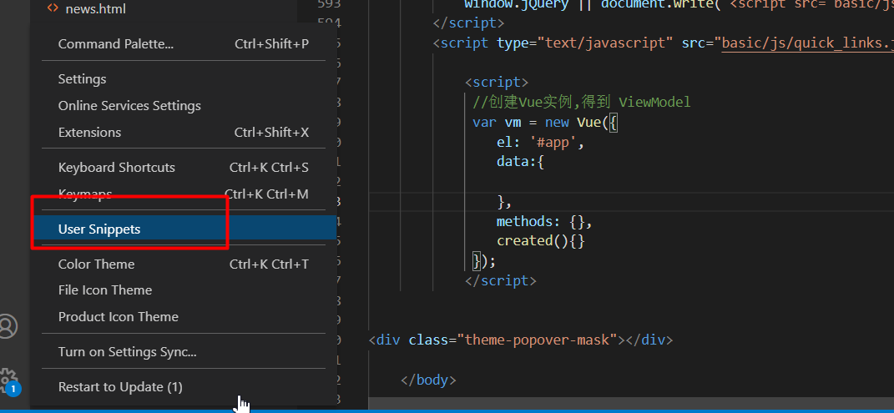
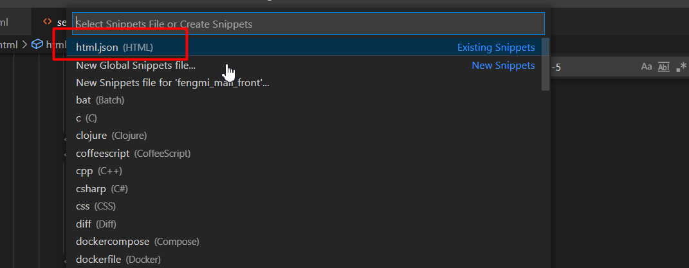

# 项目笔记
## 项目背景  （锋迷铺子）

> 通过互联网项目，应用微服务组件
>
> 垂直电商：B2C   运营平台【单体架构】、门户系统【分布式架构】
>
> 猫眼电影：https://maoyan.com/
>
> 马蜂窝旅游：http://www.mafengwo.cn/
>
> [江寓](http://www.jiangroom.com/index.html)：http://www.jiangroom.com/index.html
>
> 订餐小秘书：http://www.xiaomishu.com/
>
> 扣丁学堂：http://www.codingke.com/   腾讯云、阿里云  【点播服务】
>
> 拍卖系统 艺术品


## 技术选型

### 后端技术

| 技术                | 说明                  | 官网                                                  | 技术在项目中的使用场景 |
| ------------------- | --------------------- | ----------------------------------------------------- | ---------------------- |
| SpringBoot          | 容器+MVC框架          | https://spring.io/projects/spring-boot                |                        |
| springcloud-alibaba | 微服务组件            | https://github.com/alibaba/spring-cloud-alibaba/wiki/ |                        |
| SpringSecurity      | 认证和授权框架        | https://spring.io/projects/spring-security            |                        |
| MyBatis-Plus        | ORM框架               | https://baomidou.com/                                 |                        |
| Redis               | 分布式缓存            | https://redis.io/                                     |                        |
| Nginx               | 静态资源服务器        | https://www.nginx.com/                                |                        |
| RocketMQ            | 消息队列              | https://github.com/alibaba/druid                      |                        |
| elasticsearch       | 搜索引擎              | https://www.elastic.co/cn/elasticsearch/              |                        |
| JWT                 | JWT登录支持           | https://github.com/jwtk/jjwt                          |                        |
| Hutool              | Java工具类库          | https://github.com/looly/hutool                       |                        |
| Swagger-UI          | 文档生成工具,接口文档 | https://github.com/swagger-api/swagger-ui             |                        |
| Springtask          | 定时任务              |                                                       |                        |
| Seata               | 分布式事务            |                                                       |                        |
| Redisson            | 分布式锁              |                                                       |                        |
| Freemarker          | 网页静态化技术        |                                                       |                        |


### 前端技术

| 技术                                    | 说明              | 官网                                                  |
| --------------------------------------- | ----------------- | ----------------------------------------------------- |
| Vue                                     | 前端框架          | https://vuejs.org/                                    |
| Vue-router                              | 路由框架          | https://router.vuejs.org/                             |
| ElementUI（基于vue）layui（基于jquery） | 前端UI框架        | [https://element.eleme.io](https://element.eleme.io/) |
| Axios                                   | 前端HTTP框架      | https://github.com/axios/axios                        |
| Echarts                                 | Echarts的图表框架 | https://v-charts.js.org/                              |

## 项目技术架构


## 工程搭建

### 后台工程搭建

```xml
<?xml version="1.0" encoding="UTF-8"?>
<project xmlns="http://maven.apache.org/POM/4.0.0"
         xmlns:xsi="http://www.w3.org/2001/XMLSchema-instance"
         xsi:schemaLocation="http://maven.apache.org/POM/4.0.0 http://maven.apache.org/xsd/maven-4.0.0.xsd">
    <modelVersion>4.0.0</modelVersion>

    <groupId>org.example</groupId>
    <artifactId>fengmi-mall</artifactId>
    <version>1.0-SNAPSHOT</version>


    <!--    父工程的职责：锁定版本    springboot、springcloud、springcloud-alibaba-->

    <parent>
        <groupId>org.springframework.boot</groupId>
        <artifactId>spring-boot-starter-parent</artifactId>
        <version>2.3.2.RELEASE</version>
        <relativePath/> <!-- lookup parent from repository -->
    </parent>

    <properties>
        <!--   定义变量     -->
        <env>dev</env>
        <mysql.version>5.1.47</mysql.version>
    </properties>

    <build>
        <resources>
            <resource>
                <directory>src/main/resources/</directory>
                <filtering>true</filtering>
            </resource>
        </resources>
    </build>

    <dependencyManagement>
        <dependencies>
            <dependency>
                <groupId>com.alibaba.cloud</groupId>
                <artifactId>spring-cloud-alibaba-dependencies</artifactId>
                <version>2.2.5.RELEASE</version>
                <type>pom</type>
                <scope>import</scope>
            </dependency>
            <dependency>
                <groupId>org.springframework.cloud</groupId>
                <artifactId>spring-cloud-dependencies</artifactId>
                <version>Hoxton.SR8</version>
                <type>pom</type>
                <scope>import</scope>
            </dependency>

        </dependencies>
    </dependencyManagement>


</project>
```


服务的基础依赖

```xml
 <dependencies>
        <dependency>
            <groupId>org.springframework.boot</groupId>
            <artifactId>spring-boot-starter-web</artifactId>
        </dependency>

        <dependency>
            <groupId>org.springframework.boot</groupId>
            <artifactId>spring-boot-starter-actuator</artifactId>
        </dependency>

        <dependency>
            <groupId>com.alibaba.cloud</groupId>
            <artifactId>spring-cloud-starter-alibaba-nacos-discovery</artifactId>
        </dependency>

        <dependency>
            <groupId>com.alibaba.cloud</groupId>
            <artifactId>spring-cloud-starter-alibaba-nacos-config</artifactId>
        </dependency>

        <dependency>
            <groupId>com.baomidou</groupId>
            <artifactId>mybatis-plus-boot-starter</artifactId>
            <version>3.4.2</version>
        </dependency>

        <dependency>
            <groupId>mysql</groupId>
            <artifactId>mysql-connector-java</artifactId>
        </dependency>

        <dependency>
            <groupId>com.alibaba</groupId>
            <artifactId>druid-spring-boot-starter</artifactId>
            <version>1.1.23</version>
        </dependency>
     
     <!-- 以下暂时不需要
      <dependency>
            <groupId>org.springframework.boot</groupId>
            <artifactId>spring-boot-starter-data-redis</artifactId>
        </dependency>

        <dependency>
            <groupId>org.apache.commons</groupId>
            <artifactId>commons-pool2</artifactId>
            <version>2.8.0</version>
        </dependency>

        <dependency>
            <groupId>com.fengmi</groupId>
            <artifactId>fengmi-entity</artifactId>
            <version>1.0-SNAPSHOT</version>
        </dependency> -->


    </dependencies>

```


服务的通用配置

```yml
spring:
  zipkin:
    base-url: http://localhost:9999
    discovery-client-enabled: false
  sleuth:
    sampler:
      rate: 100
  datasource:
    druid:
      driver-class-name: com.mysql.jdbc.Driver
      username: root
      password: 123456
      url: jdbc:mysql://127.0.0.1:3306/fengmi_mall?useUnicode=true&characterEncoding=utf8&useSSL=false
      max-active: 600 #连接池配置  
  cloud:
    nacos:
      discovery:
        server-addr: localhost:8848   #指定nacos-server的服务地址
        username: nacos
        password: nacos
        namespace: dev #将服务发布到指定的命名空间，如果不指定就是默认的命名空间(public)
        group: DEFAULT_GROUP #将服务发布到指定group，如果不指定就是默认的（DEFAULT_GROUP） 
    sentinel:
      transport:
        dashboard: localhost:8888  #指定dashborad地址
        port: 8719 
      eager: true
      web-context-unify: false 
      datasource:
        flow:
          nacos:
            server-addr: ${nacos.server-addr}
            username: ${nacos.username}
            password: ${nacos.password}
            namespace: ${nacos.namespace}
            groupId: SENTINEL_GROUP
            dataId: ${spring.application.name}-flow-rules
            rule-type: flow
        degrade:
          nacos:
            server-addr: ${nacos.server-addr}
            username: ${nacos.username}
            password: ${nacos.password}
            namespace: ${nacos.namespace}
            groupId: SENTINEL_GROUP
            dataId: ${spring.application.name}-degrade-rules
            rule-type: degrade
        param-flow:
          nacos:
            server-addr: ${nacos.server-addr}
            username: ${nacos.username}
            password: ${nacos.password}
            namespace: ${nacos.namespace}
            groupId: SENTINEL_GROUP
            dataId: ${spring.application.name}-param-rules
            rule-type: param-flow
        system:
          nacos:
            server-addr: ${nacos.server-addr}
            username: ${nacos.username}
            password: ${nacos.password}
            namespace: ${nacos.namespace}
            groupId: SENTINEL_GROUP
            dataId: ${spring.application.name}-system-rules
            rule-type: system
        authority:
          nacos:
            server-addr: ${nacos.server-addr}
            username: ${nacos.username}
            password: ${nacos.password}
            namespace: ${nacos.namespace}
            groupId: SENTINEL_GROUP
            dataId: ${spring.application.name}-authority-rules
            rule-type: authority     
feign:
  sentinel:
    enabled: true
nacos:
  server-addr: localhost:8848
  username: nacos
  password: nacos
  namespace: sentinel          
seata:
  enabled: true
  tx-service-group: fengmi_tx_group
  enable-auto-data-source-proxy: true
  config:
    type: nacos
    nacos:
      server-addr: 127.0.0.1:8848
      group: DEFAULT_GROUP
      namespace: pro
      username: nacos
      password: nacos
      data-id: demo_tx_group-pro.properties

  registry: #发现seata-server
    type: nacos
    nacos:
      application: seata-server
      server-addr: 127.0.0.1:8848
      namespace: pro
      group: DEFAULT_GROUP
      username: nacos
      password: nacos  
```


jackson

```xml
    <dependencies>
        <dependency>
            <groupId>com.fasterxml.jackson.core</groupId>
            <artifactId>jackson-annotations</artifactId>
        </dependency>
        <dependency>
            <groupId>com.fasterxml.jackson.core</groupId>
            <artifactId>jackson-core</artifactId>
        </dependency>

        <dependency>
            <groupId>com.fasterxml.jackson.core</groupId>
            <artifactId>jackson-databind</artifactId>
        </dependency>
    </dependencies>

```


将项目fengmi_XX改为fengmi-XX，需要重启nacos

### 前端工程搭建

taskkill /IM nginx.exe /F


## 敏捷开发工具

### 1：任务跟踪工具

https://www.tapd.cn/

### 2：代码版本管理工具

> 后台：https://gitee.com/zhuximing/fengmi_mall.git
>
> 前端：https://gitee.com/zhuximing/fengmi_mall_front.git


git

1:创建本地仓库

2：创建忽略文件

3：将代码推送到本地仓库，生成一个版本

4：创建远程仓库

5：推送本地仓库代码到远程仓库

6：从远程仓库clone代码

7：解决代码合并冲突的问题

8：创建分支

9：分支合并

## 模块开发

### 一：首页

#### 1.1：功能

1：内容

2：商品分类展示

3：热门商品展示

#### 1.2：表设计

相关表：

cms_content、cms_content_cat

mall_goods_cat、mall_goods


#### 1.3：首页流程（架构）


#### 1.4：功能开发

轮播图


```yml
spring:
  datasource:
    druid:
      driver-class-name: com.mysql.jdbc.Driver
      username: root
      password: 123456
      url: jdbc:mysql://127.0.0.1:3306/fengmi_mall?useUnicode=true&characterEncoding=utf8&useSSL=false
      max-active: 40 #连接池配置
  cloud:
    nacos:
      discovery:
        server-addr:  localhost:8848 #指定nacos的服务地址
        username: nacos #指定用户名
        password: nacos #指定密码
        namespace: sit
        group: DEFAULT_GROUP   
  
```


```yml
spring:
  cloud:
    nacos:
      config:
        server-addr: localhost:8848
        namespace: sit
        prefix: fengmi-cms
        file-extension: yml
        shared-dataids: common.yml
        refreshable-dataids: common.yml
  profiles:
    active: sit
```


首页主要代码：

vsCode安装插件 Vetur和Vue 3 Snippets，


跨域问题解决

640行延时轮播

redis缓存问题

#### 1.5 热销商品开发

  按照首页轮播思路进行


### 二：站内搜索

#### 2.1：功能

1：解决冷启动（将数据库中已经审核通过的商品同步到elasticsearch）

2：搜索功能【基于es搜索】

​        a)：关键字搜索

​                关键字匹配【商品标题、商品品牌、商品第三级分类】【复合查询should】

​                分页、高亮

​        b)：显示过滤面板

​                分桶【品牌、商品第三级分类】

​         c)：过滤【品牌、商品第三级分类】

​         d)：排序【价格优先】

3：商品审核通过后，必须同步索引库

#### 2.2：域设计

```txt
1：类型
2：是否建立索引
3：是否存储
4：要不要分词、采用哪种分词
```


spu、sku


```java
package com.wfx;

import lombok.Data;
import org.springframework.data.annotation.Id;
import org.springframework.data.elasticsearch.annotations.Document;
import org.springframework.data.elasticsearch.annotations.Field;
import org.springframework.data.elasticsearch.annotations.FieldType;

import java.util.Date;
@Data
@Document(indexName = "es-goods",  shards = 1, replicas = 0)
public class ESGoods {
    @Id
    private Long spuId;                        // spuId

    @Field(type = FieldType.Text, analyzer = "ik_max_word",store=true)
    private String goodsName;

    @Field(type=FieldType.Long,index=true,store=true)
    private Long brandId;                       // 品牌id
    
    @Field(type = FieldType.Keyword,index=true,store=true)
    private String brandName;                   //品牌名称

     @Field(type=FieldType.Long,index=true,store=true)
    private Long cid1id;                        // 1级分类id
    @Field(type = FieldType.Keyword,index=true,store=true)
    private String cat1name;                    // 1级分类名称
   
     @Field(type=FieldType.Long,index=true,store=true)
    private Long cid2id;                        // 2级分类id
     @Field(type = FieldType.Keyword,index=true,store=true)
    private String cat2name;                    // 2级分类名称
   
    
    @Field(type=FieldType.Long,index=true,store=true)
    private Long cid3id;                        // 3级分类id
     @Field(type = FieldType.Keyword,index=true,store=true)
    private String cat3name;                    // 3级分类名称

	 @Field(type=FieldType.Date,index=true,store=true)
    private Date createTime;                    // 创建时间
    @Field(type=FieldType.Double,index=true,store=true)
    private Double price;                       // 价格，spu默认的sku的price
    @Field(type = FieldType.Keyword,index = false,store=true)
    private String smallPic;                    // 图片地址
}
```


#### 2.3：开发流程

功能1：

```xml
<?xml version="1.0" encoding="UTF-8" ?>
<!DOCTYPE mapper
        PUBLIC "-//mybatis.org//DTD Mapper 3.0//EN"
        "http://mybatis.org/dtd/mybatis-3-mapper.dtd">
<mapper namespace="com.wfx.mapper.WxbGoodsMapper">

        <!-- List<WxbGoods> findGoodsSpuInfo();-->

    <resultMap id="findGoodsSpuInfoMap" type="WxbGoods">
        <result property="id" column="spuId"></result>
        <result property="sellerId" column="seller_id"></result>
        <result property="goodsName" column="goods_name"></result>
        <result property="price" column="default_price"></result>
        <result property="typeTemplateId" column="template_id"></result>
        <result property="smallPic" column="small_pic"></result>
        <!-- 品牌-->
        <association property="brand" javaType="WxbGoodsBrand">
            <id property="id" column="brand_id"></id>
            <result property="name" column="brand_name"></result>
        </association>
        <!-- 一级分类-->
        <association property="cat1" javaType="WxbGoodsCat">
            <id property="id" column="cat1id"></id>
            <result property="name" column="cat1name"></result>
        </association>
        <!-- 二级分类-->
        <association property="cat2" javaType="WxbGoodsCat">
            <id property="id" column="cat2id"></id>
            <result property="name" column="cat2name"></result>
        </association>
        <!-- 三级分类-->
        <association property="cat3" javaType="WxbGoodsCat">
            <id property="id" column="cat3id"></id>
            <result property="name" column="cat3name"></result>
        </association>
    </resultMap>


    <select id="findGoodsSpuInfo" resultMap="findGoodsSpuInfoMap">

            SELECT
            goods.id as spuId,
            goods.seller_id ,
            goods.goods_name,
            goods.price as default_price,
            goods.small_pic,
            brand.id as brand_id,
            brand.`name` as brand_name,
            cat1.id as cat1id,
            cat1.`name` as cat1name,
            cat2.id as cat2id,
            cat2.`name` as cat2name,
            cat3.id as cat3id,
            cat3.`name` as cat3name,
            cat3.template_id

             from wxb_goods goods
            LEFT JOIN wxb_goods_brand brand on brand.id = goods.brand_id
            LEFT JOIN wxb_goods_cat cat1 on cat1.id = goods.category1_id
            LEFT JOIN wxb_goods_cat cat2 on cat2.id = goods.category2_id
            LEFT JOIN wxb_goods_cat cat3 on cat3.id = goods.category3_id
			where goods.audit_status=1
    </select>


</mapper>
```








```json
{"h5 template": {
	"prefix": "app", // 对应的是使用这个模板的快捷键
	"body": [
	 "\t<script>",
	 "\t //创建Vue实例,得到 ViewModel",
	 "\t var vm = new Vue({",
	 "\t\tel: '#app',",
	 "\t\tdata:{\n",
	 "\t\t},",
	 "\t\tmethods: {},",
	 "\t\tcreated(){}",
	 "\t });",
	 "\t</script>"
	],
	"description": "HT-H5" // 模板的描述
 }
}
```


