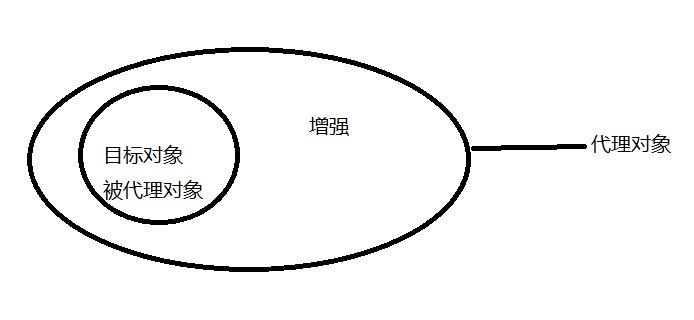

# 动态代理和SpringAOP

## 一、动态代理

### 1.1、什么是动态代理

​    **动态代理修改的是字节码。重点**

> 动态代理是一种在不修改源码的情况下对方法进行增强的技术。
>
> **特点**：字节码随用随创建，随用随加载；
>
> **作用**：不修改源码的基础上对方法增强；
>
> **学习目的**：为了学习AOP的原理做准备。
>
> **实现方式**：
>
> 1) 基于接口的动态代理，JDK官方提供，**被代理类最少实现一个接口，如果没有则不能使用**；
>
> 2) 基于子类的动态代理，第三方cglib库提供，**被代理类不能是被final修饰的类。**

### 1.2、需要明确的几个概念

> **目标对象**：被增强的对象，被代理的对象。
>
> **目标方法**：被增强的方法。
>
> **代理对象**：需要目标对象，然后在目标对象上添加了增强后的对象。
>
> 

```
代理对象 = 目标对象 + 增强
```



> 到现在为止，我们需要知道有一种方式可以在不改变目标对象方法的前提下，对方法进行增强，这个方式就是**动态代理**。使用它，我们需要提供**目标对象**和**增强**生成**代理对象**。
>
> 得到了**代理对象**就相当于有了一个强化版的**目标对象**，运行相关方法，除了运行方法本身，增强的内容也会被运行，从而实现了在不改变源码的前提下，对方法进行增强。
>
> 

### 1.3、JDK的动态代理   重要  面试

> **被代理类（目标类，被增强的类）最少实现一个接口，如果没有则不能使用**

#### 1.3.1、创建目标类接口

```java
//表示服务员的接口
public interface IWaiter {
    //提供服务的方法
    void serve();
}
```

#### 1.3.2、创建目标类

```java
//目标类
public class ManWaiter implements IWaiter {
	//目标方法
    @Override
    public void serve() {
        System.out.println("服务...");
    }
}
```

#### 1.3.3、增强

```java
//增强
public class Advice {
	/*
		前置增强，在目标方法之前运行
	*/
    public void before() {
        System.out.println("您好...");
    }

    /*
		后置增强，在目标方法之后运行
	*/
    public void after() {
        System.out.println("再见...");
    }
}
```

#### 1.3.4、实现基于JDK的动态代理

```java
//测试基于JDK的动态代理，实现在不修改ManWaiter方法源码的情况下，对ManWaiter的的方法进行增强
@Test
public void testJdkProxy() {
    //目标对象
    IWaiter manWaiter = new ManWaiter();
    //增强
    Advice advice = new Advice();

    //代理对象
    /**
	 * ClassLoader: 类加载器
     *      用于加载代理对象字节码，和被代理对象使用相同的类加载器，写法固定
     * Class<?>[]：字节码数组
     *      用于让代理对象和被代理对象有相同方法，写法固定
     * InvocationHandler：提供增强的代码
     *      用于我们写如何代理，我们一般都行写这个接口的实现类，通常情况下是匿名内部类
     *
     */
    IWaiter waiter = (IWaiter) Proxy.newProxyInstance(
        manWaiter.getClass().getClassLoader(),
        manWaiter.getClass().getInterfaces(),
        new InvocationHandler() {
            @Override
            /**
			 * 作用：执行被代理对象的任何接口方法都会经过该方法
             * proxy：代理对象的引用
             * method：当前执行的方法
             * args：当前执行方法所需的参数
             * 返回值：和被代理对象方法有相同的返回值
             *
             */
            public Object invoke(Object proxy, Method method, Object[] args) throws Throwable {
                //前置增强
                advice.before();
                //执行被增强方法
                Object result = method.invoke(manWaiter, args);
                //后置增强
                advice.after();
                //返回结果
                return result;
            }
        }
    );

    //执行目标对象的方法
    waiter.serve();
}
```

### 1.4、cglib的动态代理   重要  面试

> **被代理类不需要实现接口，被代理类不能是final类**

#### 1.4.1、添加相关依赖

> pom.xml

```xml
<dependency>
    <groupId>cglib</groupId>
    <artifactId>cglib</artifactId>
    <version>2.2</version>
</dependency>
```

#### 1.4.2、创建目标类（被代理类，被增强的类）

```java
public class WomanWaiter {
    public void serve() {
        System.out.println("服务...");
    }
}
```

#### 1.4.3、增强

```java
//增强
public class Advice {

    public void before() {
        System.out.println("您好...");
    }

    public void after() {
        System.out.println("再见...");
    }

}
```

#### 1.4.4、基于cglib的动态代理

```java
/**
  * 涉及的类：Enhancer
  * 提供者：第三方cglib库
  * 如何创建代理对象：使用Enhancer类中的create方法
  * 创建代理对象的要求：被代理类不能是final类
  * create方法的参数：
  *      Class：字节码
  *          用于指定被代理对象的字节码
  *      Callback：用于提供增强的代码
  *          它是让我们写如何代理，一般都是写一些该接口的实现类，通常情况下是匿名内部类。
  *          一般写的都是该接口的子接口实现类：MethodInterceptor
  *
  */
@Test
public void testCglib() {
    //目标对象
    WomanWaiter waiter = new WomanWaiter();
    //增强
    Advice advice = new Advice();

    //代理对象
    WomanWaiter proxyWaiter = (WomanWaiter)Enhancer.create(waiter.getClass(), new MethodInterceptor() {

        /**
         * 执行被代理对象的任何方法都会经过该方法
         *
         * 前三个参数和基于接口的动态代理中invoke方法的参数是一样的
         */
        @Override
        public Object intercept(Object o, Method method, Object[] objects, MethodProxy methodProxy) throws Throwable {
            advice.before();
            Object result = method.invoke(waiter, objects);
            advice.after();

            return result;
        }
    });

    //执行目标对象的方法
    proxyWaiter.serve();
}
```

> 总结：创建代理对象的过程就是把“目标对象”和“增强”结合到一起的过程。

### 1.5、使用代理工厂实现动态代理     了解

#### 1.5.1、创建前置增强接口及其实现

```java
//前置增强接口
public interface BeforeAdvice {
    void before();
}

//前置增强接口实现
public class BeforeAdviceImpl implements BeforeAdvice {
    @Override
    public void before() {
        System.out.println("您好！");
    }
}
```

#### 1.5.2、创建后置增强接口及其实现

```java
//后置增强接口
public interface AfterAdvice {
    void after();
}

//后置增强接口实现
public class AfterAdviceImpl implements AfterAdvice {
    @Override
    public void after() {
        System.out.println("再见...");
    }
}
```

#### 1.5.3、创建代理工厂     （创建一个代理对象）

```java
import java.lang.reflect.InvocationHandler;
import java.lang.reflect.Method;
import java.lang.reflect.Proxy;

//代理工厂
public class ProxyFactory {
    private Object targetObject;//目标对象
    private BeforeAdvice beforeAdvice;//前置增强
    private AfterAdvice afterAdvice;//后置增强

    public Object getTargetObject() {
        return targetObject;
    }

    public void setTargetObject(Object targetObject) {
        this.targetObject = targetObject;
    }

    public BeforeAdvice getBeforeAdvice() {
        return beforeAdvice;
    }

    public void setBeforeAdvice(BeforeAdvice beforeAdvice) {
        this.beforeAdvice = beforeAdvice;
    }

    public AfterAdvice getAfterAdvice() {
        return afterAdvice;
    }

    public void setAfterAdvice(AfterAdvice afterAdvice) {
        this.afterAdvice = afterAdvice;
    }

    //用来生成代理对象
    public Object createProxyObject() {
        //三大参数
        ClassLoader classLoader = this.targetObject.getClass().getClassLoader();
        Class[] interfaces = this.targetObject.getClass().getInterfaces();
        InvocationHandler handler = new InvocationHandler() {
            //在调用代理对象的方法时会执行这里的内容
            @Override
            public Object invoke(Object proxy, Method method, Object[] args) throws Throwable {
                Object resultValue = null;

                if(beforeAdvice != null) {
                    //执行前置增强
                    beforeAdvice.before();
                }
                //执行目标对象的目标方法
                resultValue = method.invoke(targetObject, args);
                if(afterAdvice != null) {
                    //执行后置增强
                    afterAdvice.after();
                }
                //返回目标对象的返回值
                return resultValue;
            }
        };

        //得到代理对象
        return Proxy.newProxyInstance(classLoader, interfaces, handler);
    }
}
```

#### 1.5.4、测试

```java
@Test
public void test3() {
    //创建代理工厂
    ProxyFactory factory = new ProxyFactory();
    //创建增强
    BeforeAdvice beforeAdvice = new BeforeAdviceImpl();
    AfterAdvice afterAdvice = new AfterAdviceImpl();
    //设置目标对象
    factory.setTargetObject(new ManWaiter());
    //设置增强
    factory.setBeforeAdvice(beforeAdvice);
    factory.setAfterAdvice(afterAdvice);
    //创建代理对象
    IWaiter proxyObject = (IWaiter) factory.createProxyObject();
    //执行目标方法
    proxyObject.serve();
}
```

### 1.6、使用代理工厂结合Spring实现动态代理    了解

#### 1.6.1、创建Spring的配置文件

 ```xml
 <bean id="beforeAdvice" class="com.qfedu.advice.impl.BeforeAdviceImpl"/>
 <bean id="afterAdvice" class="com.qfedu.advice.impl.AfterAdviceImpl" />
 <bean id="manWaiter" class="com.qfedu.proxy.ManWaiter" />
 
 <bean id="proxyFacory" class="com.qfedu.factory.ProxyFacory">
     <property name="beforeAdvice" ref="beforeAdvice" />
     <property name="afterAdvice" ref="afterAdvice" />
     <property name="targetObject" ref="manWaiter" />
 </bean>
 ```

#### 1.6.2、测试

```java
@Test
public void test4() {
    ApplicationContext context = new ClassPathXmlApplicationContext("applicationContext.xml");
    ProxyFacory facory = (ProxyFacory)context.getBean("proxyFacory");

    IWaiter manWaiter = (IWaiter)facory.createProxyObject();
    manWaiter.serve();
}
```


## 二、AOP简介

### 2.1、什么是AOP

> AOP为Aspect Oriented Programming的缩写，意思为**面向切面编程**，是通过预编译方式和运行期动态代理实现程序功能的统一维护的一种技术。
>
> AOP是OOP的延续，是软件开发中的一个热点，也是Spring框架中的一个重要内容，是函数式编程的一种衍生范型。利用AOP可以对业务逻辑的各个部分进行隔离，从而使得业务逻辑各部分之间的耦合度降低，提高程序的可重用性，同时提高了开发的效率。

### 2.2、AOP的作用及其优势

> 作用：在程序运行期间，在不修改源码的情况下对方法进行功能增强。
>
> 优势：减少重复代码，提高开发效率，并且便于维护。

### 2.3、AOP的底层实现

​     **JDK动态代理和cglib动态代理**

> 实际上，AOP的底层是通过Spring提供的的**动态代理**技术实现的。
>
> 在运行期间，Spring通过动态代理技术动态的生成代理对象，代理对象方法执行时进行增强功能的介入，在去调用目标对象的方法，从而完成功能的增强。

### 2.4、AOP的相关概念  了解

> Spring的AOP实现底层就是对上面的动态代理的代码进行了封装，封装后我们只需要对需要关注的部分进行代码编写，并通过配置的方式完成指定目标的方法增强。
>
> 在正式学习之前，必须了解的几个概念：
>
> * **Target（目标对象）**：被增强的对象；
> * **Proxy （代理）**：一个类被增强后，就产生一个结果代理类（代理=目标+增强）；
> * Joinpoint（连接点）：所谓连接点是指那些被拦截到的点。在Spring中，这些点指的是方法，因为Spring只支持方法类型的连接点；
> * **Pointcut（切入点）**：所谓切入点是指我们要对哪些 Joinpoint 进行拦截的定义；
> * **Advice（通知/ 增强）**：所谓通知是指拦截到 Joinpoint 之后所要做的事情就是通知；
> * **Aspect（切面）**：是切入点和通知的结合；
> * Weaving（织入）：是指把增强应用到目标对象来创建新的代理对象的**过程**。Spring采用动态代理织入，而AspectJ采用编译期织入和类装载期织入。
>
> 目前先了解这些概念，特别注意加粗的几个概念。
>
> 现在就明确在Spring中有这么一种技术，能够在不修改方法代码的基础上对方法功能进行增强就行了。
>
> * Joinpoint（连接点）：有可能被增强的方法
> * Pointcut（切入点）：实际被增强的方法
> * Advice（通知/ 增强）：封装增强业务逻辑的方法
> * Aspect（切面）：切点+通知
> * Weaving（织入）：将切点与通知结合的过程

### 2.5、AOP开发需要明确的事项

> **1) 需要编写的内容**
>
> * 编写核心业务代码（目标类的目标方法）
> * 编写切面类，切面类中有通知（增强功能方法）
> * 在配置文件中，配置织入关系，即将哪些通知与哪些连接点进行结合
>
> 换一种说法：
>
> * 谁是切点（切点表达式配置）
> * 谁是增强（切面类中的增强方法）
> * 将切点和通知进行织入配置
>
> **2) AOP技术实现的内容**
>
> Spring框架监控切入点方法的执行。一旦监控到切入点方法被运行，使用代理机制，动态创建目标对象的代理对象，根据通知类别，在代理对象的对应位置，将通知对应的功能织入，完成完整的代码逻辑运行。
>
> **3) AOP 底层使用哪种代理方式**
>
> 在Spring中，框架会根据目标类是否实现了接口来决定采用哪种动态代理的方式。

## 三、基于XML的AOP开发  了解 

### 3.1、快速入门

> **主要步骤：**
>
> 1) 创建Maven工程并导入坐标；
>
> 2) 创建目标接口和目标类；
>
> 3) 创建增强类；
>
> 4) 将目标类和增强类的对象创建权交给Spring；
>
> 5) 配置织入关系
>
> 6) 测试

#### 3.1.1、创建Maven工程并导入坐标

pom.xml

```xml
<?xml version="1.0" encoding="UTF-8"?>
<project xmlns="http://maven.apache.org/POM/4.0.0"
         xmlns:xsi="http://www.w3.org/2001/XMLSchema-instance"
         xsi:schemaLocation="http://maven.apache.org/POM/4.0.0 http://maven.apache.org/xsd/maven-4.0.0.xsd">
    <modelVersion>4.0.0</modelVersion>

    <groupId>com.qfedu</groupId>
    <artifactId>01_springaop</artifactId>
    <version>1.0.0</version>

    <dependencies>
        <dependency>
            <groupId>org.springframework</groupId>
            <artifactId>spring-beans</artifactId>
            <version>5.2.6.RELEASE</version>
        </dependency>
        <dependency>
            <groupId>org.springframework</groupId>
            <artifactId>spring-expression</artifactId>
            <version>5.2.6.RELEASE</version>
        </dependency>
        <dependency>
            <groupId>org.springframework</groupId>
            <artifactId>spring-context</artifactId>
            <version>5.2.6.RELEASE</version>
        </dependency>
        <dependency>
            <groupId>org.springframework</groupId>
            <artifactId>spring-core</artifactId>
            <version>5.2.6.RELEASE</version>
        </dependency>
        
        <dependency>
            <groupId>org.springframework</groupId>
            <artifactId>spring-aop</artifactId>
            <version>5.2.6.RELEASE</version>
        </dependency>
        <dependency>
            <groupId>org.springframework</groupId>
            <artifactId>spring-aspects</artifactId>
            <version>5.2.6.RELEASE</version>
        </dependency>
    </dependencies>
</project>
```

#### 3.1.2、创建目标接口和目标类

```java
//目标接口
public interface IWaiter {
    //上菜
    void food();
    //上酒
    void wine();
    //上烟
    void smoke();
}

//目标类
public class ManWaiter implements IWaiter {
    @Override
    public void food() {
        System.out.println("上菜！！！！");
    }

    @Override
    public void wine() {
        System.out.println("上酒！！！！");
    }

    @Override
    public void smoke() {
        System.out.println("上烟！！！！");
    }
}
```

#### 3.1.3、创建增强类

```java
public class WaiterAspect {
    public void abc() {
        System.out.println("你好...");
    }
}
```

#### 3.1.4、将目标类和增强类的对象创建权交给Spring

```xml
<bean id="waiter" class="com.qfedu.aop.ManWaiter" />
<bean id="waiterAspect" class="com.qfedu.aop.WaiterAspect" />
```

#### 3.1.5、配置织入关系

```xml
<?xml version="1.0" encoding="UTF-8"?>
<beans xmlns="http://www.springframework.org/schema/beans"
       xmlns:aop="http://www.springframework.org/schema/aop"
       xmlns:xsi="http://www.w3.org/2001/XMLSchema-instance"
       xsi:schemaLocation="http://www.springframework.org/schema/beans
       http://www.springframework.org/schema/beans/spring-beans.xsd
       http://www.springframework.org/schema/aop
       http://www.springframework.org/schema/aop/spring-aop.xsd">
    <!-- 配置目标类 -->
    <bean id="waiter" class="com.qfedu.aop.ManWaiter" />
    <!-- 配置增强类 -->
    <bean id="waiterAspect" class="com.qfedu.aop.WaiterAspect" />

    <!-- 配置织入  记住 -->
    <aop:config>
        <aop:aspect ref="waiterAspect">
            <!--配置waiter的food方法执行时要使用waiterAspect的before方法进行前置增强-->
            <aop:before method="abc" pointcut="execution(public void com.qfedu.aop.ManWaiter.food())" />
        </aop:aspect>
    </aop:config>
</beans>
```

#### 3.1.6、测试代码

```java
@Test
public void test1() throws Exception {
    ApplicationContext context = new ClassPathXmlApplicationContext("classpath:applicationContext.xml");
    IWaiter waiter = (IWaiter)context.getBean("waiter");

    waiter.food();
    System.out.println("---------------------------------------------------");
    waiter.smoke();
}
```

> 配置了增强的方法之前打印了“你好”，没有配置增强的方法之前没有出现“你好”。

### 3.2、XML配置AOP详解

#### 3.2.1、切点表达式         

> **语法：**

```xml
execution([修饰符] 返回值类型 包名.类名.方法名(参数))
```

> 
>
> **注意：**
>
> 1) 访问修饰符可以省略
>
> 2) 返回值类型、包名、类名、方法名可以使用星号*代表任意
>
> 3) 包名与类名之间一个点 . 代表当前包下的类，两个点 .. 表示当前包及其子包下的类
>
> 4) 参数列表可以使用两个点 .. 表示任意个数，任意类型的参数列表
>
> **案例：**

```xml
execution(public void com.qfedu.aop.ManWaiter.food())
execution(void com.qfedu.aop.ManWaiter.food())
execution(* com.qfedu.aop.ManWaiter.*(..))
execution(* com.qfedu.aop..*.*(..))
execution(* *..*.*(..))       常用！！！
```


#### 3.2.2、通知的类型    重点 


> 通知的配置：

```xml
<aop:通知类型 method="切面类中方法名" pointcut="切点表达式"></aop:通知类型>
```

| 名称         | 配置                    | 说明                     |
| ------------ | ----------------------- | ------------------------ |
| 前置通知     | `<aop:before>`          | 在切入点之前运行         |
| 后置通知     | `<aop:after-returning>` | 在切入点之后运行         |
| 环绕通知     | `<aop:around>`          | 在切入点之前和之后都运行 |
| 异常抛出通知 | `<aop:after-throwing>`  | 在出现异常时运行         |
| 最终通知     | `<aop:after>`           | 无论是否出现异常都运行   |

> 修改增强类

```java
public class WaiterAspect {
    //前置通知
    public void before() {
        System.out.println("你好...");
    }

    //后置通知
    public void afterReturning() {
        System.out.println("吃好喝好...");
    }


    //环绕通知
    public void around(ProceedingJoinPoint pjp) throws Throwable {
        try {
            System.out.println("你好！");
            Object proceed = pjp.proceed();//执行目标方法
            System.out.println("吃好喝好！");
        } catch (Exception e) {
            System.out.println("....");
        } finally {
            System.out.println("再见...");
        }
    }

    //异常抛出通知
    public void afterThrowing() {
        System.out.println("........");
    }

    //最终通知
    public void after() {
        System.out.println("再见...");
    }
}
```

> 配置织入关系

```xml
<?xml version="1.0" encoding="UTF-8"?>
<beans xmlns="http://www.springframework.org/schema/beans"
       xmlns:aop="http://www.springframework.org/schema/aop"
       xmlns:xsi="http://www.w3.org/2001/XMLSchema-instance"
       xsi:schemaLocation="http://www.springframework.org/schema/beans
       http://www.springframework.org/schema/beans/spring-beans.xsd
       http://www.springframework.org/schema/aop
       http://www.springframework.org/schema/aop/spring-aop.xsd">
    <!-- 配置目标类 -->
    <bean id="waiter" class="com.qfedu.aop.ManWaiter" />
    <!-- 配置增强类 -->
    <bean id="waiterAspect" class="com.qfedu.aop.WaiterAspect" />
	
    <!-- 配置织入 -->
    <aop:config>
        <aop:aspect ref="waiterAspect">
            <!--<aop:before method="before" pointcut="execution(* *..*(..))" />-->
            <!--<aop:after-returning method="afterReturning" pointcut="execution(* *..*(..))" />-->
            <!--<aop:after-throwing method="afterThrowing" pointcut="execution(* *..*(..))" />-->
            <!--<aop:after method="after" pointcut="execution(* *..*(..))" />-->
			<aop:around method="around" pointcut-ref="execution(* *..*(..))" />
        </aop:aspect>
    </aop:config>
</beans>
```

> **通常情况下，环绕通知都是独立使用的。**

#### 3.2.3、切点表达式的抽取

> 当多个增强的切点表达式相同时，可以将切点表达式进行抽取，在增强中使用pointcut-ref属性代替pointcut属性来引用抽取后的切点表达式。

```xml
<?xml version="1.0" encoding="UTF-8"?>
<beans xmlns="http://www.springframework.org/schema/beans"
       xmlns:aop="http://www.springframework.org/schema/aop"
       xmlns:xsi="http://www.w3.org/2001/XMLSchema-instance"
       xsi:schemaLocation="http://www.springframework.org/schema/beans
       http://www.springframework.org/schema/beans/spring-beans.xsd
       http://www.springframework.org/schema/aop
       http://www.springframework.org/schema/aop/spring-aop.xsd">
    <!-- 配置目标类 -->
    <bean id="waiter" class="com.qfedu.aop.ManWaiter" />
    <!-- 配置增强类 -->
    <bean id="waiterAspect" class="com.qfedu.aop.WaiterAspect" />
	
    <!-- 配置织入 -->
    <aop:config>
        <aop:aspect ref="waiterAspect">
            <aop:pointcut id="pt1" expression="execution(* *..*(..))" />
            <!--<aop:before method="before" pointcut-ref="pt1" />-->
            <!--<aop:after-returning method="afterReturning" pointcut-ref="pt1" />-->
            <!--<aop:after-throwing method="afterThrowing" pointcut-ref="pt1" />-->
            <!--<aop:after method="after" pointcut-ref="pt1" />-->
            <aop:around method="around" pointcut-ref="pt1" />
		</aop:aspect>
    </aop:config>
</beans>
```
