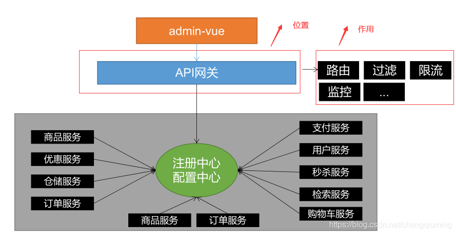
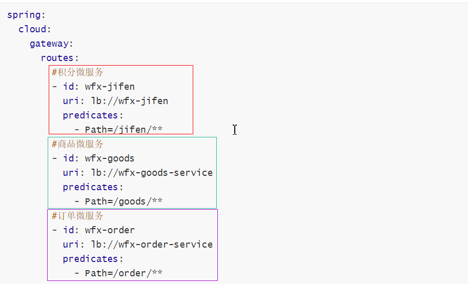
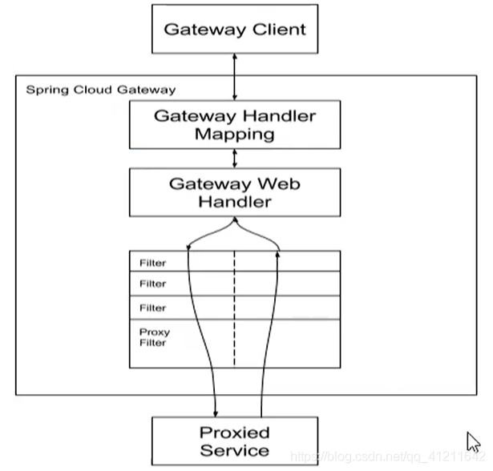
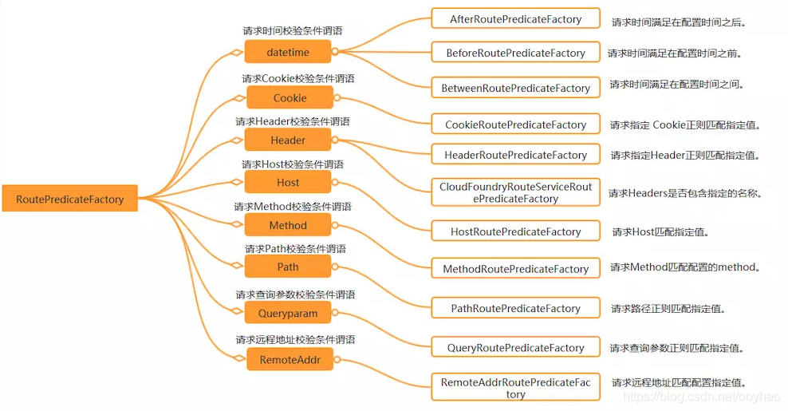

# GateWay

**面试题**

**比方问你，项目中用的网关： Spring Cloud Gateway , Zuul**

**网关中如何进行限流，通过整合Sentinel服务哨兵进行限流**

**运行过程中，始终无法运行到自己的业务逻辑模块中，可能的原因是什么？**

**过滤器**

**跨域问题如何解决：**

**1 项目中用到了网关，在网关中解决跨域**

**2 单体项目，用@CrossOrign注解**

# 一：Gateway简介

文档：https://spring.io/projects/spring-cloud-gateway#learn

> 小结：
>
> nacos ：注册中心，解决服务的注册与发现
>
> nacos ：配置中心，配置文件中心化管理
>
> Ribbon：客户端负载均衡器，解决微服务集群负载均衡的问题
>
> Openfeign：声明式HTTP客户端，解决微服务之间远程调用问题
>
> Sentinel：微服务流量防卫兵,以流量为入口，保护微服务，防止出现服务雪崩.


## 1.1：为什么使用网关

​      nginx 的动静分离   





## 1.2：Spring  cloud-gateway简介

是基于spring5、springboot2.0和Project Reactor等技术开发的网关，目的是为微服务架构系统提供高性能，且简单易用的api路由管理方式。

优点：

1：性能强劲，是第一代网关**zuul（netflix）**的1.6倍

2：功能强大，内置很多实用功能如：路由、过滤、限流、监控等。

3：易于扩展。


## 1.3：gateway核心概念




- Route（路由）

```
路由是构建网关的基本模块，它由ID，目标URI，一系列的断言和过滤器组成，如果断言为true则匹配该路由
```

- Predicate（断言、谓词）

```
开发人员可以匹配HTTP请求中的所有内容（例如请求头或请求参数），如果请求与断言相匹配则进行路由
```

- Filter（过滤）

```
指的是Spring框架中GatewayFilter的实例，使用过滤器，可以在请求被路由前或者之后对请求进行修改
```


## 1.4：gateway的工作流程

```txt
1:客户端向 Spring Cloud Gateway 发出请求。然后在 Gateway Handler Mapping 中找到与请求相匹配的路由
2:将其发送到 Gateway Web Handler。
3:Handler 再通过指 定的过滤器链来将请求发送到我们实际的服务执行业务逻辑，然后返回。过滤器之间用虚线分开是因为过滤器可能会在发送代理请求之前（“pre”）或之后（“post”）执行业务逻辑。
```





## 1.5：搭建网关

### 1.5.1：pom依赖

注意：不要依赖spring-boot-starter-web

```xml
<dependency>
    <groupId>org.springfrawmework.boot</groupId>
    <!--servlet编程模型、运行的服务器是tomcat-->
    <artifactId>spring-boot-starter-web</artifactId>
</dependency>
```

依赖如下:         

​             webflux  （非阻塞式） 高并发的场景                reactor                   (netty)

​             springmvc  (阻塞式)     @ControllerAdvice        servlet    （tomcat）   DispatcherServlet

```xml
 <dependencies>
        <!--   spring-cloud gateway,底层基于netty     -->
        <dependency>
            <groupId>org.springframework.cloud</groupId>
            <artifactId>spring-cloud-starter-gateway</artifactId>
        </dependency>
      <!-- 端点监控 -->
        <dependency>
            <groupId>org.springframework.boot</groupId>
            <artifactId>spring-boot-starter-actuator</artifactId>
        </dependency>

        <!--  nacos注册中心      -->
        <dependency>
            <groupId>com.alibaba.cloud</groupId>
            <artifactId>spring-cloud-starter-alibaba-nacos-discovery</artifactId>
        </dependency>
    </dependencies>
```


### 1.5.2：基本配置

配置文件采用yml

```yml
server:
  #gateway的端口
  port: 8040

spring:
  application:
    name: cloud-gateway
  cloud:
    nacos:
      discovery:
        server-addr: 127.0.0.1:8848
```


### 1.5.3：引导类

```java
package com.wfx;

import org.springframework.boot.SpringApplication;
import org.springframework.boot.autoconfigure.SpringBootApplication;
import org.springframework.cloud.client.discovery.EnableDiscoveryClient;


@SpringBootApplication
@EnableDiscoveryClient
public class WfxGateway {

    public static void main(String[] args) {
        SpringApplication.run(WfxGateway.class,args);
    }

}
```


# 二：路由配置姿势

## 2.1：路由到指定URL

```yaml
spring:
  cloud:
    gateway:
      routes:
        - id: baidu
          uri: http://www.baidu.com
          predicates:
            - Path=/**
         
     
```

访问 http://localhost:8040/**  转发给   http://www.baidu.com/**

http://localhost:8040/a     =>     http://www.baidu.com/a

http://localhost:8040/a/b     =>     http://www.baidu.com/a/b


## 2.2：路由到微服务

静态路由和动态路由


### 2.2.1：静态路由


```yml
spring:
    cloud:
     gateway:
      #路由是一个数组，可以配置多个路由
      routes:
        #配置商品微服务,静态配置
        - id: wfx-goods
          uri: http://localhost:8001
          predicates:
            - Path=/goods/**
```


### 2.2.2：动态路由

```yml
server:
  #gateway启动端口
  port: 8040
spring:
  cloud:
    gateway:
      routes:
        #配置商品微服务
        - id: wfx-goods
          uri: lb://wfx-goods
          predicates:
            - Path=/goods/**
        #配置积分微服务
        - id: wfx-jifen
          uri: lb://wfx-jifen
          predicates:
            - Path=/jifen/**
        #配置订单微服务
        - id: wfx-order
          uri: lb://wfx-order
          predicates:
            - Path=/order/**
    nacos:
      discovery:
        server-addr: 127.0.0.1:8848
  application:
    name: wfx-gateway

```

@LoadBalanced       ----> Ribbon


# 三：谓词工厂详解

Spring Cloud Gateway提供了十来种路由谓词工厂。为网关实现灵活的转发提供了基石。

Spring Cloud Gateway中内置的谓词工厂，包括：




### Path      重要

```yml
 gateway:
      #配置路由规则
      routes:
        - id: wfx-goods
          #请求转发到微服务集群
          uri: lb://wfx-goods
          predicates:
            - Path=/goods/**    #http://localhost:8040/goods/hello ->lb://wfx-goods/goods/hello
```


### After

示例：

```yaml
spring:
  cloud:
    gateway:
      routes:
        - id: wfx-jifen
          uri: lb://wfx-goods
          predicates:       //谓词
            - Path=/goods/detail/100   //true
            - After=2024-10-29T22:24:40.626+08:00[Asia/Shanghai]   //true
```

### Before

示例：

```yaml
spring:
  cloud:
    gateway:
      routes:
        - id: wfx-jifen
          uri: lb://wfx-goods
          predicates:
            - Path=/goods/detail/100
            - Before=2020-10-29T22:24:40.626+08:00[Asia/Shanghai]
```

### Between

示例：

```yaml
spring:
  cloud:
    gateway:
      routes:
        - id: wfx-jifen
          uri: lb://wfx-goods
          predicates:
            - Path=/goods/detail/100
            - Between=2020-10-29T22:24:40.626+08:00[Asia/Shanghai], 2020-10-29T22:24:40.626+08:00[Asia/Shanghai]
```

### Cookie  重要

示例：

```yaml
spring:
  cloud:
    gateway:
      routes:
        - id: wfx-jifen
          uri: lb://wfx-goods
          predicates:
            - Path=/goods/detail/100
            - After=2020-10-29T22:26:40.626+08:00[Asia/Shanghai]
            - Cookie=age,18
```

### Header    重要 

```yaml
spring:
  cloud:
    gateway:
      routes:
        - id: wfx-jifen
          uri: lb://wfx-goods
          predicates:
            - Path=/goods/detail/100
            - After=2020-10-29T22:26:40.626+08:00[Asia/Shanghai]
            - Cookie=name,jack
            - Header=token,123
```

### Host

```yaml
spring:
  cloud:
    gateway:
      routes:
        - id: wfx-jifen
          uri: lb://wfx-goods
          predicates:
            - Path=/goods/detail/100
            - After=2020-10-29T22:26:40.626+08:00[Asia/Shanghai]
            - Cookie=name,jack
            - Header=token
            - Host=goods.wfx.com,**.jd.com
```

### Method   重要

```yaml
spring:
  cloud:
    gateway:
      routes:
        - id: wfx-jifen
          uri: lb://wfx-goods
          predicates:
            - Path=/goods/detail/100
            - After=2020-10-29T22:26:40.626+08:00[Asia/Shanghai]
            - Cookie=name,jack
            - Header=token
            - Host=**.wfx.com,**.jd.com
            - Method=GET
```


### Query     重要

示例：

```yaml
spring:
  cloud:
    gateway:
      routes:
        - id: wfx-jifen
          uri: lb://wfx-goods
          predicates:
            - Path=/goods/detail/100
            - After=2020-10-29T22:26:40.626+08:00[Asia/Shanghai]
            - Cookie=name,jack
            - Header=token
            - Host=**.wfx.com,**.jd.com
            - Method=GET
            - Query=baz,123
```


### RemoteAddr

示例：

```yaml
spring:
  cloud:
    gateway:
      routes:
        - id: wfx-jifen
          uri: lb://wfx-goods
          predicates:
            - Path=/goods/detail/100
            - After=2020-10-29T22:26:40.626+08:00[Asia/Shanghai]
#            - Cookie=name,jack
            - Header=token
            - Host=**.wfx.com,**.jd.com
            - Query=baz
            - RemoteAddr=192.168.234.122,192.168.234.123   # 配远程的地址
```


### 自定义RoutePredicateFactory

> 自定义谓词工厂的类名规范：后缀必须是RoutePredicateFactory

```java
package com.wfx.predicates;

import org.springframework.cloud.gateway.handler.predicate.AbstractRoutePredicateFactory;
import org.springframework.stereotype.Component;
import org.springframework.util.StringUtils;
import org.springframework.web.server.ServerWebExchange;

import java.util.Arrays;
import java.util.List;
import java.util.function.Predicate;

/**
 * <p>title: com.wfx.predicates</p>
 * author zhuximing
 * description:   需求：年龄必须是18以上
 */
@Component
public class MyHeaderRoutePredicateFactory extends AbstractRoutePredicateFactory<MyConfig> {
    public MyHeaderRoutePredicateFactory() {
        super(MyConfig.class);
    }

    @Override
    public Predicate<ServerWebExchange> apply(MyConfig config) {


        return new Predicate<ServerWebExchange>() {
            @Override
            public boolean test(ServerWebExchange exchange) {

                //获取请求头
                //需求：请求头中必须要有 指定的kv 键值对
//                String value = exchange.getRequest().getHeaders().getFirst(config.getKey());
//                if (value == null) {
//
//                    return false;
//                }else{
//                    if(value.equals(config.getValue())){
//                        return true;
//                    }else{
//                        return  false;
//                    }
//                }


                if(StringUtils.isEmpty(config.getValue())){//只配置了key，但是没有配置value

                    if(exchange.getRequest().getHeaders().containsKey(config.getKey())){
                        return true;
                    }else{
                        return  false;
                    }


                }else{//同时配置了key和value

                    //根据key获取value
                    String value = exchange.getRequest().getHeaders().getFirst(config.getKey());
                    if(config.getValue().equals(value)){
                           return  true;
                    }else{
                        return  false;
                    }

                }


            }
        };
    }

    //获取配置参数
    @Override
    public List<String> shortcutFieldOrder() {


        //- MyHeader=bbb,cccc
        //[bbb,cccc]
        //bbb赋值给MyConfig#key
        //cccc赋值给MyConfig#value

        return Arrays.asList("key","value");
    }
}
```


```java
server:
  #网关微服务的启动端口
  port: 8040
spring:
  application:
    name: wfx-gateway #微服务的应用名
  cloud:
    nacos:
      discovery:
        server-addr: 127.0.0.1:8848 #nacos-server的服务地址
    gateway:
      #配置路由规则
      routes:
        - id: wfx-goods
          #请求转发到微服务集群
          uri: lb://wfx-goods
          predicates:
            - Path=/goods/**    #http://localhost:8040/goods/hello ->lb://wfx-goods/goods/hello
            - After=2021-02-04T09:35:30.654+08:00[Asia/Shanghai]
            - Cookie=age,18
            - MyHeader=name,xx
```


# 四：过滤器工厂详解


## 4.1：内置过滤器

1 AddRequestHeader GatewayFilter Factory
2 AddRequestParameter GatewayFilter Factory
3 AddResponseHeader GatewayFilter Factory
4 DedupeResponseHeader GatewayFilter Factory
5 Hystrix GatewayFilter Factory
6 FallbackHeaders GatewayFilter Factory
7 PrefixPath GatewayFilter Factory
8 PreserveHostHeader GatewayFilter Factory
9 RequestRateLimiter GatewayFilter Factory
10 RedirectTo GatewayFilter Factory
11 RemoveHopByHopHeadersFilter GatewayFilter Factory
12 RemoveRequestHeader GatewayFilter Factory
13 RemoveResponseHeader GatewayFilter Factory
14 RewritePath GatewayFilter Factory
15 RewriteResponseHeader GatewayFilter Factory
16 SaveSession GatewayFilter Factory
17 SecureHeaders GatewayFilter Factory
18 SetPath GatewayFilter Factory
19 SetResponseHeader GatewayFilter Factory
20 SetStatus GatewayFilter Factory
21 StripPrefix GatewayFilter Factory
22 Retry GatewayFilter Factory
23 RequestSize GatewayFilter Factory
24 Modify Request Body GatewayFilter Factory
25 Modify Response Body GatewayFilter Factory
26 Default Filters


## 4.2：使用内置过滤器

```
spring:
  cloud:
    gateway:
      routes:
      - id: add_request_header_route
        uri: https://example.org
        filters:
        - AddRequestHeader=Foo, Bar
```


```java
 @GetMapping("detail/{goodsId}")
    public Map detail(@PathVariable String goodsId,@RequestHeader("Foo") String foo){
        System.out.println(foo+"!!!!");
        return  new HashMap(){{
            put("goodName","华为meta10");
            put("price",99.99);
        }};
    }
```


## 4.3：自定义过滤器

命名规范：过滤器工厂的类名必须以GatewayFilterFactory为后缀

```java
package com.qf.predicates;

import org.springframework.cloud.gateway.filter.GatewayFilter;
import org.springframework.cloud.gateway.filter.GatewayFilterChain;
import org.springframework.cloud.gateway.filter.factory.AbstractGatewayFilterFactory;
import org.springframework.cloud.gateway.filter.factory.AbstractNameValueGatewayFilterFactory;
import org.springframework.stereotype.Component;
import org.springframework.web.server.ServerWebExchange;
import reactor.core.publisher.Mono;
       
/**
 * <p>title: com.wfx.filters</p>
 * author zhuximing
 * description:
 */
@Component
    public class CalServiceTimeGatewayFilterFactory extends AbstractGatewayFilterFactory<MyConfig> {


    public CalServiceTimeGatewayFilterFactory() {
        super(MyConfig.class);
    }

    @Override
    public GatewayFilter apply(MyConfig config) {


        return new GatewayFilter() {
            @Override
            public Mono<Void> filter(ServerWebExchange exchange, GatewayFilterChain chain) {
                //前处理
                long startTime = System.currentTimeMillis();

            

//                return chain.filter(exchange);//放行

                return  chain.filter(exchange).then(
                    //后置处理
                    Mono.fromRunnable(()->{
                        System.out.println("post come in");
                        //获取系统当前时间戳为endTime
                        long entTime = System.currentTimeMillis();
                        System.out.println("time="+(entTime-startTime));

                    }));
            }
        };
    }


}
```


```yml
server:
  #gateway的端口
  port: 8040

spring:
  application:
    name: cloud-gateway
  cloud:
    nacos:
      discovery:
        server-addr: 127.0.0.1:8848
        namespace: pro #服务发布到指定的namespace，默认是public
        group: my-group #服务发布到指定的group，默认值是DEFAULT_GROUP
    gateway:
      routes:
        - id: cloud-goods
          uri: lb://cloud-goods/
          predicates:
            - Path=/goods/**
            - After=2021-08-23T15:51:15.200+08:00[Asia/Shanghai]
            - Cookie=age,18
            - MyHeader=name,jack
          filters:
            - AddRequestHeader=token,123
            - CalServiceTime=a,b
        - id: baidu
          uri: http://www.baidu.com
          predicates:
            - Path=/**  #http://localhost:8040/a=》http://www.baidu.com/a

```


> 过滤器执行的顺序，就是配置的顺序


## 4.4：全局过滤器     重点

Spring Cloud Gateway内置的全局过滤器。包括：
1 Combined Global Filter and GatewayFilter Ordering
2 Forward Routing Filter
3 LoadBalancerClient Filter
4 Netty Routing Filter
5 Netty Write Response Filter
6 RouteToRequestUrl Filter
7 Websocket Routing Filter
8 Gateway Metrics Filter
9 Marking An Exchange As Routed

> 自定义全局过滤器
>
> 需求：全局校验令牌，令牌合法放行，不合法拒绝访问   （jwt）

```java
package com.qf.filters;

import cn.hutool.json.JSONUtil;
import org.springframework.cloud.gateway.filter.GatewayFilterChain;
import org.springframework.cloud.gateway.filter.GlobalFilter;
import org.springframework.core.Ordered;
import org.springframework.core.io.buffer.DataBuffer;
import org.springframework.http.server.reactive.ServerHttpRequest;
import org.springframework.http.server.reactive.ServerHttpResponse;
import org.springframework.stereotype.Component;
import org.springframework.util.StringUtils;
import org.springframework.web.server.ServerWebExchange;
import reactor.core.publisher.Flux;
import reactor.core.publisher.Mono;

import java.util.HashMap;
import java.util.Map;

/**
 * <p>title: com.qf.filters</p>
 * <p>Company: wendao</p>
 * author zhuximing
 * date 2021/8/23
 * description:
 */
@Component
public class AuthFilter implements GlobalFilter, Ordered {


    //针对所有的路由进行过滤
    @Override
    public Mono<Void> filter(ServerWebExchange exchange, GatewayFilterChain chain) {

        //过滤器的前处理
        ServerHttpRequest request = exchange.getRequest();
        ServerHttpResponse response = exchange.getResponse();
        String token = request.getHeaders().getFirst("token");
        if(StringUtils.isEmpty(token)){
            Map res = new HashMap(){{
                put("msg", "没有登录!!");
            }};
           return response(response,res);
        }else{
            if(!"123".equals(token)){
                Map res = new HashMap(){{
                    put("msg", "令牌无效!!");
                }};
                return response(response,res);
            }else{
                return  chain.filter(exchange);  //放行
            }
        }


    }

    private Mono<Void>  response(ServerHttpResponse response,Object msg){
        response.getHeaders().add("Content-Type", "application/json;charset=UTF-8");
        String resJson = JSONUtil.toJsonPrettyStr(msg);
        DataBuffer dataBuffer = response.bufferFactory().wrap(resJson.getBytes());
        return response.writeWith(Flux.just(dataBuffer));//响应json数据
    }


    //数字越小越先执行
    @Override
    public int getOrder() {
        return 0;
    }
}
```


```java
public Mono<Void>  response(ServerHttpResponse response,Object msg){
    response.getHeaders().add("Content-Type", "application/json;charset=UTF-8");
    String resJson = JSONUtil.toJsonPrettyStr(msg);
    DataBuffer dataBuffer = response.bufferFactory().wrap(resJson.getBytes());
    return response.writeWith(Flux.just(dataBuffer));//响应json数据
}

```


```java
package com.qf;

import org.springframework.boot.SpringApplication;
import org.springframework.boot.autoconfigure.SpringBootApplication;
import org.springframework.cloud.client.discovery.EnableDiscoveryClient;
import org.springframework.cloud.gateway.filter.GlobalFilter;
import org.springframework.context.annotation.Bean;
import org.springframework.core.annotation.Order;
import reactor.core.publisher.Mono;

/**
 * <p>title: com.qf</p>
 * <p>Company: wendao</p>
 * author zhuximing
 * date 2021/8/23
 * description:
 */
@SpringBootApplication
@EnableDiscoveryClient
public class GWApp {


    public static void main(String[] args) {
        SpringApplication.run(GWApp.class, args);
    }


    @Bean
    @Order(-1)
    public GlobalFilter a() {
        return (exchange, chain) -> {
            System.out.println("first pre filter");
            return chain.filter(exchange).then(Mono.fromRunnable(() -> {
                System.out.println("first post filter");
            }));
        };
    }

    @Bean
    @Order(0)
    public GlobalFilter b() {
        return (exchange, chain) -> {
            System.out.println("second pre filter");
            return chain.filter(exchange).then(Mono.fromRunnable(() -> {
                System.out.println("second post filter");
            }));
        };
    }

    @Bean
    @Order(1)
    public GlobalFilter c() {
        return (exchange, chain) -> {
            System.out.println("third pre filter");
            return chain.filter(exchange).then(Mono.fromRunnable(() -> {
                System.out.println("third post filter");
            }));
        };
    }


}
```


# 五：gateway整合sentinel

如何在gateway中限流 


Sentinel从 1.6.0 版本开始提供了 Spring Cloud Gateway 的适配模块，可以提供两种资源维度的限流：

- route 维度：即在 Spring 配置文件中配置的路由条目，资源名为对应的 routeId自定义
- API 维度：用户可以利用 Sentinel 提供的 API 来自定义一些 API 分组

## 5.1：整合步骤

第一步：pom依赖

```xml
<dependency>
    <groupId>com.alibaba.cloud</groupId>
    <artifactId>spring-cloud-starter-alibaba-sentinel</artifactId>
</dependency>
<dependency>
    <groupId>com.alibaba.csp</groupId>
    <artifactId>sentinel-spring-cloud-gateway-adapter</artifactId>
</dependency>
```


第二步：配置

```yml
spring:
  cloud:
    nacos:
      discovery:
        server-addr: 127.0.0.1:8848
    sentinel:
      eager: true
      transport:
        dashboard: 127.0.0.1:8888
        port: 8710

        
```

配置相应的流控规则


# 六：gateway跨域

由于gateway使用的是webflux，而不是springmvc，所以需要先关闭springmvc的cors，再从gateway的filter里边设置cors就行了。

```java

import org.springframework.context.annotation.Bean;
import org.springframework.context.annotation.Configuration;
import org.springframework.web.cors.CorsConfiguration;
import org.springframework.web.cors.reactive.CorsWebFilter;
import org.springframework.web.cors.reactive.UrlBasedCorsConfigurationSource;
import org.springframework.web.util.pattern.PathPatternParser;

@Configuration
public class CorsConfig {
    @Bean
    public CorsWebFilter corsFilter() {
        CorsConfiguration config = new CorsConfiguration();
        //允许所有方法跨域  
        config.addAllowedMethod("*");
        //所有域名跨域
        config.addAllowedOrigin("*");
        //放行所有头部信息
        config.addAllowedHeader("*");

        UrlBasedCorsConfigurationSource source = new UrlBasedCorsConfigurationSource(new PathPatternParser());
        source.registerCorsConfiguration("/**", config);

        return new CorsWebFilter(source);
    }
}
```


违反同源策略，@CrossOrign


