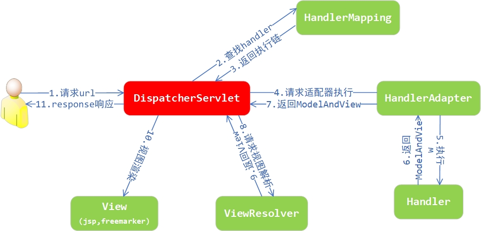

# SpringMVC快速入门及解析
**SpringMVC执行流程？**

**查找：前端控制器调用处理器映射器，根据url路径和设置的访问路径进行匹配，查找到相应的controller  **

**执行：前端控制器调用处理器适配器，处理适配器调用controller，将controller的执行结果modelAndview     返回 给前端控制器**   

**返回：前端控制器调用视图解析器 ，根据 modelAndview找到相应的视图**      

​      

**200：成功**

**404：资源不存在**

**500:服务器内部错误**

**400：参数错误**

## 一、SpringMVC概述及快速入门

### 1.1、概述

   springmvc是spring的一部分

> SpringMVC是一种基于Java 的实现MVC设计模型的请求驱动类型的轻量级Web框架，属于SpringFrameWork的后续产品，已经融合在Spring中。
>
> SpringMVC已经成为目前最主流的MVC框架之一，并且随着Spring3.0的发布，全面超越Struts2，成为最优秀的MVC框架。它通过一套注解，让一个简单的Java类成为处理请求的控制器，而无须实现任何接口。同时它还支持RESTful编程风格的请求。
>
> Servlet 处理web请求，doGet()  doPost()  不能自定义方法处理请求，action 
>
> 基于Servlet，DispatcherServlet （前端控制器）

### 1.2、快速入门

> **需求**：客户端发起请求，服务器端接收请求，执行逻辑并进行视图跳转。
>
> **开发步骤**
>
> 1) 创建Maven web项目并导入坐标；
>
> 2) 创建Controller类(类似于Servlet)和视图页面；
>
> 3) 使用注解配置Controller类中业务方法的映射地址；
>
> 4) 配置SpringMVC核心文件spring-mvc.xml；
>
> 5) 配置SpringMVC核心控制器DispatcherServlet；
>
> 6) 浏览器发起请求测试。

#### 1.2.1、创建Maven web项目并导入坐标

> pom.xml

```xml
<?xml version="1.0" encoding="UTF-8"?>
<project xmlns="http://maven.apache.org/POM/4.0.0" xmlns:xsi="http://www.w3.org/2001/XMLSchema-instance"
         xsi:schemaLocation="http://maven.apache.org/POM/4.0.0 http://maven.apache.org/xsd/maven-4.0.0.xsd">
    <modelVersion>4.0.0</modelVersion>

    <groupId>com.qfedu</groupId>
    <artifactId>01_springmvc_start</artifactId>
    <version>1.0.0</version>
    <packaging>war</packaging>

    <name>01_springmvc_start Maven Webapp</name>
    <!-- FIXME change it to the project's website -->
    <url>http://www.example.com</url>

    <properties>
        <project.build.sourceEncoding>UTF-8</project.build.sourceEncoding>
        <maven.compiler.source>1.8</maven.compiler.source>
        <maven.compiler.target>1.8</maven.compiler.target>
    </properties>

    <dependencies>
        <dependency>
            <groupId>org.springframework</groupId>
            <artifactId>spring-web</artifactId>
            <version>5.2.6.RELEASE</version>
        </dependency>
        <dependency>
            <groupId>org.springframework</groupId>
            <artifactId>spring-webmvc</artifactId>
            <version>5.2.6.RELEASE</version>
        </dependency>
        <dependency>
            <groupId>javax.servlet</groupId>
            <artifactId>javax.servlet-api</artifactId>
            <scope>provided</scope>
            <version>3.0.1</version>
        </dependency>
        <dependency>
            <groupId>javax.servlet.jsp</groupId>
            <artifactId>javax.servlet.jsp-api</artifactId>
            <scope>provided</scope>
            <version>2.3.3</version>
        </dependency>

        <dependency>
            <groupId>junit</groupId>
            <artifactId>junit</artifactId>
            <version>4.11</version>
            <scope>test</scope>
        </dependency>
    </dependencies>
</project>
```

#### 1.2.2、创建Controller类和视图页面

> HelloController.java

```java
//指定这是一个控制器类
@Controller        
//指定这个控制器的地址  /abc/hello
@RequestMapping("/abc")
public class HelloController {
    /**
     * 在访问时要使用类上的RequestMapping中的路径和方法上的RequestMapping中的路径才能访问到该方法
     * 如果在视图解析器中没有配置前缀和后缀，文件的路径和后缀不能省略
     * 默认以转发的方式访问视图
     * @return 视图的位置
     */
    @RequestMapping("/hello")
    public String hello() {
        return "/jsp/success.jsp";
    }
}
```

> 在web目录下新建jsp目录，在该目录中创建success.jsp。

```jsp
<%@ page contentType="text/html;charset=UTF-8" language="java" %>
<html>
<head>
    <title>success</title>
</head>
<body>
    <p>success</p>
</body>
</html>
```

#### 1.2.3、配置SpringMVC核心文件spring-mvc.xml       别忘记！

```xml
<?xml version="1.0" encoding="UTF-8"?>
<beans xmlns="http://www.springframework.org/schema/beans"
       xmlns:context="http://www.springframework.org/schema/context"
       xmlns:xsi="http://www.w3.org/2001/XMLSchema-instance"
       xsi:schemaLocation="http://www.springframework.org/schema/beans
       http://www.springframework.org/schema/beans/spring-beans.xsd
        http://www.springframework.org/schema/context http://www.springframework.org/schema/context/spring-context.xsd">
     <!-- 配置包扫描 -->
    <context:component-scan base-package="com.qfedu.controller" />
</beans>
```

#### 1.2.4、配置SpringMVC前端控制器DispatcherServlet   别忘记！   web.xml

```xml
<?xml version="1.0" encoding="UTF-8"?>
<web-app xmlns="http://xmlns.jcp.org/xml/ns/javaee"
         xmlns:xsi="http://www.w3.org/2001/XMLSchema-instance"
         xsi:schemaLocation="http://xmlns.jcp.org/xml/ns/javaee
         	http://xmlns.jcp.org/xml/ns/javaee/web-app_3_1.xsd"
         version="3.1">
    <!-- 配置SpringMVC核心控制器，其本质上就是一个Servlet -->
    <servlet>
        <servlet-name>DispatcherServlet</servlet-name>
        <servlet-class>org.springframework.web.servlet.DispatcherServlet</servlet-class>
        <init-param>
            <!-- 配置SpringMVC配置文件使SpringMVC核心控制器能够加载 -->
            <param-name>contextConfigLocation</param-name>
            <param-value>classpath:spring-mvc.xml</param-value>
        </init-param>
        <!-- tomcat启动就加载 -->
        <load-on-startup>1</load-on-startup>
    </servlet>
    <servlet-mapping>
        <servlet-name>DispatcherServlet</servlet-name>
        <url-pattern>/</url-pattern>
    </servlet-mapping>
</web-app>
```

#### 1.2.5、浏览器发起请求测试

```
http://localhost:8080/hello/hello
```

## 二、SpringMVC组件解析

### 2.1、SpringMVC执行流程（会自己描述） 面试

查找：处理器映射器 

​          **前端控制器调用处理器映射器，根据url路径和设置的访问路径进行匹配，查找到相应的controller**

执行：处理器适配器    

​          **前端控制器调用处理器适配器，处理适配器调用controller，将controller的执行结果modelAndview返回给前端控制器 **

​         

返回：视图解析器        

​      **前端控制器调用视图解析器 ，根据 modelAndview找到相应的视图**      

> 1) 用户发送请求至前端控制器DispatcherServlet；
>
> 2) DispatcherServlet收到请求调用HandlerMapping处理器映射器；
>
> 3) 处理器映射器找到具体的处理器 （controller）(可以根据xml配置、注解进行查找)，生成处理器对象及处理器拦截器(如果有则生成)一并返回给DispatcherServlet；
>
> 4) DispatcherServlet调用HandlerAdapter处理器适配器；
>
> 5) HandlerAdapter经过适配调用具体的处理器(Controller，也叫后端控制器)；
>
> 6) Controller执行完成返回ModelAndView；
>
> 7) HandlerAdapter将Controller执行结果ModelAndView返回给DispatcherServlet；
>
> 8) DispatcherServlet将ModelAndView传给ViewReslover视图解析器； 
>
> 9) ViewReslover解析后返回具体View；
>
> 10) DispatcherServlet根据View进行渲染视图（即将模型数据填充至视图中）；
>
> 11) DispatcherServlet响应用户。

### 2.2、SpringMVC各组件简介

#### 2.2.1、前端控制器  DispatcherServlet     重要web.xml配置

   是SpringMVC象征或是标志

> 用户请求到达前端控制器，它就相当于MVC模式中的C，DispatcherServlet是整个流程控制的中心，由它调用其它组件处理用户的请求，DispatcherServlet的存在降低了组件之间的耦合性。

#### 2.2.2、处理器映射器HandlerMapping     

> HandlerMapping负责根据用户请求找到Handler即处理器(Controller)，SpringMVC提供了不同的映射器实现不同的映射方式，例如：配置文件方式，实现接口方式，**注解方式等**。

#### 2.2.3、处理器适配器HandlerAdapter

> 通过HandlerAdapter对处理器进行执行，这是适配器模式的应用，通过扩展适配器可以对更多类型的处理器进行执行。

#### 2.2.4、处理器Handler      自己写的Controller

> **就是我们上面写的Controller**，由DispatcherServlet把用户请求转发到Handler。由Handler 对具体的用户请求进行处理。

#### 2.2.5、视图解析器ViewResolver     重要 spring-mvc.xml配置

> ViewResolver负责将处理结果生成View视图，ViewResolver 首先根据逻辑视图名解析成物理视图名，即具体的页面地址，再生成View视图对象，最后对View进行渲染将处理结果通过页面展示给用户。

#### 2.2.6、视图View

> SpringMVC框架提供了很多View视图类型的支持，包括：jsp、freemarker、Thymeleaf等。最常用的视图就是JSP。一般情况下需要通过页面标签或页面模版技术将模型数据通过页面展示给用户，需要由程序员根据业务需求开发具体的页面。

## 三、SpringMVC注解解析  重点

### 3.1、@RequestMapping     （ @GetMapping/@PostMapping ）

> 作用：用于建立请求URL和处理请求类及方法之间的对应关系。
>
> 给类或方法加上访问路径。
>
> 位置：
>
> * 类上，请求URL的第一级访问目录。此处不写的话，就相当于应用的根目录；
> * 方法上，请求URL的第二级访问目录，与类上的使用@RequestMapping标注的一级目录一起组成访问路径。
>
> 属性：
>
> * value：用于指请求的URL，它和path属性的作用是一样的；
> * method：用于指定请求的方式；

```java
@RequestMapping(value = "/hello", method = RequestMethod.POST)
public String hello() {
    return "/jsp/success.jsp";
}
```

> params：用于指定限制请求参数的条件，它支持简单的表达式，要求请求参数的key和value必须和配置的一模一样    ，了解
>
> 例如：
>
> * params = {"accountName"}，表示请求参数必须有accountName
> * params = {"moeny!100"}，表示请求参数中money不能是100

```java
@RequestMapping(value = "/hello", method = RequestMethod.GET, params = {"username"})
public String hello() {
    return "/jsp/success.jsp";
}
```

> 如果限制请求的方式，可以使用如下注解进行地址映射： 
>
> 1. @GetMapping(地址)，限制只接收get请求；     常用
> 2. @PostMapping(地址)，限制只接收post请求。  常用

### 3.2、@Controller   重点

> 指定这是一个控制器类，**这个注解的作用和@Component作用是一样的**，用来配置bean让Spring容器进行管理。配置了@Controller注解之后，需要在SpringMVC配置文件中配置包扫描：`<context:component-scan />`

## 四、SpringMVC的XML配置解析   重点

> **配置视图解析器    配置在springmvc核心配置文件中配置**

```xml
<bean id="viewResolver" class="org.springframework.web.servlet.view.InternalResourceViewResolver">
    <!-- 配置视图名称前缀 -->
    <property name="prefix" value="/jsp/" />
    <!-- 配置视图名称后缀 -->
    <property name="suffix" value=".jsp" />
</bean>
```

> 修改HelloController中的方法

```java
/**
  * 配置视图解析器的前缀后缀之后，视图的写法
  */
@RequestMapping("/hello")
public String hello() {
    return "success";
}
```

## 五、转发和重定向

Servlet中 ，转发： request.getRequestDispatcher("服务器端路径").forward(request,response)

​                     重定向： response.sendRedirect("客户端路径")   302

> 我们在Controller中写的方法，默认以转发的方式转发到相应名称的试图，如果希望明确配置转发和重定向，在视图名称前加上`forward:`或者`redirect:`。

```java
/**
  * 请求转发
  */
@RequestMapping("/hello1")
public String hello1() {
    return "forward:/jsp/success.jsp";
}

/**
  * 重定向 （路径和服务端路径写法类似）
  */
@RequestMapping("/hello2")
public String hello2() {
    return "redirect:/jsp/success.jsp";
}
```


