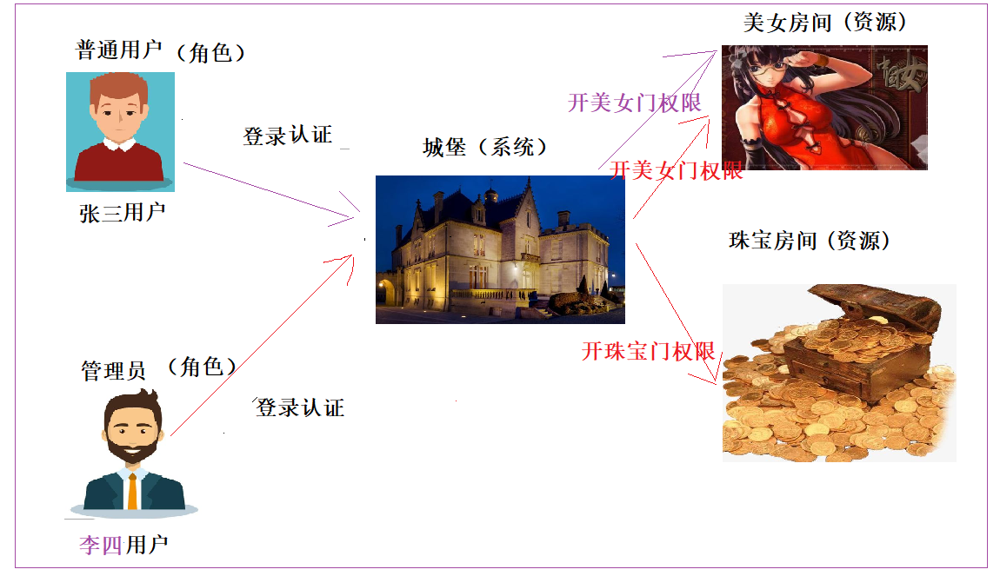
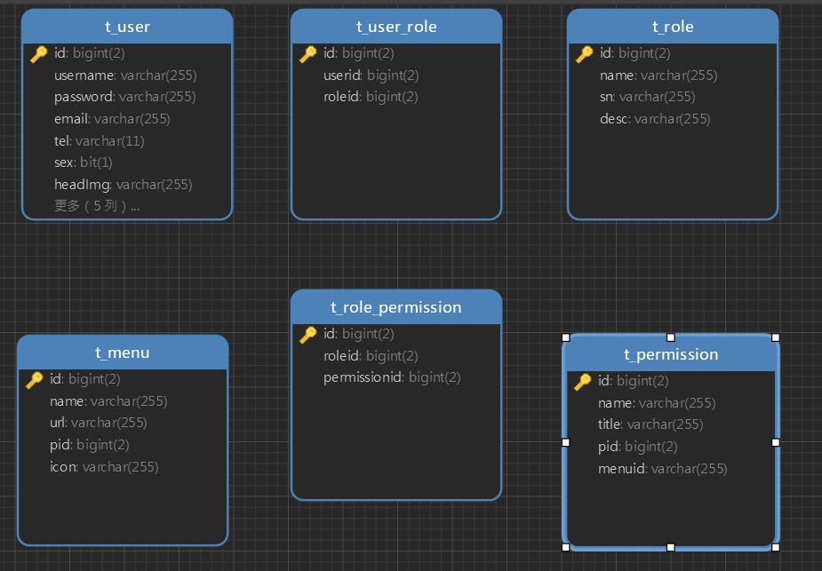
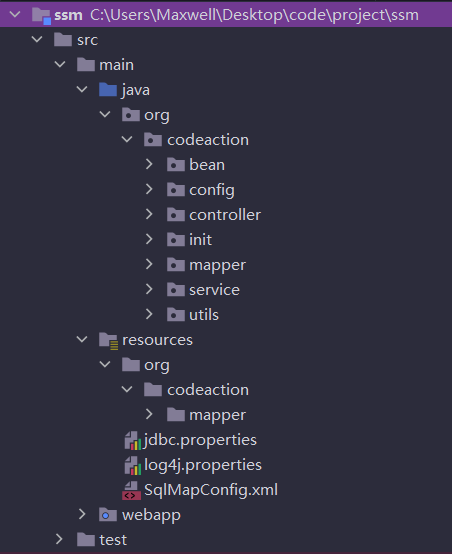

# SpringSecurity通用权限管理系统
**Shiro和SpringSecurity区别  了解**  

 **1 SpringSecurity 是Spring官方的，整合Spring其它技术比较方便**

​    **2 SpringSecurity支持分布式，oauth认证，单点登录**

​    **3 Shiro比较轻便，做简单的认证、授权比较方便**

**SpringSecurity的核心功能？认证和授权       面试 **

​    认证：登录验证

​    授权:认证通过后，验证用户是否有特定的权限执行某项操作

**RBAC:基于角色的访问控制    面试   **

认证的几个点：

  1）如何确保ss拿到用户输入的用户名和密码  (key是username 和 password)

2) 什么时候认证，form表单的action要和后端设置处理请求的地址一致

**认证过程：**
**1前端发起登录请求（/form）后，ss会进行认证**
**2前端发送的数据key值是username和password，ss就会获取输入的用户名和密码** 
**3通过调用AuthenticationManagerBuilder类中的方法userDetailsService，传入相应的**
  **UserDetailsService接口的实现类的对象，实现loadUserByUsername方法,**
  **ss就会调用此方法获取数据库中存的正确的用户名和密码，和前端传来的用户名和密码**
  **进行比对。**

**授权过程：**

**1认证通过才进行授权**

**2实现UserDetailsService，重写loadUserByUsername方法，查询到登录用户的角色和权限**

**3在SpringSecurity配置类上开启细粒度控制**

**4 在Controller中的方法上，加上角色控制或者权限控制**

**如何实现树形菜单：**

**1表设计时，要体现父子关系(pid)**

**2类设计时，添加List Menu  child**

**3查询一级菜单及其二级菜单，在mybaits映射文件中配置一对多的关系**

**4前端循环遍历(art-template /jstl )**

在线解析Json串：https://www.json.cn/

## 一、是什么

> 一个项目为什么需要添加权限，权限有什么用？
>
> 一般一个稍微复杂一点的项目或者系统，都会涉及到权限部分，权限部分可以说是每一个系统的基础部分。
>
> **权限**：不同人进入系统看到、操作的东西不一样。
>
> * 演员(角色) -> 演戏(权限)
> * 导演(角色) -> 演戏(权限)、写剧本(权限)
>
> 如何完成一个权限系统？
>
> * 自己手写一个权限系统(对程序员门槛要高一点)；
>
> * 使用权限框架
>   * `Shiro`  ( 认证， 授权)
>   
>   * `Springsecurity`    安全框架（认证，授权）
>   
>     

## 二、Shiro和SpringSecurity区别  面试

​    **1 SpringSecurity 是Spring官方的，整合Spring其它技术比较方便**

​    **2 SpringSecurity支持分布式，oauth认证，单点登录**

​    **3 Shiro比较轻便，做简单的认证、授权比较方便**

​    

> `Shiro`的实现功能比`SpringSecurity`要少的多。`SpringSecurity`除了基本的`Shiro`的认证和授权以外，还对分布式，`oauth`认证，单点登录都比较友好支持；
>
> `SpringSecurity`的社区讨论更丰富，有更好的社区支持；
>
> `SpringSecurity`和`Spring`是无缝衔接，比`Shiro`好的多，特别是现在`SpringBoot`流行的当，`SpringSecurity`更能发挥他的特点；
>
> `SpringSecurity`更加细粒度的控制权限，比`Shiro`做的好. 数据访问完全可以在`Controller`控制；
>
> `Shiro`简单，功能没有那么多，容易学，`SpringSecurity`稍微复杂一点。

## 三、SpringSecurity的认识

   **认证**、**授权 **  **面试**

> `Spring Security`基于`Spring`框架，提供了一套`Web`应用安全性的完整解决方案。一般来说，`Web`应用的安全性包括`用户认证Authentication`和`用户授权Authorization`两个部分。
>
> **用户认证**指的是验证某个用户**是否为系统中的合法主体**，也就是说用户能否访问该系统。用户认证一般要求用户提供用户名和密码。系统通过校验用户名和密码来完成认证过程。===登录过程
>
> **用户授权**指的是**验证某个用户是否有权限执行某个操作**。在一个系统中，不同用户所具有的权限是不同的。
>
> 权限框架核心：用户认证 Authentication 和 用户授权(Authorization)。

### 3.1、RBAC

> 用户的认证和用户的授权在这里都是基于`RBAC`的，什么是`RBAC`？现在我们来认识一下。

#### 3.1.1、什么是RBAC 

  **`RBAC`是基于角色的访问控制   面试  **

> `RBAC`是基于角色的访问控制(Role-Based Access Controll)的缩写，在`RBAC`中，权限与角色相关联，用户通过成为适当角色的成员而得到这些角色的权限。这就极大地简化了权限的管理。
>
>    

#### 3.1.2、RBAC的关键字

谈需求 --- 项目经理--->数据库设计    

 谈需求---产品[项目]经理--->原型图    【前端，后端-->口头表达】            


> 角色(Role):
>
> * 为了对许多拥有相似权限的用户进行分类管理，定义了角色的概念, 比如说管理员，普通用户，访客。
>
> 权限(Permisison):
>
> * 具体的操作，比如新增用户、修改用户、删除用户操作等。
>
> 用户(User):
>
> * 就是操作的个体。说白了就是指人。
>
> 资源(Resource)     ----菜单
>
> * 具体的内容东西。



#### 3.1.3、RBAC关键字的关系

* 用户和角色 <--> 多对多关系 (多个用户可以拥有一个角色，一个角色可以赋给多个用户)  <--> 建一个中间表

* 角色和权限 <--> 多对多关系 (多个权限可以拥有一个角色，一个角色可以赋给多个权限) <--> 建一个中间表

* 权限和资源 <--> 这里可以是一对一 ，也可以是一对多  (一个权限对应一个资源，也可以一个权限对应多个资源) 

  图片：硬盘上

  表：图片路径         文件上传解析器   MultiPartFile   transferTo

  ​                  

### 3.2、数据库表结构




## 四、项目搭建

### 4.1、系统的技术结构

> * `Spring`、`SpringMVC`、`SpringSecurity`、`MyBatis`、`MyBatis PageHelper`、`JSP`
> * `jQuery`、`Bootstrap`、`Art-template`
> * `MySQL`
> * `Maven`

### 4.2、建库建表

> * 创建数据库`ssm_security`；
> * 运行下面的SQL脚本（建议直接导入SQL脚本）。

```sql
SET NAMES utf8mb4;
SET FOREIGN_KEY_CHECKS = 0;

-- ----------------------------
-- Table structure for t_menu
-- ----------------------------
DROP TABLE IF EXISTS `t_menu`;
CREATE TABLE `t_menu`  (
  `id` bigint(2) NOT NULL AUTO_INCREMENT,
  `name` varchar(255) CHARACTER SET utf8 COLLATE utf8_general_ci NULL DEFAULT NULL,
  `url` varchar(255) CHARACTER SET utf8 COLLATE utf8_general_ci NULL DEFAULT NULL,
  `pid` bigint(2) NULL DEFAULT NULL,
  `icon` varchar(255) CHARACTER SET utf8 COLLATE utf8_general_ci NULL DEFAULT NULL,
  PRIMARY KEY (`id`) USING BTREE
) ENGINE = InnoDB AUTO_INCREMENT = 53 CHARACTER SET = utf8 COLLATE = utf8_general_ci ROW_FORMAT = Dynamic;

-- ----------------------------
-- Records of t_menu
-- ----------------------------
INSERT INTO `t_menu` VALUES (1, '系统管理', NULL, NULL, 'mdi mdi-file-outline');
INSERT INTO `t_menu` VALUES (2, '用户维护', 'user/index', 1, NULL);
INSERT INTO `t_menu` VALUES (3, '角色维护', 'role/index', 1, NULL);
INSERT INTO `t_menu` VALUES (4, '权限维护', 'permission/index', 1, NULL);
INSERT INTO `t_menu` VALUES (5, '菜单维护', 'menu/index', 1, NULL);
INSERT INTO `t_menu` VALUES (20, '报表管理', NULL, NULL, 'mdi mdi-file-chart');
INSERT INTO `t_menu` VALUES (21, '报表列表', 'report/index', 20, '');
INSERT INTO `t_menu` VALUES (22, '日志管理', NULL, NULL, 'mdi mdi-equal-box ');
INSERT INTO `t_menu` VALUES (23, '日志列表', 'log/index', 22, '');
INSERT INTO `t_menu` VALUES (37, '图书管理', NULL, NULL, 'mdi mdi-locker-multiple');
INSERT INTO `t_menu` VALUES (38, '图书列表', 'book/index', 37, '');
INSERT INTO `t_menu` VALUES (39, '图书借阅', 'book/brrow', 37, '');
INSERT INTO `t_menu` VALUES (40, '图书归还', 'book/returnBook', 37, '');
INSERT INTO `t_menu` VALUES (41, '图书入库', 'book/addPage', 37, '');
INSERT INTO `t_menu` VALUES (42, '借阅记录', 'book/history', 37, '');
INSERT INTO `t_menu` VALUES (44, '测试管理', NULL, NULL, 'mdi mdi-account-card-details');
INSERT INTO `t_menu` VALUES (46, '测试列表1', 'test/index', 44, '');
INSERT INTO `t_menu` VALUES (51, '父级管理1', '', NULL, 'mdi mdi-account-circle');
INSERT INTO `t_menu` VALUES (52, '子级列表3', 'zj3/index', 51, '');

-- ----------------------------
-- Table structure for t_permission
-- ----------------------------
DROP TABLE IF EXISTS `t_permission`;
CREATE TABLE `t_permission`  (
  `id` bigint(2) NOT NULL AUTO_INCREMENT,
  `name` varchar(255) CHARACTER SET utf8 COLLATE utf8_general_ci NULL DEFAULT NULL,
  `title` varchar(255) CHARACTER SET utf8 COLLATE utf8_general_ci NULL DEFAULT NULL,
  `pid` bigint(2) NULL DEFAULT NULL,
  `menuid` varchar(255) CHARACTER SET utf8 COLLATE utf8_general_ci NULL DEFAULT NULL,
  PRIMARY KEY (`id`) USING BTREE
) ENGINE = InnoDB AUTO_INCREMENT = 53 CHARACTER SET = utf8 COLLATE = utf8_general_ci ROW_FORMAT = Dynamic;

-- ----------------------------
-- Records of t_permission
-- ----------------------------
INSERT INTO `t_permission` VALUES (1, 'user', '用户模块', 0, '2');
INSERT INTO `t_permission` VALUES (7, 'role', '角色模块', 0, '3');
INSERT INTO `t_permission` VALUES (8, 'role:add', '新增角色', 7, NULL);
INSERT INTO `t_permission` VALUES (9, 'role:delete', '删除角色', 7, NULL);
INSERT INTO `t_permission` VALUES (10, 'role:get', '查询角色', 7, NULL);
INSERT INTO `t_permission` VALUES (11, 'role:update', '修改角色', 7, NULL);
INSERT INTO `t_permission` VALUES (13, 'menu', '菜单管理', 0, '5');
INSERT INTO `t_permission` VALUES (14, 'menu:add', '新增菜单', 13, NULL);
INSERT INTO `t_permission` VALUES (15, 'user:add', '用户新增', 1, NULL);
INSERT INTO `t_permission` VALUES (16, 'user:delete', '用户删除', 1, NULL);
INSERT INTO `t_permission` VALUES (17, 'user:get', '用户查询', 1, NULL);
INSERT INTO `t_permission` VALUES (18, 'user:update', '用户更新', 1, NULL);
INSERT INTO `t_permission` VALUES (19, 'menu:delete', '菜单删除', 13, NULL);
INSERT INTO `t_permission` VALUES (20, 'menu:query', '菜单查询', 13, NULL);
INSERT INTO `t_permission` VALUES (21, 'menu:get', '菜单获取', 13, NULL);
INSERT INTO `t_permission` VALUES (22, 'permission', '权限列表', 0, '4');
INSERT INTO `t_permission` VALUES (24, 'student', '学生列表', 0, '11');
INSERT INTO `t_permission` VALUES (29, 'report', '报表列表', 0, '21');
INSERT INTO `t_permission` VALUES (30, 'log', '日志列表', 0, '23');
INSERT INTO `t_permission` VALUES (41, 'book:list', '图书列表', 0, '38');
INSERT INTO `t_permission` VALUES (42, 'book:brrow', '图书借阅', 0, '39');
INSERT INTO `t_permission` VALUES (43, 'book:return', '图书归还', 0, '40');
INSERT INTO `t_permission` VALUES (44, 'book:add', '图书入库', 0, '41');
INSERT INTO `t_permission` VALUES (45, 'book:history', '借阅记录', 0, '42');
INSERT INTO `t_permission` VALUES (46, 'test:list', '测试列表1', 0, '46');
INSERT INTO `t_permission` VALUES (49, 'test:add1', '新增测试1', 46, NULL);
INSERT INTO `t_permission` VALUES (50, 'fj', '子级列表1', 0, '49');
INSERT INTO `t_permission` VALUES (51, 'zj', '子级列表1', 0, '50');
INSERT INTO `t_permission` VALUES (52, 'zj2', '子级列表2', 0, '52');

-- ----------------------------
-- Table structure for t_role
-- ----------------------------
DROP TABLE IF EXISTS `t_role`;
CREATE TABLE `t_role`  (
  `id` bigint(2) NOT NULL AUTO_INCREMENT,
  `name` varchar(255) CHARACTER SET utf8 COLLATE utf8_general_ci NULL DEFAULT NULL,
  `sn` varchar(255) CHARACTER SET utf8 COLLATE utf8_general_ci NULL DEFAULT NULL,
  `desc` varchar(255) CHARACTER SET utf8 COLLATE utf8_general_ci NULL DEFAULT NULL,
  PRIMARY KEY (`id`) USING BTREE
) ENGINE = InnoDB AUTO_INCREMENT = 5 CHARACTER SET = utf8 COLLATE = utf8_general_ci ROW_FORMAT = Dynamic;

-- ----------------------------
-- Records of t_role
-- ----------------------------
INSERT INTO `t_role` VALUES (1, '管理员', NULL, NULL);
INSERT INTO `t_role` VALUES (2, '老师权限', NULL, NULL);
INSERT INTO `t_role` VALUES (3, '学生权限', '', '<p>学生权限</p>\n');
INSERT INTO `t_role` VALUES (4, '测试权限', '', '<![CDATA[<p>测试权限</p>\n]]>');

-- ----------------------------
-- Table structure for t_role_permission
-- ----------------------------
DROP TABLE IF EXISTS `t_role_permission`;
CREATE TABLE `t_role_permission`  (
  `id` bigint(2) NOT NULL AUTO_INCREMENT,
  `roleid` bigint(2) NULL DEFAULT NULL,
  `permissionid` bigint(2) NULL DEFAULT NULL,
  PRIMARY KEY (`id`) USING BTREE
) ENGINE = InnoDB AUTO_INCREMENT = 454 CHARACTER SET = utf8 COLLATE = utf8_general_ci ROW_FORMAT = Dynamic;

-- ----------------------------
-- Records of t_role_permission
-- ----------------------------
INSERT INTO `t_role_permission` VALUES (232, 3, 23);
INSERT INTO `t_role_permission` VALUES (237, 3, 29);
INSERT INTO `t_role_permission` VALUES (238, 2, 23);
INSERT INTO `t_role_permission` VALUES (244, 2, 29);
INSERT INTO `t_role_permission` VALUES (268, 4, 29);
INSERT INTO `t_role_permission` VALUES (269, 4, 30);
INSERT INTO `t_role_permission` VALUES (270, 4, 46);
INSERT INTO `t_role_permission` VALUES (431, 1, 1);
INSERT INTO `t_role_permission` VALUES (432, 1, 7);
INSERT INTO `t_role_permission` VALUES (433, 1, 8);
INSERT INTO `t_role_permission` VALUES (434, 1, 9);
INSERT INTO `t_role_permission` VALUES (435, 1, 10);
INSERT INTO `t_role_permission` VALUES (436, 1, 11);
INSERT INTO `t_role_permission` VALUES (437, 1, 13);
INSERT INTO `t_role_permission` VALUES (438, 1, 14);
INSERT INTO `t_role_permission` VALUES (439, 1, 15);
INSERT INTO `t_role_permission` VALUES (440, 1, 16);
INSERT INTO `t_role_permission` VALUES (441, 1, 17);
INSERT INTO `t_role_permission` VALUES (442, 1, 18);
INSERT INTO `t_role_permission` VALUES (443, 1, 19);
INSERT INTO `t_role_permission` VALUES (444, 1, 20);
INSERT INTO `t_role_permission` VALUES (445, 1, 21);
INSERT INTO `t_role_permission` VALUES (446, 1, 22);
INSERT INTO `t_role_permission` VALUES (447, 1, 29);
INSERT INTO `t_role_permission` VALUES (448, 1, 30);
INSERT INTO `t_role_permission` VALUES (449, 1, 41);
INSERT INTO `t_role_permission` VALUES (450, 1, 42);
INSERT INTO `t_role_permission` VALUES (451, 1, 43);
INSERT INTO `t_role_permission` VALUES (452, 1, 44);
INSERT INTO `t_role_permission` VALUES (453, 1, 45);

-- ----------------------------
-- Table structure for t_user
-- ----------------------------
DROP TABLE IF EXISTS `t_user`;
CREATE TABLE `t_user`  (
  `id` bigint(2) NOT NULL AUTO_INCREMENT,
  `username` varchar(255) CHARACTER SET utf8 COLLATE utf8_general_ci NULL DEFAULT NULL,
  `password` varchar(255) CHARACTER SET utf8 COLLATE utf8_general_ci NULL DEFAULT NULL,
  `email` varchar(255) CHARACTER SET utf8 COLLATE utf8_general_ci NULL DEFAULT NULL,
  `tel` varchar(11) CHARACTER SET utf8 COLLATE utf8_general_ci NULL DEFAULT NULL,
  `sex` bit(1) NULL DEFAULT NULL,
  `headImg` varchar(255) CHARACTER SET utf8 COLLATE utf8_general_ci NULL DEFAULT NULL,
  `createTime` datetime(0) NULL DEFAULT NULL,
  `stunum` varchar(255) CHARACTER SET utf8 COLLATE utf8_general_ci NULL DEFAULT NULL,
  `type` bigint(2) NULL DEFAULT NULL,
  `classesid` bigint(2) NULL DEFAULT NULL,
  `courseid` bigint(2) NULL DEFAULT NULL,
  PRIMARY KEY (`id`) USING BTREE
) ENGINE = InnoDB AUTO_INCREMENT = 56 CHARACTER SET = utf8 COLLATE = utf8_general_ci ROW_FORMAT = Dynamic;

-- ----------------------------
-- Records of t_user
-- ----------------------------
INSERT INTO `t_user` VALUES (1, 'admin', '$2a$10$YITYi7HjqT2gh8jEF6eyquR/Og0qmYBNT8cQLaEjjS92jcZHwsI9G', 'admin@qq.com', '18000010002', b'1', '229caa82-17c6-4515-9bd6-edbf10212099.png', '2020-05-15 13:49:07', NULL, 1, NULL, NULL);
INSERT INTO `t_user` VALUES (2, 'admin2', '$2a$10$YITYi7HjqT2gh8jEF6eyquR/Og0qmYBNT8cQLaEjjS92jcZHwsI9G', 'test112244@qq.com', '18000020003', b'1', '229caa82-17c6-4515-9bd6-edbf10212099.png', '2020-05-13 13:49:11', NULL, 1, NULL, NULL);
INSERT INTO `t_user` VALUES (17, 't1', '$2a$10$t7K//qDwIbaPGt6fiRVL.eXeFHBHtF4aON2VGwd3u.pOwvH8AzTBe', 't1@qq.com', '18800030005', b'1', '229caa82-17c6-4515-9bd6-edbf10212099.png', '2020-06-02 15:04:05', NULL, 2, 10, NULL);
INSERT INTO `t_user` VALUES (18, 't2', '$2a$10$yPSGzDtZevO/O9LwJVFteOJJywpJXIMW2FZJdMHAQukTxul3WCVWG', 't2@qq.com', '18800040006', b'1', '229caa82-17c6-4515-9bd6-edbf10212099.png', '2020-06-02 15:06:08', NULL, 2, 9, NULL);
INSERT INTO `t_user` VALUES (19, 't611', '$2a$10$uMG5QlQE3n67AFQDmpPZJ.ucP6cgIGFLHnBnWMyoCcVevcTZ8q/Yu', 't611@qq.com', '18100010002', b'1', '229caa82-17c6-4515-9bd6-edbf10212099.png', '2020-06-12 22:49:42', NULL, 2, 6, NULL);
INSERT INTO `t_user` VALUES (20, 't6', '$2a$10$.DBmvE23vYeY16qR/kRPZeZU3wulG2EQPn/r8xEKNKl0/YOmF68Xi', 't6@qq.com', '18100010002', b'1', '229caa82-17c6-4515-9bd6-edbf10212099.png', '2020-06-12 22:53:31', NULL, 2, 5, NULL);
INSERT INTO `t_user` VALUES (21, 't7', '$2a$10$3pQ85MLW37W3EvhiyzqkVuSVlATF6DXgK7ns/FDzUhsP6far8WBhm', 't7@qq.com', '18800010002', b'1', '229caa82-17c6-4515-9bd6-edbf10212099.png', '2020-06-12 23:09:58', NULL, 2, 4, NULL);
INSERT INTO `t_user` VALUES (22, 't8', '$2a$10$btpAN5Xf7VVxI34qFDftl.M8E.3LKPLa2ojl2wc21Xl7irGq.tPgm', 't8@qq.com', '18800010002', b'1', '229caa82-17c6-4515-9bd6-edbf10212099.png', '2020-06-12 23:39:27', NULL, 2, 3, NULL);
INSERT INTO `t_user` VALUES (24, 'stu1', '$2a$10$HXjVMCWmEck18JvqOT6IeuZwDo/XfVfgTif27DH/1CLpdUTHBrbwS', 'stu1@qq.com', '19900010003', b'0', '229caa82-17c6-4515-9bd6-edbf10212099.png', '2020-06-30 18:06:49', '10101002', 3, 2, NULL);
INSERT INTO `t_user` VALUES (26, 'stu3', '$2a$10$RjOTW0w0mQIXtXQFxzDPbO3HguIF4L.7qNbdyyYzKFtI4Ksdc34sW', 'stu3@qq.com', '18800010002', b'0', '229caa82-17c6-4515-9bd6-edbf10212099.png', '2020-07-01 09:31:51', '8000180002', 3, 1, 2);
INSERT INTO `t_user` VALUES (27, 'stu4', '$2a$10$bhmglaF.WL39kygFBLgtYONWSO1Rcw5/WtJeIULAEEC1qdAljPn1O', 'stu4', '18800010004', b'0', '229caa82-17c6-4515-9bd6-edbf10212099.png', '2020-07-01 09:33:33', '8000180004', 3, 9, 3);
INSERT INTO `t_user` VALUES (28, 'stu5', '$2a$10$Jf14s.LlXVzBI1iBHPmUPOtcfPWP3kxM8yOqc8zPycYdAx//CBejS', 'stu5@qq.com', '18800010002', b'1', '1525ae79-887d-4dff-b714-7eafb6240e8b.jpg', '2020-07-13 16:44:50', '11223344', 3, NULL, NULL);
INSERT INTO `t_user` VALUES (30, 'stu6', '$2a$10$ryipfFNTTL1p2yT674g2i.df.SgH2R2yl7p0ZHP4ANTzMbYxswd2C', 'stu6@qq.com', '18100010006', b'0', 'bc7d0bba-24f7-4e18-baed-00070b079bc3.jpg', '2020-07-16 09:53:05', '', 2, NULL, NULL);
INSERT INTO `t_user` VALUES (31, 't9', '$2a$10$PQeGFnam4DCZ9Fgomjxcne7qym0kweTFXJdmmIy8oMsNnVEoVJGpW', 't9@qq.com', '13300010002', b'1', '03c47649-ab10-4aaa-bdc2-c78b1b487f69.jpg', '2020-07-16 09:58:08', '', 2, NULL, NULL);
INSERT INTO `t_user` VALUES (36, 't10', '$2a$10$VCrN6EeQZeZbkLC.1BbiT.BN7oOHy/1vN8J5mf2GwXyEx6sXcIWAe', '377905687@qq.com', '18100010007', b'0', NULL, '2020-07-16 10:36:28', '', 2, NULL, NULL);
INSERT INTO `t_user` VALUES (37, 't11', '$2a$10$A4er7ex3ojpEz/1Ae8VW0uWp/1EbA5jrhDl7YNPuKeBKcy5RDHhvK', '377905687@qq.com', '18100010008', b'0', '8b5ddd72-1b4e-4d93-97e7-7a3be5e4cdce.jpg', '2020-07-16 10:37:48', '', 2, NULL, NULL);
INSERT INTO `t_user` VALUES (38, 't12', '$2a$10$sdxDG4tt84uzvARd27WSdONQ1zNTuPnR/WndxK/oVekdR6VjeBADa', '377905687@qq.com', '18100010016', b'0', 'e4b6b114-0ab8-4f39-bc8b-7bff79f4b67a.jpg', '2020-07-16 10:39:58', '', 2, NULL, NULL);
INSERT INTO `t_user` VALUES (39, 't13', '$2a$10$2fB/LR34Ft0I6yv8BC8sYu0S.Gr1w08vms0frs8Kf4usw/1pkCfJe', '377905687@qq.com', '18100010009', b'0', '352e239e-2078-4a48-ac21-65f0ca32f7e8.jpg', '2020-07-16 10:45:48', '', 2, NULL, NULL);
INSERT INTO `t_user` VALUES (40, 't16', '$2a$10$w/.F4/ABHUALeCMwebIFbOYV3ZEoLOsMuurSHuQjeB13B7dp9nJNS', '377905687@qq.com', '18100010026', b'0', 'effde538-f745-46a7-9e38-28e51c7b5a6b.jpg', '2020-07-16 10:49:40', '', 2, NULL, NULL);

-- ----------------------------
-- Table structure for t_user_role
-- ----------------------------
DROP TABLE IF EXISTS `t_user_role`;
CREATE TABLE `t_user_role`  (
  `id` bigint(2) NOT NULL AUTO_INCREMENT,
  `userid` bigint(2) NULL DEFAULT NULL,
  `roleid` bigint(2) NULL DEFAULT NULL,
  PRIMARY KEY (`id`) USING BTREE
) ENGINE = InnoDB AUTO_INCREMENT = 23 CHARACTER SET = utf8 COLLATE = utf8_general_ci ROW_FORMAT = Dynamic;

-- ----------------------------
-- Records of t_user_role
-- ----------------------------
INSERT INTO `t_user_role` VALUES (1, 1, 1);
INSERT INTO `t_user_role` VALUES (2, 1, 2);
INSERT INTO `t_user_role` VALUES (3, 17, 2);
INSERT INTO `t_user_role` VALUES (14, 18, 2);
INSERT INTO `t_user_role` VALUES (15, 19, 2);
INSERT INTO `t_user_role` VALUES (16, 20, 2);
INSERT INTO `t_user_role` VALUES (17, 21, 2);
INSERT INTO `t_user_role` VALUES (18, 22, 2);
INSERT INTO `t_user_role` VALUES (19, 24, 3);
INSERT INTO `t_user_role` VALUES (20, 27, 3);
INSERT INTO `t_user_role` VALUES (21, 26, 3);
INSERT INTO `t_user_role` VALUES (22, 40, 4);

SET FOREIGN_KEY_CHECKS = 1;
```

### 4.3、创建Maven项目并导入依赖

> 创建Maven web项目，并导入如下的依赖

```xml
<dependencies>
    <!--springmvc -->
    <dependency>
        <groupId>javax.servlet</groupId>
        <artifactId>javax.servlet-api</artifactId>
        <version>4.0.1</version>
        <scope>provided</scope>
    </dependency>
    <dependency>
        <groupId>javax.servlet.jsp</groupId>
        <artifactId>javax.servlet.jsp-api</artifactId>
        <version>2.3.3</version>
        <scope>provided</scope>
    </dependency>
    <dependency>
        <groupId>org.springframework</groupId>
        <artifactId>spring-webmvc</artifactId>
        <version>5.2.6.RELEASE</version>
    </dependency>
    <dependency>
        <groupId>org.springframework</groupId>
        <artifactId>spring-web</artifactId>
        <version>5.2.6.RELEASE</version>
    </dependency>
    <!-- MyBatis相关 -->
    <dependency>
        <groupId>org.mybatis</groupId>
        <artifactId>mybatis-spring</artifactId>
        <version>2.0.3</version>
    </dependency>
    <dependency>
        <groupId>org.mybatis</groupId>
        <artifactId>mybatis</artifactId>
        <version>3.4.5</version>
    </dependency>
    <!-- 分页助手 -->
    <dependency>
        <groupId>com.github.pagehelper</groupId>
        <artifactId>pagehelper</artifactId>
        <version>3.7.5</version>
    </dependency>
    <dependency>
        <groupId>com.github.jsqlparser</groupId>
        <artifactId>jsqlparser</artifactId>
        <version>0.9.1</version>
    </dependency>
    <!-- 文件上传相关 -->
    <dependency>
        <groupId>commons-io</groupId>
        <artifactId>commons-io</artifactId>
        <version>2.6</version>
    </dependency>
    <dependency>
        <groupId>commons-fileupload</groupId>
        <artifactId>commons-fileupload</artifactId>
        <version>1.4</version>
    </dependency>
    <dependency>
        <groupId>mysql</groupId>
        <artifactId>mysql-connector-java</artifactId>
        <version>5.1.49</version>
    </dependency>
    <dependency>
        <groupId>com.alibaba</groupId>
        <artifactId>druid</artifactId>
        <version>1.1.5</version>
    </dependency>
    <dependency>
        <groupId>log4j</groupId>
        <artifactId>log4j</artifactId>
        <version>1.2.17</version>
    </dependency>
    <dependency>
        <groupId>org.springframework</groupId>
        <artifactId>spring-test</artifactId>
        <version>5.2.6.RELEASE</version>
    </dependency>
    <dependency>
        <groupId>junit</groupId>
        <artifactId>junit</artifactId>
        <version>4.13</version>
        <scope>test</scope>
    </dependency>
    <!--事务控制-->
    <dependency>
        <groupId>org.springframework</groupId>
        <artifactId>spring-aspects</artifactId>
        <version>5.2.6.RELEASE</version>
    </dependency>
    <dependency>
        <groupId>org.springframework</groupId>
        <artifactId>spring-tx</artifactId>
        <version>5.2.6.RELEASE</version>
    </dependency>
    <dependency>
        <groupId>org.springframework</groupId>
        <artifactId>spring-jdbc</artifactId>
        <version>5.2.6.RELEASE</version>
    </dependency>
    <!-- jackson -->
    <dependency>
        <groupId>com.fasterxml.jackson.core</groupId>
        <artifactId>jackson-core</artifactId>
        <version>2.9.0</version>
    </dependency>
    <dependency>
        <groupId>com.fasterxml.jackson.core</groupId>
        <artifactId>jackson-databind</artifactId>
        <version>2.9.0</version>
    </dependency>
    <dependency>
        <groupId>com.fasterxml.jackson.core</groupId>
        <artifactId>jackson-annotations</artifactId>
        <version>2.9.0</version>
    </dependency>
    <!--  SpringSecurity -->
    <dependency>
        <groupId>org.springframework.security</groupId>
        <artifactId>spring-security-core</artifactId>
        <version>5.2.4.RELEASE</version>
    </dependency>
    <dependency>
        <groupId>org.springframework.security</groupId>
        <artifactId>spring-security-web</artifactId>
        <version>5.2.4.RELEASE</version>
    </dependency>
    <dependency>
        <groupId>org.springframework.security</groupId>
        <artifactId>spring-security-config</artifactId>
        <version>5.2.4.RELEASE</version>
    </dependency>
    <dependency>
        <groupId>org.springframework.security</groupId>
        <artifactId>spring-security-test</artifactId>
        <version>5.2.4.RELEASE</version>
    </dependency>
    <dependency>
        <groupId>org.springframework.security</groupId>
        <artifactId>spring-security-taglibs</artifactId>
        <version>5.2.4.RELEASE</version>
    </dependency>
    <!-- lombok -->
    <dependency>
        <groupId>org.projectlombok</groupId>
        <artifactId>lombok</artifactId>
        <version>1.18.22</version>
    </dependency>
</dependencies>
```

> 项目结构如下：



### 4.4、创建相关配置文件

#### 4.4.1、jdbc.properties

```properties
jdbc.driver=com.mysql.jdbc.Driver
jdbc.url=jdbc:mysql://localhost:3306/ssm_security?useSSL=false
jdbc.username=root
jdbc.password=root
```

#### 4.4.2、log4j.properties

```properties
#
# Hibernate, Relational Persistence for Idiomatic Java
#
# License: GNU Lesser General Public License (LGPL), version 2.1 or later.
# See the lgpl.txt file in the root directory or <http://www.gnu.org/licenses/lgpl-2.1.html>.
#

### direct log messages to stdout ###
log4j.appender.stdout=org.apache.log4j.ConsoleAppender
log4j.appender.stdout.Target=System.err
log4j.appender.stdout.layout=org.apache.log4j.PatternLayout
log4j.appender.stdout.layout.ConversionPattern=%d{ABSOLUTE} %5p %c{1}:%L - %m%n

### direct messages to file hibernate.log ###
#log4j.appender.file=org.apache.log4j.FileAppender
#log4j.appender.file.File=hibernate.log
#log4j.appender.file.layout=org.apache.log4j.PatternLayout
#log4j.appender.file.layout.ConversionPattern=%d{ABSOLUTE} %5p %c{1}:%L - %m%n

### set log levels - for more verbose logging change 'info' to 'debug' ###

log4j.rootLogger=debug, stdout
```

#### 4.4.3、MyBatis核心配置文件

> SqlMapConfig.xml

```xml
<?xml version="1.0" encoding="UTF-8" ?>
<!DOCTYPE configuration
        PUBLIC "-//mybatis.org//DTD Config 3.0//EN"
        "http://mybatis.org/dtd/mybatis-3-config.dtd">
<configuration>
    <settings>
        <!-- 打印查询语句 -->
        <setting name="logImpl" value="LOG4J" />
    </settings>

    <!-- 配置插件 -->
    <plugins>
        <!-- 配置分页插件 -->
        <plugin interceptor="com.github.pagehelper.PageHelper">
            <!-- 配置分页插件方言 -->
            <property name="dialect" value="mysql" />
        </plugin>
    </plugins>
</configuration>
```

### 4.5、相关配置类

> 我们后面的配置尽可能使用Java代码配置。

#### 4.5.1、JdbcConfig

```java
/**
 * JDBC配置类
 */
@Configuration
//引入外部配置文件
@PropertySource("classpath:jdbc.properties")
//扫描特定包下的mapper
@MapperScan(basePackages = "com.qfedu.mapper")
//配置事务的注解驱动   
@EnableTransactionManagement
public class JdbcConfig {
    @Value("${jdbc.driver}")
    private String driverClassName;
    @Value("${jdbc.url}")
    private String url;
    @Value("${jdbc.username}")
    private String username;
    @Value("${jdbc.password}")
    private String password;

    //创建数据源
    @Bean("dataSource")
    public DataSource dataSource() {
        DruidDataSource dataSource = new DruidDataSource();
        dataSource.setDriverClassName(driverClassName);
        dataSource.setUrl(url);
        dataSource.setUsername(username);
        dataSource.setPassword(password);

        return dataSource;
    }

    //配置事务平台管理器
    @Bean("transactionManager")
    public DataSourceTransactionManager transactionManager(@Qualifier("dataSource") DataSource dataSource) {
        return new DataSourceTransactionManager(dataSource);
    }

    //创建并配置SqlSessionFactoryBean
    @Bean("sqlSessionFactoryBean")
    public SqlSessionFactoryBean sqlSessionFactoryBean(@Qualifier("dataSource") DataSource dataSource) {
        SqlSessionFactoryBean factoryBean = new SqlSessionFactoryBean();
        factoryBean.setDataSource(dataSource);
        //配置别名
        factoryBean.setTypeAliasesPackage("com.qfedu.bean");
        //加载MyBatis的核心配置文件
        factoryBean.setConfigLocation(new ClassPathResource("SqlMapConfig.xml"));

        return factoryBean;
    }
}
```

#### 4.5.2、RootConfig

```java
//Spring的配置类
@Configuration
@ComponentScan(
        basePackages = "com.qfedu",
        excludeFilters = {
                @ComponentScan.Filter(
                        type = FilterType.ANNOTATION,
                        classes = {Controller.class}
                )
        }
)
@Import(value = JdbcConfig.class)
public class RootConfig {

}
```

#### 4.5.3、WebConfig

```java
/**
 * SpringMVC配置类
 */
@Configuration
@ComponentScan(
        basePackages = "com.qfedu",
        includeFilters = {
            @ComponentScan.Filter(type = FilterType.ANNOTATION, classes = {Controller.class})
})
@EnableWebMvc 
public class WebConfig implements WebMvcConfigurer {
    //配置视图解析器
    @Override
    public void configureViewResolvers(ViewResolverRegistry registry) {
        InternalResourceViewResolver resolver = new InternalResourceViewResolver();
        resolver.setPrefix("/");
        resolver.setSuffix(".jsp");

        registry.viewResolver(resolver);
    }

    //配置静态资源不过滤
    @Override
    public void configureDefaultServletHandling(DefaultServletHandlerConfigurer configurer) {
        configurer.enable();
    }
     //文件上传解析器multipartResolver    
    @Bean("multipartResolver") 
    public MultipartResolver commonsMultipartResolver() {
        CommonsMultipartResolver multipartResolver = new CommonsMultipartResolver();
        multipartResolver.setDefaultEncoding("utf-8");
        multipartResolver.setMaxUploadSize(90000000000L);

        return multipartResolver;
    }

}
```

#### 4.5.4、SecurityConfig

```java
认证：登录验证    
       1)用户输入的用户名和密码  
       2)用户正确的用户名和密码 
授权：是否具备操作权限    


@Configuration
@EnableWebSecurity
public class SecurityConfig extends WebSecurityConfigurerAdapter {
 @Override
    protected void configure(HttpSecurity http) throws Exception {
        http
        .authorizeRequests()//HttpServletRequest请求认证
                            //放行路径 不需要认证
        .antMatchers("/css/**").permitAll()   //放行  
                             //访问user/**这个资源需要具有User角色
        .antMatchers("/user/**").hasRole("USER")  
        .anyRequest().authenticated() //其他任何请求都需要登录认证
        .and()
        .formLogin() //form表单登录方式       
        .and()
        .csrf().disable() //关闭CSRF   ，允许跨域   
        .formLogin().loginPage("/login") //表示登录时候 跳转的页面
        .loginProcessingUrl("/form") //form表单登录请求  ，form中action的值 /form
        .defaultSuccessUrl("/index") //成功登陆后跳转页面
        .failureUrl("/loginError").permitAll();//失败错误跳转
        
         
    }
   
    //基于内存方式登录
    @Autowired     //作用1：spring容器启动后，会自动执行方法  
                    //作用2：如果方法有入参，参数会注入
    public void configureGlobal(AuthenticationManagerBuilder auth) throws Exception {

        auth.inMemoryAuthentication()
                .passwordEncoder(new BCryptPasswordEncoder())
                .withUser("admin")  //用户名是admin
                .password(new BCryptPasswordEncoder()
                        .encode("123456")).roles("USER");


    }
}
```

#### 4.5.5、WebAppInitializer

过滤器: Filter  优先于 Servlet   

```java
public class WebAppInitializer extends AbstractAnnotationConfigDispatcherServletInitializer {
    @Override
    protected Class<?>[] getRootConfigClasses() {
        return new Class[]{RootConfig.class, SecurityConfig.class};
    }

    @Override
    protected Class<?>[] getServletConfigClasses() {
        return new Class[]{WebConfig.class};
    }

    @Override
    protected String[] getServletMappings() {
        return new String[]{"/"};
    }
}
```

#### 4.5.6、SecurityWebApplicationInitializer     

 // 开关,告诉spring 用到了springSecurity

```java
public class SecurityWebApplicationInitializer extends    AbstractSecurityWebApplicationInitializer {
}
```

### 4.6、认证

 **基于内存和基于数据库的认证**

#### 4.6.1、基于内存方式登录认证

##### 4.6.1.1、相关页面

> 登录页login.jsp

```html
<%@ page contentType="text/html;charset=UTF-8" language="java" %>
<html>
<head>
    <meta charset="UTF-8"/>
    <title>home</title>
</head>
<body>
<form  class="form-signin" action="${pageContext.request.contextPath}/form" method="post">
    <h2 class="form-signin-heading">用户登录</h2>
    <table>
        <tr>
            <td>用户名:</td>
            <td><input type="text" name="username"  class="form-control"  placeholder="请输入用户名"/></td>
        </tr>
        <tr>
            <td>密码:</td>
            <td><input type="password" name="password"  class="form-control" placeholder="请输入密码" /></td>
        </tr>
        <tr>

            <td colspan="2">
                <button type="submit"  class="btn btn-lg btn-primary btn-block" >登录</button>
            </td>
        </tr>
    </table>
</form>
</body>
</html>
```

> 创建一个登录成功页面index.jsp

```html
<%@ page contentType="text/html;charset=UTF-8" language="java" %>
<html lang="en">
<head>
    <meta charset="UTF-8">
    <title>Title</title>
</head>
<body>
    恭喜登录成功
</body>
</html>
```

> 创建一个登录失败页面error.jsp

```html
<!DOCTYPE html>
<html lang="en">
<head>
    <meta charset="UTF-8">
    <title>Title</title>
</head>
<body>
    登录失败
</body>
</html>
```

##### 4.6.1.2、LoginController

```java
@Controller
public class LoginController {
    @RequestMapping("/login")
    public String login() {
        return "login";
    }

    @RequestMapping("/index")
    public String index() {
        return "index";
    }

    @RequestMapping("/loginError")
    public String loginError() {
        return "error";
    }
}
```

##### 4.6.1.3、测试

> 访问`http://localhost:8080/index`，会跳转到登录页，只有登录之后才能访问该路径。

#### 4.6.2、基于数据库的登录认证

> 以下操作和之前学习的登录方式完全不同，如果用SpringSecurity，必须按照下面的操作进行。
>
> 这是一种规范，也是一种约定。

##### 4.6.2.1、创建实体类

@RequestBody     前端json串转化成java对象   （方法入参)  @DateTimeFormat

@ResponseBody  对象转json串 （ @JsonFormat  指定日期属性格式），返回的是数据不是页面

@ResponseBody+@Controller=@RestController


```java
//用户实体类
@Data
public class User {
    private Long id;
    private String username;
    private String password;
    private String email;
    private String tel;
    @JsonFormat(pattern="yyyy-MM-dd HH:mm:ss")
    private Date createTime;
    private Boolean sex;
    private String headImg;
    private Integer type; //type=1 是管理员  type=2是老师
    private List<Role> roles = new ArrayList();//用户对应的角色集合
}

//角色实体类
@Data
public class Role {
    private Long id;
    private String name;
    private String sn;
    private String desc;
    List<Permission> permissions = new ArrayList();
}

//权限实体类
@Data
public class Permission {
    private Long id;
    private String name;
    private String title;
    private Long pid;
    private Long menuid;
}
```

##### 4.6.2.2、创建UserMapper和UserService

> UserMapper接口

```java
public interface UserMapper {
    User findUserByUserName(String username);   //
}
```

> UserMapper映射配置文件

```xml
<?xml version="1.0" encoding="UTF-8" ?>
<!DOCTYPE mapper PUBLIC "-//mybatis.org//DTD Mapper 3.0//EN" "http://mybatis.org/dtd/mybatis-3-mapper.dtd" >
<mapper namespace="com.qfedu.mapper.UserMapper">
    <select id="findUserByUserName" resultType="user">
        select * from t_user where username=#{username}
    </select>
</mapper>
```

>UserService接口

```java
public interface UserService {
    User findUserByUserName(String username);
}
```

> UserService实现类

```java
@Service
public class UserServiceImpl implements UserService {
    @Autowired
    private UserMapper userMapper;

    @Override
    public User findUserByUserName(String username) {
        return userMapper.findUserByUserName(username);
    }
}
```

##### 4.6.2.3、封装用户类UserSecurity

> 主要用于登录之后，存储用户的信息，需要是`UserDetails`接口的实现类。
>
> `org.springframework.security.core.userdetails.User`类是`UserDetails`接口的实现类，我们只需要继承该类即可。

```java
//登录用户封装
public class UserSecurity extends org.springframework.security.core.userdetails.User {
    private User loginUser;

    public UserSecurity(User user, Set<GrantedAuthority> authorities) {
        super(user.getUsername(), user.getPassword(), true, true, true, true, authorities);
        this.loginUser = user;
    }

    public User getLoginUser() {
        return loginUser;
    }

    public void setLoginUser(User loginUser) {
        this.loginUser = loginUser;
    }
}
```

##### 4.6.2.4、添加登录认证处理类UserDetailsServiceImpl   

UserDetailsService 接口来自于SpringSecurity

```java
@Component
public class UserDetailsServiceImpl implements UserDetailsService {

    @Autowired
    private UserService userService;

    //查询用户和角色
    @Override
    public UserDetails loadUserByUsername(String username) throws UsernameNotFoundException {
        //根据用户名查询出用户
        User user = userService.findUserByUserName(username);
        if(user != null) {
            //构建所有权限集合==ROLE_角色+权限
            HashSet<GrantedAuthority> authorities = new HashSet<GrantedAuthority>();
            authorities.add(new SimpleGrantedAuthority("ROLE_管理员"));
            return new UserSecurity(user, authorities);
        }else{
            return null;
        }
    }
}
```

##### 4.6.2.5、改造SecurityConfig

> 把基于内存的注释掉，添加基于数据库登录方式

```java
@Configuration
@EnableWebSecurity
public class SecurityConfig extends WebSecurityConfigurerAdapter {
    @Autowired
    private UserDetailsService userDetailsService;

    @Override
    protected void configure(HttpSecurity http) throws Exception {
        http.authorizeRequests()//HttpServletRequest请求认证
                //放行路径 不需要认证
                .antMatchers("/css/**").permitAll()
                //访问user/**这个资源需要具有User角色
                .antMatchers("/user/**").hasRole("USER")
                .anyRequest().authenticated() //其他任何请求都需要登录认证
                .and()
                .formLogin() //form表单登录方式
                .and()
                .csrf().disable() //关闭CSRF
                .formLogin().loginPage("/login") //表示登录时候 跳转的页面
                .loginProcessingUrl("/form") //form表单登录请求
                .defaultSuccessUrl("/index") //成功登陆后跳转页面
                .failureUrl("/loginError").permitAll();//失败错误跳转
    }

    //基于数据库的认证
    @Autowired
    public void configureGlobal(AuthenticationManagerBuilder auth) throws Exception {
       
        auth.userDetailsService(userDetailsService)
                .passwordEncoder(new BCryptPasswordEncoder());

    }
}
```

#####  4.6.2.6、测试

> 访问`http://localhost:8080/index`，会跳转到登录页，只有登录之后才能访问该路径。
>
> 这次登录，可以使用数据库中存在的用户名和密码了。

### 4.7、授权 

> **权限控制**：说白了就是用户有**特定权限或者有特定角色**，就可以操作内容，如果没有特定权限或者没有特定角色 ，就不能操作内容。
>
> 实现的步骤： 
>
> * 首先把该用户存储在数据库的**权限和角色**查询出来，交给`SpringSecurity`框架去管理；
> * 该框架在发现你在操作某个内容的时候，就会把你的权限拿出来 和你操作的内容进行对比一下，如果存在就可以操作，如果不存在就不能操作。

#### 4.7.1、添加相关mapper和service层

> RoleMapper接口

```java
public interface RoleMapper {
    //根据用户id查询对应的角色
    List<Role> listRoleByUser(Long uid);  
}
```

> RoleMapper映射配置文件

```xml
<?xml version="1.0" encoding="UTF-8" ?>
<!DOCTYPE mapper PUBLIC "-//mybatis.org//DTD Mapper 3.0//EN" "http://mybatis.org/dtd/mybatis-3-mapper.dtd" >
<mapper namespace="com.qfedu.mapper.RoleMapper">
    <select id="listRoleByUser" resultType="role">
        select
            r.*
        from
            t_user u, t_user_role ur, t_role r
        where
            u.id=ur.userid and ur.roleid=r.id and u.id=#{uid}
    </select>
</mapper>
```

> RoleService接口

```java
public interface RoleService {
    List<Role> listRoleByUser(Long uid);
}
```

> RoleService实现类

```java
@Service
public class RoleServiceImpl implements RoleService {
    @Autowired
    private RoleMapper roleMapper; //注入落下了

    @Override
    public List<Role> listRoleByUser(Long uid) {
        return roleMapper.listRoleByUser(uid);
    }
}
```

> PermissionMapper接口

```java
public interface PermissionMapper {
    List<Permission> listPermissionByUser(Long uid);
}
```

> PermissionMapper映射配置文件

```xml
<?xml version="1.0" encoding="UTF-8" ?>
<!DOCTYPE mapper PUBLIC "-//mybatis.org//DTD Mapper 3.0//EN" "http://mybatis.org/dtd/mybatis-3-mapper.dtd" >
<mapper namespace="com.qfedu.mapper.PermissionMapper">
    <select id="listPermissionByUser" resultType="permission">
        select
            distinct p.*
        from
            t_user u, t_user_role ur, t_role r, t_role_permission rp, t_permission p
        where
            u.id=ur.userid and ur.roleid=r.id and r.id=rp.roleid and rp.permissionid=p.id and u.id=#{uid}
    </select>
</mapper>
```

> PermissionService接口

```java
public interface PermissionService {
    List<Permission> listPermissionByUser(Long uid);
}
```

> PermissionService实现类

```java
@Service
public class PermissionServiceImpl implements PermissionService {
    @Autowired
    private PermissionMapper permissionMapper;

    @Override
    public List<Permission> listPermissionByUser(Long uid) {
        return permissionMapper.listPermissionByUser(uid);
    }
}
```

#### 4.7.2、添加对应的权限获取代码

```java
@Service
public class UserDetailsServiceImpl implements UserDetailsService {
    @Autowired
    private UserMapper userMapper;
    @Autowired
    private RoleMapper roleMapper;
    @Autowired
    private PermissionMapper permissionMapper;

    @Override
    public UserDetails loadUserByUsername(String username) throws UsernameNotFoundException {
        User user = userMapper.findUserByUserName(username);
        if(user != null){
            Set<GrantedAuthority> authoritySet = new HashSet<>();
            //获取该登录用户所有的角色
            List<Role> roles = roleMapper.listRoleByUser(user.getId());
            for (Role role : roles) {
                authoritySet.add(new SimpleGrantedAuthority("ROLE_" + role.getName()));
                  //角色要加ROLE_前缀
            }
            
            //获取该登录用户所有的权限
            List<Permission> permissions = permissionMapper.listPermissionByUser(user.getId());
            for (Permission permission : permissions) {
                authoritySet.add(new SimpleGrantedAuthority(permission.getName()));
            }
			//根据该用户的的信息 将查询到的权限和角色交给springsecurity去管理
            return new UserSecurity(user, authoritySet);
        }
        return null;
    }
}
```

#### 4.7.3、调整SecurityConfig的配置

```java
@Configuration
@EnableWebSecurity
@EnableGlobalMethodSecurity(prePostEnabled = true)//开启细粒度控制  
public class SecurityConfig extends WebSecurityConfigurerAdapter {
    @Autowired
    private UserDetailsService userDetailsService;

    @Override
    protected void configure(HttpSecurity http) throws Exception {
        http.authorizeRequests()//HttpServletRequest请求认证
                //放行路径 不需要认证
                .antMatchers("/css/**").permitAll()
                ////访问user/**这个资源需要具有User角色
                //.antMatchers("/user/**").hasRole("USER")
                .anyRequest().authenticated() //其他任何请求都需要登录认证
                .and()
                .formLogin() //form表单登录方式
                .and()
                .csrf().disable() //关闭CSRF
                .formLogin().loginPage("/login") //表示登录时候 跳转的页面
                .loginProcessingUrl("/form") //form表单登录请求
                .defaultSuccessUrl("/index") //成功登陆后跳转页面
                .failureUrl("/loginError").permitAll();//失败错误跳转

        //退出登录处理
        http.logout().logoutUrl("/logout").logoutSuccessUrl("/login").invalidateHttpSession(true);
        //处理不满足授权的情况
        http.exceptionHandling().accessDeniedHandler((req, resp, e) -> {
            String header = req.getHeader("X-Requested-With");
            if("XMLHttpRequest".equals(header)) {  //通过ajax发起的请求
                resp.getWriter().println("{\"errorMsg\":\"不好意思，您没有权限访问\"}");
            } else {  //页面发来的请求
                req.getRequestDispatcher("/error403").forward(req,resp);
            }
        });
    }
    
    @Autowired
    public void configureGlobal(AuthenticationManagerBuilder auth) throws Exception {
        //基于数据库的认证
        auth.userDetailsService(userDetailsService)
                .passwordEncoder(new BCryptPasswordEncoder());

    }
}
```

#### 4.7.4、修改UserMapper和UserService

> UserMapper接口

```java
public interface UserMapper {
    User findUserByUserName(String username);
    List<User> findAll();
}
```

> UserMapper映射配置文件

```xml
<?xml version="1.0" encoding="UTF-8" ?>
<!DOCTYPE mapper PUBLIC "-//mybatis.org//DTD Mapper 3.0//EN" "http://mybatis.org/dtd/mybatis-3-mapper.dtd" >
<mapper namespace="com.qfedu.mapper.UserMapper">
    <select id="findUserByUserName" resultType="user">
        select * from t_user where username=#{username}
    </select>
    <select id="findAll" resultType="user">
        select * from t_user
    </select>
</mapper>
```

> UserService接口

```java
public interface UserService {
    User findUserByUserName(String username);
    List<User> findAll();
}
```

> UserService实现类

```java
@Service
public class UserServiceImpl implements UserService {
    @Autowired
    private UserMapper userMapper;

    @Override
    public User findUserByUserName(String username) {
        return userMapper.findUserByUserName(username);
    }

    @Override
    public List<User> findAll() {
        return userMapper.findAll();
    }
}
```

#### 4.7.5、增加UserController   重点

```java
@Controller
@RequestMapping("/user")
public class UserController {
    @Autowired
    private UserService userService;

    @PreAuthorize("hasRole('a')") //拥有管理员权限才能访问      
    @RequestMapping("/findAll")
    @ResponseBody
    public List<User> findAll() {
        return userService.findAll();
    }
}
```

#### 4.7.5、测试

> 使用`admin`登录后，可以访问`http://localhost:8080/user/findAll`接口，而使用`t1`就不能。
