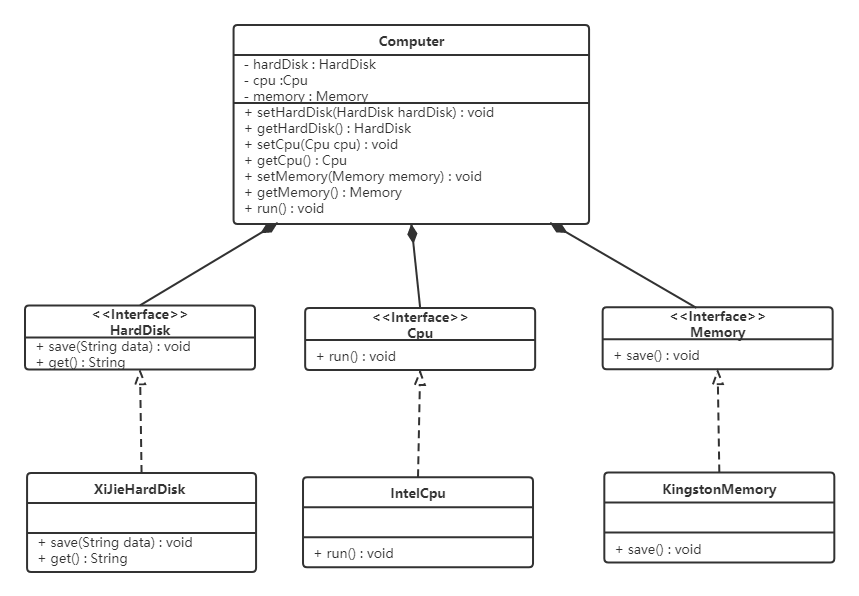

<LockArticle :highHeightPercent="0.3"/>

# 3.2 依赖倒转原则

## 3.2.1 介绍
* 依赖倒转原则是开闭原则的基础，针对接口进行编程
* 依赖抽象，而不是具体的实现
* 可以减少类之间的耦合性，提高系统的稳定性，提高代码的可读性和可维护性
* 降低修改程序所造成的风险

高层模块不应该依赖低层模块，两者都应该依赖其抽象；抽象不应该依赖细节，细节应该依赖抽象。简单的说就是要求对抽象进行编程，不要对实现进行编程，这样就降低了客户与实现模块间的耦合。

下面看一个例子来理解依赖倒转原则

【例】组装电脑

现要组装一台电脑，需要配件cpu，硬盘，内存条。只有这些配置都有了，计算机才能正常的运行。选择cpu有很多选择，如Intel，AMD等，硬盘可以选择希捷，西数等，内存条可以选择金士顿，海盗船等。

**类图如下：**


代码如下：

**希捷硬盘类（XiJieHardDisk）:**

```java
public class XiJieHardDisk implements HardDisk {

    public void save(String data) {
        System.out.println("使用希捷硬盘存储数据" + data);
    }

    public String get() {
        System.out.println("使用希捷希捷硬盘取数据");
        return "数据";
    }
}
```

**Intel处理器（IntelCpu）：**

```java
public class IntelCpu implements Cpu {

    public void run() {
        System.out.println("使用Intel处理器");
    }
}
```

**金士顿内存条（KingstonMemory）：**

```java
public class KingstonMemory implements Memory {

    public void save() {
        System.out.println("使用金士顿作为内存条");
    }
}
```

**电脑（Computer）：**

```java
public class Computer {

    private XiJieHardDisk hardDisk;
    private IntelCpu cpu;
    private KingstonMemory memory;

    public IntelCpu getCpu() {
        return cpu;
    }

    public void setCpu(IntelCpu cpu) {
        this.cpu = cpu;
    }

    public KingstonMemory getMemory() {
        return memory;
    }

    public void setMemory(KingstonMemory memory) {
        this.memory = memory;
    }

    public XiJieHardDisk getHardDisk() {
        return hardDisk;
    }

    public void setHardDisk(XiJieHardDisk hardDisk) {
        this.hardDisk = hardDisk;
    }

    public void run() {
        System.out.println("计算机工作");
        cpu.run();
        memory.save();
        String data = hardDisk.get();
        System.out.println("从硬盘中获取的数据为：" + data);
    }
}
```

**测试类（TestComputer）：**

测试类用来组装电脑。

```java
public class TestComputer {
    public static void main(String[] args) {
        Computer computer = new Computer();
        computer.setHardDisk(new XiJieHardDisk());
        computer.setCpu(new IntelCpu());
        computer.setMemory(new KingstonMemory());

        computer.run();
    }
}
```

上面代码可以看到已经组装了一台电脑，但是似乎组装的电脑的cpu只能是Intel的，内存条只能是金士顿的，硬盘只能是希捷的，这对用户肯定是不友好的，用户有了机箱肯定是想按照自己的喜好，选择自己喜欢的配件。

根据依赖倒转原则进行改进：

代码我们只需要修改Computer类，让Computer类依赖抽象（各个配件的接口），而不是依赖于各个组件具体的实现类。

**类图如下：**



**电脑（Computer）：**

```java
public class Computer {

    private HardDisk hardDisk;
    private Cpu cpu;
    private Memory memory;

    public HardDisk getHardDisk() {
        return hardDisk;
    }

    public void setHardDisk(HardDisk hardDisk) {
        this.hardDisk = hardDisk;
    }

    public Cpu getCpu() {
        return cpu;
    }

    public void setCpu(Cpu cpu) {
        this.cpu = cpu;
    }

    public Memory getMemory() {
        return memory;
    }

    public void setMemory(Memory memory) {
        this.memory = memory;
    }

    public void run() {
        System.out.println("计算机工作");
    }
}
```

面向对象的开发很好的解决了这个问题，一般情况下抽象的变化概率很小，让用户程序依赖于抽象，实现的细节也依赖于抽象。即使实现细节不断变动，只要抽象不变，客户程序就不需要变化。这大大降低了客户程序与实现细节的耦合度。


## 3.2.2 案例

* 创建人的行为
```java
public interface Human {
    void eat();

    void  sleep();
}
```
* 程序员继承人的行为
```java
public abstract class Progarmer implements Human{
    @Override
    public void eat() {
        System.out.println("程序员在吃饭");
    }

    @Override
    public void sleep() {
        System.out.println("程序员在睡觉");
    }

    public abstract void work();
}
```
* Java程序员实现自己特有的行为
```java
public class JavaProgarmer extends Progarmer{
    @Override
    public void work() {
        System.out.println("java programmer work...");
    }
}

```
* 测试程序员实现自己特有的行为
```java
public class TestProgarmer extends Progarmer{
    @Override
    public void work() {
        System.out.println("test programmer work...");
    }
}
```
* 测试
```java
public class Test {
    public static void main(String[] args) {
        JavaProgarmer javaProgarmer = new JavaProgarmer();
        javaProgarmer.work();

        TestProgarmer testProgarmer = new TestProgarmer();
        testProgarmer.work();
    }
}
```
