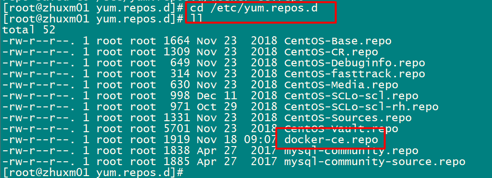
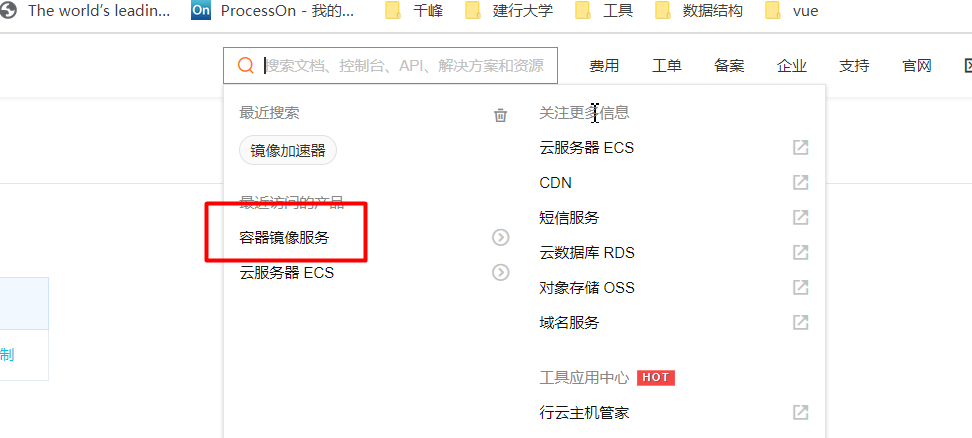
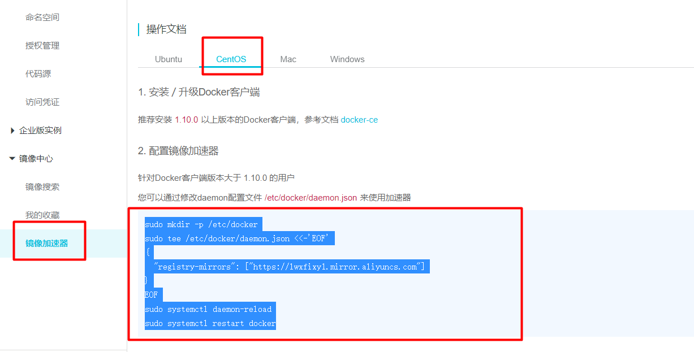
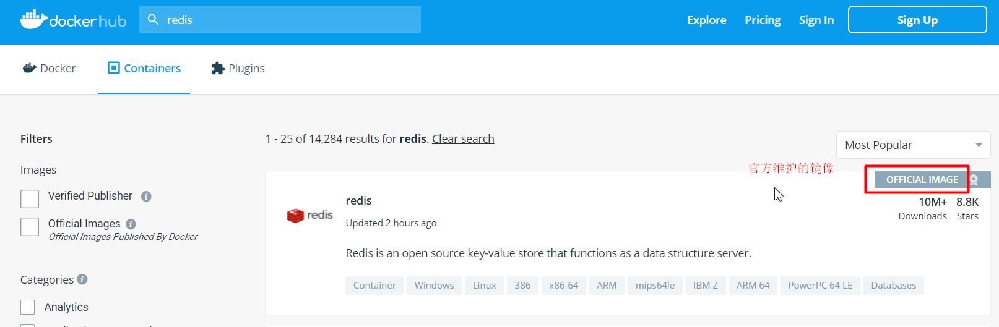
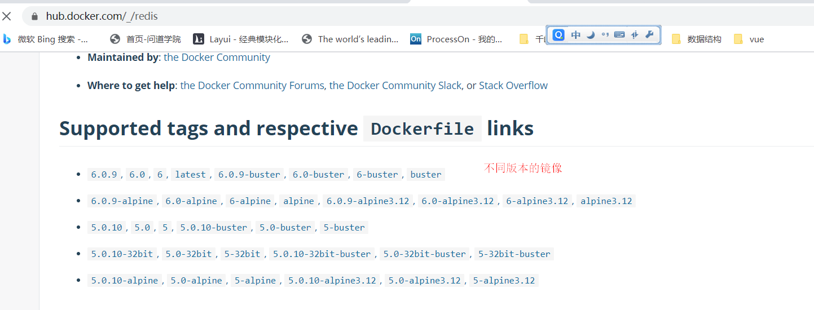
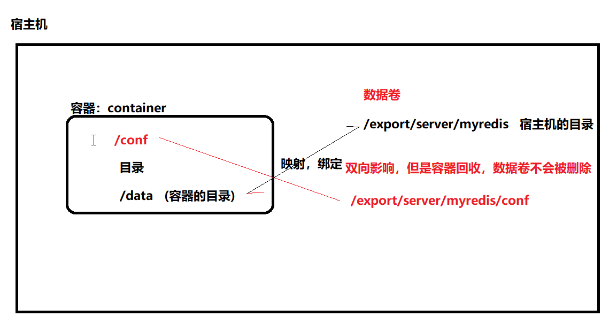

# Docker入门
## 一：Docker介绍

### 1.1：devops存在的问题  

1.环境不一致，导致水土不服

开发的时候jdk使用1.8，发版服务器的jdk版本1.7, 比如开发用1.8 配 tomcat 8.5 ，发布用tomcat 10可能会出问题

2.多用户的操作系统相互不能隔离，会相互影响

一台服务器如果部署多个应用程序，当某个程序运行出了问题牵连其他的服务.

多个程序部署在同一个tomcat，默认最大并发150，某个系统超过了呢？其他系统卡

3.当做活动需要快速搭建服务集群时，传统方式效率低

 一个大型项目，多个模块实现，打包更换太繁琐

4.安装redis、nginx等服务太繁琐

 安装一个Java项目生成环境，jdk,mysql,redis,tomcat，nginx，至少半天时间

### 1.2：docker 思想   

1.集装箱   （镜像 ，据此创建容器 ） 

将你的应用程序打包成一个集装箱(jdk1.8+项目代码、nginx+gcc+依赖库)，谁需要这个应用直接把整个箱子拿过去即可    

2.标准化

运输的标准化、命令的标准化   ，（下载镜像，创建容器的方式标准化）

3.隔离性

docker基于linux内核单独开辟一块空间，来部署运行应用服务


## 二：Docker架构与概念

### 2.1：架构图


### 2.2：相关概念

```txt
Docker 包括三个基本概念:
1.仓库（Repository）：仓库可看成一个代码控制中心，用来保存镜像。
2.镜像（Image）：Docker 镜像，就相当于是一个 root 文件系统。比如官方镜像 ubuntu:16.04 就包含了完整的一套 Ubuntu16.04 最小系统的 root 文件系统。
3.容器（Container）：镜像和容器的关系，就像是面向对象程序设计中的类和实例一样，镜像是静态的定义，容器是镜像运行时的实体。容器可以被创建、启动、停止、删除、暂停等。
```

Docker 使用客户端-服务器 (C/S) 架构模式，使用远程API来管理和创建Docker容器。

Docker 容器通过 Docker 镜像来创建。

容器与镜像的关系类似于面向对象编程中的对象与类。


## 三：Docker安装

docker官网：https://www.docker.com/


Docker CE（社区免费版） 的安装请参考官方文档：

- MacOS：https://docs.docker.com/docker-for-mac/install/
- Windows：https://docs.docker.com/docker-for-windows/install/
- Ubuntu：https://docs.docker.com/install/linux/docker-ce/ubuntu/
- Debian：https://docs.docker.com/install/linux/docker-ce/debian/
- CentOS7：https://docs.docker.com/install/linux/docker-ce/centos/  7以下兼容性差
- Fedora：https://docs.docker.com/install/linux/docker-ce/fedora/
- 其他 Linux 发行版：https://docs.docker.com/install/linux/docker-ce/binaries/


### 第一步：设置docker的yum源

```shell
#yum-util 提供yum-config-manager功能
yum install -y yum-utils
yum-config-manager \
    --add-repo \
    https://download.docker.com/linux/centos/docker-ce.repo
    
    
      \:换行 
    

```





### 第二步：安装docker   

```shell
#下载并安装最新版【不建议】
#yum install docker-ce docker-ce-cli containerd.io -y 
#下载并安装指定版本【建议】
#查看docker-ce版本
yum list docker-ce --showduplicates | sort -r
#保证服务器能连接外网
yum install docker-ce-18.09.0 docker-ce-cli-18.09.0 containerd.io -y


#查看docker版本
docker -v   

#启动命令
systemctl start docker
systemctl stop docker
systemctl restart docker
#开机自启动
systemctl enable docker  	  

```


### 第三步：docker镜像加速器

> 安装好Docker之后，我们可以在Docker Hub(https://hub.docker.com/)上下载到大量已经容器化的应用镜像，即拉即用。这些镜像中，有些是Docker官方维护的，更多的是众多开发者自发上传分享的
>
> 不幸的是，Docker Hub并没有在国内部署服务器或者使用国内的CDN服务，因此在国内特殊的网络环境下，镜像下载十分耗时，少则二十分钟，多则数十小时。


配置阿里镜像加速器







```shell
sudo mkdir -p /etc/docker
sudo tee /etc/docker/daemon.json <<-'EOF'
{
  "registry-mirrors": ["https://evedyeni.mirror.aliyuncs.com"]
}
EOF
sudo systemctl daemon-reload
sudo systemctl restart docker

 #---------------网易-------------------
sudo mkdir -p /etc/docker
sudo tee /etc/docker/daemon.json <<-'EOF'
{
  "registry-mirrors": ["http://hub-mirror.c.163.com"]
}
EOF
sudo systemctl daemon-reload
sudo systemctl restart docker


```


## 四：Docker命令

### 4.1：基础命令

```shell
docker version
docker info
docker --help

```


### 4.2：docker服务相关命令

```shell
systemctl start docker
systemctl status docker
systemctl stop docker
systemctl restart docker
#开机启动
systemctl enable docker
```


### 4.3：docker镜像相关命令

- **列出本地镜像**     

```shell
#列出本地所有的docker iamges
docker images 
```

- 搜索镜像

```shell
#搜索镜像
docker search mysql
```


镜像查找地址：https://hub.docker.com/   需要注册







- **下载镜像**

```shell
#下载最新（latest）版 ，非必要不建议-
docker pull 镜像名

#下载指定版本
docker pull 镜像名:镜像的版本号     docker pull mysql:5.7
```


- **删除镜像**

> 注意，如果镜像有实例在运行是不能被删除的

```shell
#根据镜像id删除，注意如果两个镜像的镜像id（id前缀）一样，是无法被删除的
docker rmi aa27923130e6

#根据镜像名:版本删除   
docker rmi mysql:5.7


```

**1 查看镜像 docker images**

**2 下载镜像 docker pull**

**3删除镜像 docker rmi** 


### 4.4：docker容器实例命令

**docker run  创建容器    [守护式: -d      交互式: -it]** 

**docker exec  进入容器**

**exit  退出容器**

**docker ps 查看正在运行    -a   所有的容器**       all所有

**docker start 容器名** 

**docker stop** 

**docker rm** 

#### 创建容器实例    

- 命令：
	docker run [OPTIONS] IMAGE [COMMAND][ARG…]
- OPTIONS说明：
	**–-name=‘容器新名字’：为容器自定义一个名称**
	**-d：后台运行容器，并返回容器ID，也即启动守护式容器**
	**-i：以交互模式运行容器**
	**-t：(terminal)为容器重新分配一个伪终端**
	-P：随机端口映射
	-p：指定映射端口，有以下四种格式
	①ip:hostPort:containerPort
	②ip::containerPort
	③hostPort:containerPort
	④containerPort

```shell
#根据mysql镜像创建mysql容器实例
[root@zhuxm01 ~]# docker run -d --name mysql01 \        #交互式用-it 代替 -d -d：代表守护式
-p 3307:3306 \
-e MYSQL_ROOT_PASSWORD=root \
mysql:5.7
#进入到容器：
docker exec -it mysql01 /bin/bash

#或用交互式创建
docker run -it --name mysql05 -p 3308:3306 -e MYSQL_ROOT_PASSWORD=root mysql:5.7 /bin/bash

#切换到容器的根目录
root@09eb509b5fd4:/data# cd /
#查看容器的跟目录
root@09eb509b5fd4:/# ls
in   dev                         entrypoint.sh  home  lib64  mnt  proc  run   srv  tmp  var
boot  docker-entrypoint-initdb.d  etc            lib   media  opt  root  sbin  sys  usr
#如果是-it形式的，退出交互窗口，注意一旦exit，那么容器实例也随之关闭
root@09eb509b5fd4:/# exit
exit
[root@zhuxm01 ~]# 
```


#### 列出正在运行的容器

- 命令：
	docker ps [OPTIONS]
- OPTIONS说明：
	-a :列出当前所有正在运行的容器+历史上运行过的
	-l :显示最近创建的容器。
	-n：显示最近n个创建的容器。
	-q :静默模式，只显示容器编号。
	–no-trunc :不截断输出。

```shell
#查看正在运行的
docker ps
#查看正在运行以及创建了但是并没有运行的容器实例
docker ps -a
```


#### 关闭容器实例

```shell
#其中redis02是容器的名称
docker stop mysql01   
```


#### 启动容器实例

```shell
#其中redis-c2是容器的名称
docker start mysql01
```


#### 删除容器实例

```shell
#其中redis-c2是容器的名称
docker rm mysql01
```


#### 查看容器实例的信息

```shell
docker inspect mysql01
```


## 五：Docker数据卷

### 5.0：数据卷概念

思考：

容器数据持久化，即容器如果被删除，那么容器的数据是否会被删除？如果数据删除了怎么办？


数据卷

1.数据卷就是宿主机   (虚拟机)的一个目录或者文件    

2.当容器目录与宿主机目录绑定后可以双向影响   

3.一个数据卷可以被多个容器绑定（挂载）

4.一个容器可以绑定多个数据卷

5**.当容器被删除，数据卷不会被删除**




### 5.1：创建数据卷

创建tomcat容器

```shell
docker search tomcat
docker pull tomcat:9.0


# -- rm表示当容器被停止时会自动删除该容器  
docker run -d --name tomcat01 \
--rm \    
-p 8081:8080 \          centos 端口     docker容器 端口
tomcat:9.0
    
                
```


```shell
#创建数据卷的命令,tomcat为数据卷的名称
docker volume create tomcat    
#数据卷本质就是宿主机的一个目录 ，的默认存放路径为
/var/lib/docker/volumes/


docker volume inspect tomcat
docker volume ls
docker volume rm tomcat


#数据卷绑定容器目录，以下面这种方式绑定，如果/usr/local/tomcat/目录下有内容，会将这些内容同步到数据卷中
docker run -it --name tomcat01 \
--rm \
-p 8081:8080 \
-v tomcat:/usr/local/tomcat/  \
tomcat:9.0


#修改宿主目录，查看容器目录

#修改容器目录，查看宿主目录

#删除容器，查看数据卷，数据卷不会被删除
```


创建mysql的数据卷：

docker run -d --name mysql01 -p3307:3306 -e MYSQL_ROOT_PASSWORD=root -v mysql:/var/lib/mysql  mysql:5.7

```shell

```


```txt

```


## 六：docker应用服务部署

### 6.1:docker安装mysql

第一步：搜索mysql镜像

```shell
docker search mysql
```


第二步：下载mysql镜像

```shell
docker pull mysql:5.7
```


第三步：创建mysql容器

```shell
docker run -d --name mysql02 \
-p3306:3306 \
-e MYSQL_ROOT_PASSWORD=root \
mysql:5.7
```


第四步：远程连接mysql

```shell
#进入容器内部
docker exec -it mysql01 /bin/bash       退出用exit
#连接容器内的mysql   如：mysql -uroot -proot  
grant all privileges  on *.* to root@'%' identified by "root";
flush privileges;
```


## 七：DockerFile

我们自己想做自己的镜像，这么做？

我们可以做微服务的镜像


### 7.1：dockerfile简介

1.DockerFile是一个文本文件

2.DockerFile文件中包含了一条条的指令

3.DockerFile可以帮我们构建一个自己的全新镜像

通过dockerfile为团队提供一个完全一致的环境，解决了因环境不同导致的水土不服的问题


### 7.2：dockerfile指令

| 关键字      | 作用                     | 备注                                                         |
| ----------- | ------------------------ | ------------------------------------------------------------ |
| FROM        | 指定父镜像               | 指定dockerfile基于那个image构建                              |
| MAINTAINER  | 作者信息                 | 用来标明这个dockerfile谁写的                                 |
| LABEL       | 标签                     | 用来标明dockerfile的标签 可以使用Label代替Maintainer 最终都是在docker image基本信息中可以查看 |
| RUN         | 执行命令                 | 执行一段命令 默认是/bin/sh 格式: RUN command 或者 RUN ["command" , "param1","param2"] |
| CMD         | 容器启动命令             | 提供启动容器时候的默认命令 和ENTRYPOINT配合使用.格式 CMD command param1 param2 或者 CMD ["command" , "param1","param2"] |
| ENTRYPOINT  | 入口                     | 一般在制作一些执行就关闭的容器中会使用                       |
| COPY        | 复制文件                 | build的时候复制文件到image中                                 |
| ADD         | 添加文件                 | build的时候添加文件到image中 不仅仅局限于当前build上下文 可以来源于远程服务 |
| ENV         | 环境变量                 | 指定build时候的环境变量 可以在启动的容器的时候 通过-e覆盖 格式ENV name=value |
| ARG         | 构建参数                 | 构建参数 只在构建的时候使用的参数 如果有ENV 那么ENV的相同名字的值始终覆盖arg的参数 |
| VOLUME      | 定义外部可以挂载的数据卷 | 指定build的image那些目录可以启动的时候挂载到文件系统中 启动容器的时候使用 -v 绑定 格式 VOLUME ["目录"] |
| EXPOSE      | 暴露端口                 | 定义容器运行的时候监听的端口 启动容器的使用-p来绑定暴露端口 格式: EXPOSE 8080 或者 EXPOSE 8080/udp |
| WORKDIR     | 工作目录                 | 指定容器内部的工作目录 如果没有创建则自动创建 如果指定/ 使用的是绝对地址 如果不是/开头那么是在上一条workdir的路径的相对路径 |
| USER        | 指定执行用户             | 指定build或者启动的时候 用户 在RUN CMD ENTRYPONT执行的时候的用户 |
| HEALTHCHECK | 健康检查                 | 指定监测当前容器的健康监测的命令 基本上没用 因为很多时候 应用本身有健康监测机制 |
| ONBUILD     | 触发器                   | 当存在ONBUILD关键字的镜像作为基础镜像的时候 当执行FROM完成之后 会执行 ONBUILD的命令 但是不影响当前镜像 用处也不怎么大 |
| STOPSIGNAL  | 发送信号量到宿主机       | 该STOPSIGNAL指令设置将发送到容器的系统调用信号以退出。       |
| SHELL       | 指定执行脚本的shell      | 指定RUN CMD ENTRYPOINT 执行命令的时候 使用的shell            |


```shell
FROM 指定当前自定义镜像需要依赖的镜像
RUN 执行linux命令，比如cd mkdir等
WORKDIR：声明镜像的默认工作目录，当容器启动后自动跳到该目录
ADD 将宿主机的jar包加入到自定义的镜像的目录中
CMD：需要执行的命令，在workdir目录下执行这条命令,容器启动（在workdir目录）执行该命令
```


### 7.3：部署Springboot微服务

需求：

定义dockerfile，发布springboot项目

第一步：编写dockerfile

```shell
#定义基础镜像
from java:8
maintainer sujie <823601183@qq.com>
#创建目录
run mkdir /jars
#指定工作目录
workdir /jars
#把宿主机的jar包放入容器目录(/jars)中
add  hospital-0.0.1-SNAPSHOT.jar app.jar
#容器启动后，启动服务
cmd java -jar app.jar
```

 传到 export/server下

第二步：构建镜像

```shell
docker build -f dockerfile.txt -t app:1.0 .    空格和.
```

docker images 本地镜像可以看到

第三步：启动容器

```shell
docker run -it --name app01 -p 8881:9999 app:1.0 
```


常用命令总结：

**镜像：**

​	**1 查看镜像 docker images**

  **2 下载镜像 docker pull  **

**3删除镜像 docker rmi** 

**容器：**

 **docker run  创建容器    [守护式: -d      交互式: -it]** 

**docker exec  进入容器**

**exit  退出容器**

**docker ps 查看正在运行    -a:所有的容器**

**docker start 容器名** 

**docker stop** 

**docker rm     **

数据卷：

   docker volume create      ( 数据备份)

   docker volume rm 

   docker volume ls

**构建镜像：**

**docker build**

