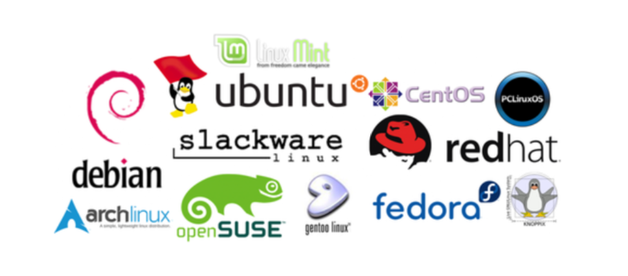
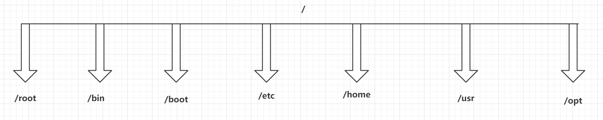

# Linux_简介及常用命令

## 一、引言

环境主要指的是数据不一样，搞一个开发库，数据随便增删改查

测试环境，数据往往是和生产环境一致的

生产环境，真实数据，

### 1.1、开发环境  

   dev:  本机(windows系统) idea (代码) --------开发环境的数据库  

> 平时大家大多是在Windows或者Mac操作系统下去编写代码进行开发，在开发环境中安装大量的软件，这样会导致环境的稳定性和安全性降低
>
> 

### 1.2、生产环境

 pro : linux    tomcat(war)   -------生产环境的数据库

> 是将程序运行在此环境中，供用户去使用。这个环境是有专业的人员去维护，一般人是没有权限去操做生产环境的

### 1.3、测试环境

sit: linux   tomcat(war) -----测试环境的库

> 一般克隆一份生产环境，会将开发环境中的程序部署到测试环境中，这个环境的主要目的是去程序进程检测，收集程序中的各种问题，并交给开发人员进行修改

### 1.4、操作系统的选择

   .net  (c#)      java 

> 生产环境中，常用的操作系统有Windows Server (IIS)，Linux (tomcat)，Unix等等，Linux操作系统，在生产环境中占据了大量的市场份额，Linux主要以稳定，可靠，免费的特点成为全球使用最多的服务器操作系统。
>
> Linux操作系统现在已经成为后台开发人员必备的技能，并且后期学习的各种知识都会涉及到Linux操作系统。

## 二、Linux介绍

### 2.1、Linux介绍

> 在Linux操作系统出现之前，还有一个操作系统叫做Minix，Minix操作系统是由Andrew S. Tanenbaum教授研发出来的，当时大学教授是为了给学生上课，买了一套Unix操作系统，参考Unix自己写了一个操作系统，并且命名为Minix。同时将Minix开源，供学校内部的研究和教学，到了2000年，Andrew将Minix操作系统完全对外开源。
>
> Minix由于完全对外开源之后，在互联网上迅速的传播，但是大家在使用时，发展Minix不时很完美，内部存在各种各样问题。用户将问题解决后，编写了一个补丁，将补丁以邮件的方式发给Andrew，但是Andrew教授最初的目的只是为了教学和研究。
>
> 于此同时，一位芬兰的大学生出现了，叫Linus，在Minix操作系统基础上，自己添加了一些补丁和插件，并将其命名为Linux操作系统，并且完全对外开源，而且开始维护Linux操作系统。


### 2.2、Linux的版本

> Linux的版本分为两种，一种是Linus团队正在维护的开源内核版本。另一种是一些厂商基于内核版本封装的发行版本。
>
>    - Linux的内核版本官网：https://www.kernel.org/
>
> - Linux的发行版本，咱们需要学习的发行版本就时CentOS
>
>   CentOS 免费 
>
>   redhat 收费



### 2.3、Linux和Windows区别

> - Linux是严格区分大小写的； sql 大小写 
> - Linux中一切皆是文件；
> - **Linux中文件是没有后缀的，但是他有一些约定俗成的后缀；**
> - Windows下的软件一般是无法直接运行的Linux中。
>
> [Ps：我们在学习Linux时，参考Windows下做了什么，就在Linux中做什么]()

## 三、Linux安装

> - 安装Linux，我们需要一个虚拟机，为了安装虚拟环境：VMware或者Virtual Box（采用VMware）
>
>    https://www.vmware.com/go/getworkstation-win
>
> - 为了安装Linux，我们需要一个Linux的镜像文件：CentOS7版本
>
>    http://mirrors.163.com/centos/7/isos/x86_64/CentOS-7-x86_64-Minimal-1908.iso
>
> - 安装一个连接Linux的图形化界面：Xterm，SSH，XShell（Xterm）

### 3.1、安装VMware

> 参考安装教程

### 3.2、安装Xshell和Xftp

> 参考安装教程

### 3.3、在VMware中安装Linux

> 参考安装教程

### 3.4、使用Xshell连接Linux

> 参考安装教程

## 四、Linux的目录结构  重点

> Windows的目录结构是带有盘符的。D：  E： C：，而Linux中是没有盘符的

linux根目录 /

> 在xshell中输入ls / 查看Linux的顶级目录。


> Linux的常用目录



> - **root**：该目录为系统管理员(root)HOME目录
> - bin：这个目录下放着经常使用的命令
> - boot：这里存放的是启动Linux时的一些核心文件
> - **etc**：存放系统管理所需要的配置文件和子目录   （配置有关的）
> - **home**：普通用户的HOME目录
> - **usr**：默认安装软件的目录，类似Windows中的Program Files目录 
> - opt：是主机额外安装软件拜访的目录

## 五、Linux的基本命令

> Linux中命令的基本格式：**命令 [选项]  [参数]**
>
> 需要注意，个别命令是不遵循这个格式
>
> 当命令中有多个选项时，可以写在一起的，并且选项也是由简写方式的 命令 -选项A选项B
>
> Linux的基本操作命令，不遵循上述格式，但是后期会经常使用……

```sh
# 1. 我是谁
who am i    //查看登录账号

# 2. 我在哪   //当前路径
pwd    

# 3. 查看ip 地址
ip a | ip address
ifconfig         

# 4. 清屏
clear

# 5. ping域名|ip
ping 地址

# 6. 强制停止
Ctrl + C
```

## 六、Linux目录命令【`重点`】

**ls  -al**  查看所有文件包含隐藏的并列出详细信息

**ls -l = ll**  查看非隐藏的目录和文件并列出详细信息

### 6.1、列出目录

> 查看指定目录下的内容，默认查看当前目录下内容
>
> [Linux中的隐藏文件是以.开头的，当前目录使用.表示，上一级目录使用..表示]()

```sh
ls [-alh] [目录名或文件名]
# 目录名不填写，默认为当前目录。
# -a：列出的全部的文件，包括隐藏文件
# -l：列举出全部的信息
# -h：以人们方便阅读的形式显示文件大小
ll ----> ls -l 
```

### 6.2、切换目录

cd   .  ..  /   ~

> 实现目录间切换，使用绝对路径、相对路径、特殊符号

```sh
cd 具体路径 | 特殊符号
```

| 特殊符号 | 表达的路径             |
| -------- | ---------------------- |
| .        | 当前目录               |
| ..       | 上一级目录             |
| /        | 根目录                 |
| ~        | 当前登录用户的HOME目录 |
| -        | 返回上一次所在的目录   |

### 6.3、创建目录

> 创建目录，以及创建多级目录方式

```shell
mkdir [-p] 目录名
# -p：代表创建多级目录时，使用
```

### 6.4、删除目录   

  rm [-rf]  删目录/删文件

   删除非空目录或包含内容的目录

```shell
# 只能删除空目录   
rmdir 目录名 

# 删除非空或空目录  
rm [-rf] 目录名   
# -r：代表递归删除目录下的全部内容
# -f：不询问，直接删除
```

### 6.5、复制目录

 目标目录要以/结尾，如果没有/，就是相当于复制并重命名

> 复制目录下的全部内容

```sh
cp -r 来源目录 目标目录
# -r：递归复制全部内容，必填项
# 来源目录：被复制的目录
# 目标目录：复制到哪儿
```

### 6.6、移动、重命名目录  

> 移动、重命名目录，会根据第二个参数指定具体操作逻辑

```sh
mv 目录名 新目录名 | 路径
# 如果第二个参数指定的路径不存在，就是重命名，如果第二个参数的路径存在，就是移动（剪切）
```

## 七、Linux的文件命令【`重点`】

### 7.1、创建文件

> 创建空文件

```sh
touch 文件名1 文件名2 ……
```

### 7.2、查看文件

> 根据不同的业务，可以选择不同的查看方式

文件小: **cat** 

文件大:**more**   **less** 

查看头head          head -n 10 文件名

查看尾 **tail**     (tail -f        )      **面试题**    ---------查看生产日志----

```sh
# 查看文件，直接展示到最后一行       查看文件 
cat 文件名    

# 从最后一行开始查看文件内容，展示全部
tac 文件名

# 显示文件的用时，展示行号
nl 文件名

# 查看大文件时，可以一页一页的向下翻
# 嗯space向下翻页，退出时摁q   (quit退出)
more 文件名

# 查看大文件时，可以任意的向上或者向下翻
# 向上或向下翻页摁PageUp和PageDown，一行一行查看，摁光标的↑↓  退出q
less 文件名

# 只查看前几行
head 文件名
head -n 行数 文件名

# 只查看后几行
tail 文件名
tail -n 行数 文件名
# 监控日志
tail -f 文件名     #很重要    面试题     

自动补全: tab  命令切换 上下箭头
```

### 7.3、移动、重命名文件

> 移动、重命名目录，会根据第二个参数指定具体操作逻辑

```sh
# 如果第二个参数指定的路径不存在，就是重命名，如果第二个参数的路径存在，就是移动
mv 文件名 新文件名 | 路径
```

### 7.4、复制文件

> 复制文件到指定目录下

```sh
cp 文件名 目录
```

### 7.5、删除文件

> 删除文件方式

```sh
rm [-f] 文件名
# -f：是否询问
```

## 八、Linux的压缩解压命令【`重点`】

### 8.1、针对tar命令

> Linux中常用的压缩包，大多是.tar，.tar.gz、.tar.bz2的

#### 8.1.1、解压压缩包

> 针对压缩包后缀的情况，采用不同的参数，否则可能会损失文件

```sh
tar [-zxvf] 压缩包名称 [-C 路径]

# -z： 通过gzip的支持进行压缩和解压缩，档案名最好为*.tar.gz
# -j： 通过bzip2的支持进行压缩和解压缩，档案名最好为*.tar.bz2
# -x： 代表解压 
# -v： 解压时，打印详细信息
# -f： -f选项必须放在所有选项的最后，代表指定文件名称
# -C 路径： 代表将压缩包内容解压到指定路径
```

#### 8.1.2、打包成压缩包

> 可以将多个文件以及目录打包成压缩包，根据选择的参数指定压缩包名

```sh
tar [-zcvf] 压缩包名称 文件1 文件2 目录1 目录2 ...
# -c： 代表打包
# 其他参数同上
```

### 8.2、针对zip类型压缩包 

> Linux不仅仅针对tar类型的压缩包，也支持zip，rar这种Windows下的压缩包。
>
> 不过需要安装软件针对对各种类型压缩包的操作

#### 8.2.1、安装软件

```sh
yum -y install zip     # 打包程序
yum -y install unzip   # 解压程序
```

#### 8.2.2、解压以及打包

```shell
# 解压
unzip 压缩包名称

# 打包
zip 压缩包名称 文件1 文件2 目录1 目录2 ...
```

## 九、用户&用户组的操作

### 9.1、用户的常用操作命令

> Linux是一个多用户的操作系统，任何一个用户想要操作Linux操作系统，必须向系统管理员申请一个账号才可以，并且以这个账号的身份去操作Linux。
>
> 用户的账号一方面可以帮助系统管理员追踪当前用户的操作。另一方面可以控制当前用户对系统资源访问。

#### 9.1.1、用户的创建

```sh
useradd [-cgd] [选项指定的具体内容] 用户名
# -c：代表comment，给用户添加一段注释
# -g：代表group，可以修改用户的所在组
# -d：代表指定用户的HOME目录
```

#### 9.1.2、设置用户密码

```sh
passwd 用户名
```

#### 9.1.3、切换用户  --- 重点     

```sh
su 用户名
# [root@localhost ~]#   -> root用户在本地登录，并且当前在~目录下，#代表是超级管理员
# [qf@localhost ~]$		-> qf用户在本地登录，并且当前在~目录下，$代表是普通用户
```

#### 9.1.4、删除用户

```sh
userdel [-r] 用户名
# -r： 代表删除用户的同时
```

#### 9.1.5、修改用户

```sh
usermod [-cgd] [选项指定的具体内容] 用户名
# -c：代表comment，给用户添加一段注释
# -g：代表group，可以修改用户的所在组
# -d：代表指定用户的HOME目录
# -l:改名
```

### 9.2、用户组的操作

> 用户的身份除了用户本身，还会分配到指定的用户组，可以通过用户组对设置一些文件的操作权限

#### 9.2.1、创建用户组

```sh
groupadd 用户组名 

查看用户组 cat /etc/group
```

#### 9.2.2、修改用户组

```sh
groupmod [-n] [选项指定的具体内容] 用户组名
# -n 修改用户组名称
```

#### 9.2.1、删除用户组

```sh
groupdel 用户组名
# 只能删除不存在用户的用户组
```

## 十、文件权限的修改【`重点`】

> 首先我们要清楚Linux文件的权限信息
>
> 在Linux中输入ls -l 或者 ll查看文件和目录的详细信息


> 实例中，a目录的第一个属性用“d”标识这个a是一个目录。
>
> anaconda-ks.cfg第一个属性用“-”标识他是一个文件。
>
> 在Linux文件详情的后面属性需要分为三组查看
>
> - rwx： 代表文件拥有者的权限
> - rwx： 代表文件所属组用户的权限
> - rwx： 代表其他用户对当前文件的操作权限
>   - r： 代表read，读的权限
>   - w： 代表write，写的权限
>   - x： 代表execute，代表执行权限
>
> 其余信息
>
> - 后续的第一个root：代表当前文件的拥有者
>
> - 后续的第二个root： 代表当前文件的所属组
>
> - 后续分别为：文件的大小和最后修改时间等信息

### 10.1、对文件的权限修改     重点

> 使用chmod对文件的权限进行修改，一种使用数字，一种使用符号……
>
> - 数字方式方便操作，不过要修改整体权限信息
> - 符号方式更细粒度华，不过操作麻烦

#### 10.1.1、数字方式    

文件的所有者

所有者同组

其他用户


```sh
chmod [-R] 777 文件|目录
# rwx在这三个权限中r：4，w：2，x：1     4 +2+ 1 =7  
# -R： 当修改一个目录权限时，可以添加-R，将目录下的全部内容，都修改权限。

```


#### 10.1.2、符号方式

```sh
chmod [-R] a=rw 文件|目录
# user：u，group：g，other：o，all：a
# read：r，write：w，execute：x
# 赋予权限的方式 , 添加：+，减掉：-，设定：=
# -R： 当修改一个目录权限时，可以添加-R，将目录下的全部内容，都修改权限。
```

### 10.2、文件拥有者及所属组修改 

> chown可以直接修改拥有者和所属组，chgrp只能修改所属组……

```shell
# 修改文件的拥有者和所属组
chown [-R] 拥有者：所属组 文件|目录
# 修改文件的拥有者
chown [-R] 拥有者 文件|目录
# 修改文件的所属组
chgrp [-R] 所属组 文件|目录
```

### **10.3 端口占用 **       

windows端口占用
netstat -ano|findStr 8080
taskkill /f /pid 7116

linux端口占用    
netstat -ntlp | grep 8080              
kill -9 PID

### 10.4 总结
如果代码中有文件读写的涉及到路径的问题，要注意windows和linux两个系统的区别

常用的基本命令：

**pwd  ifconfig  ping   ctrl+c**

su 用户名：切换用户

目录的操作：

mkdir 创建目录  -p 多级目录

mv 移动或**改名**

rm -rf  删除

cp  复制  -r 多级

文件操作:

touch 创建

mv 移动或改名

cp复制

删除rm -rf

打包 tar -zcf   解压 tar -zxf    -C

修改权限chmod [-R] 多级         7 : 4  2  1     --->  755

**linux端口占用    
netstat -ntlp | grep 8080          查看进程号(占用了8080端口的进程)      
kill -9 PID**                                     **终止进程**

**如何在linux中查找一个文件?    find 路径 -name "文件名"    例: find / -name  "a.txt"**

读文件:

cat     读小文件

more/less    读大文件

tail  -f   实时刷新日志 (生产中经常用看日志)            
