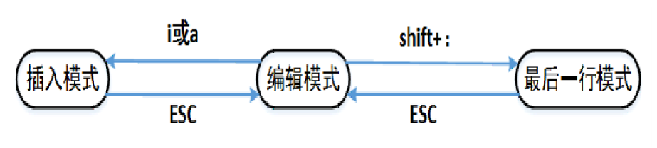

# Linux_Vim使用
## 一、Vi/Vim简介

**修改配置文件        **

### 1.1、是什么

> 文本编辑器，类似于Windows下的记事本、notepad++。

### 1.2、用途    

>编写代码 
>
>编写文档
>
>记录简短信息

### 1.3、为什么要学习Vi/Vim

>Linux系统默认的编辑器；
>
>多数时候Linux都不安装GUI -图形界面 ，作为服务器操作系统有时需要通过修改配置文件修改配置，因此需要学习vi/vim。  
>
>公司里的linux基本不安图形界面，所以使用命令操作居多

## 二、Vi/Vim的三种操作模式

用vim编辑器打开一个文件 vim  c.txt

### 2.1、三种操作模式简介

> 编辑模式：vi将输入的字符作为**命令**对待，并对每个命令做出回应，但不显示这些字符；
>
> 插入模式：vi将输入的字符作为正文内容放在正编辑的文件中；
>
> 最后一行模式：所有以冒号":"开始的命令将使vi处于最后一行模式，光标移动到屏幕最底一行，输入的**命令**将在该行显示。

### 2.2、三种操作模式转换

### 2.3、编辑模式下移动光标

> **[n]G:** 将光标定位到第n行开始处；常用
>
> **G:** 将光标定位到文件结束处；    常用
>
> **gg:** 将光标定位到文件开始处；   常用
>
> **H:** 光标定位到屏幕顶部；
>
> **M:** 光标定位到屏幕中间；
>
> **L:** 光标定位到屏幕底部。

### 2.4、编辑模式下进入插入模式

> i:从光标当前位置开始插入；   常用
>
> a:从光标当前位置的下一个字符开始插入；
>
> o:在光标位置的下行插入一个空行，再进行插入； 
>
> O:在光标位置的上一行插入一个空行，再进行插入；  
>
> I:从光标所在行的开头开始插入正文；
>
> A:从光标所在行的末尾开始插入正文

### 2.5、编辑模式下删除和修改文本

> u:撤销前面多次修改；   常用   
>
> **[n]x:** 删除光标后n个字符；
>
> **[n]X:** 删除光标前n个字符；
>
> **[n]dd:** 删除从当前行开始的n行；    常用
>
> **[n]yy:** 复制从当前行开始的n行；     常用
>
> **p:** 把剪切板上的内容插入到当前行； 常用
>
> **dw**:删除单词
>
> **.:** 执行上一次操作；
>
> **shift+zz:** 保存并退出当前文件

### 2.6、编辑模式下的查找 （看日志会常用！！！）      

>**/字符串:** 从光标开始处向文件尾查找字符串；   常用
>
>**？字符串:** 从光标开始处向文件首查找字符串；常用
>
>**n** 同一方向重复上一次查找命令；   常用
>
>**N** 反方向重复上一次查找命令。       常用

### 2.7、最后一行常用命令
> **w ** 保存当前文件；
>
> **q ** 退出vi；       
>
> **wq** 保存当前文件，退出；   常用
>
> **x** 同上；
>
> **q!** 不保存文件并退出；   常用
>
> **set number ** 设置行号显示

以vim打开文件，处于编辑模式下：

列出常用：

移动光标：移动到头 gg  移动到尾G  移动到某一行[n]G

进入插入模式: i

删除和修改：回退修改 u    复制多行[n]yy  删除多行[n]dd     粘贴 p

查找（看日志）:  从前往后找/       从后往前找?     查找下一个 n    反方向查找 N

最后一行命令：保存退出 wq  强制退出q!

项目日志框架 .logback    applicaiton.propertie配置日志位置和名字    

外置的tomcat每天生成日志，项目有异常发生了，就可以通过查看tomcat的日志看到，

内置的也可以生成日志，需要配置

登录到服务器, tail -f 查看实时日志     

查看往期日志 cat / more

### 2.8、总结
**如何看生产日志，排查生产问题?   /    n  N**

**Vim常用命令**

**[n]G: 将光标定位到第n行开始处；常用**

**G: 将光标定位到文件结束处；    常用**

**gg: 将光标定位到文件开始处；   常用**

**i:从光标当前位置开始插入；   常用**

**[n]dd: 删除从当前行开始的n行；    常用**

**[n]yy: 复制从当前行开始的n行；     常用**

**p: 把剪切板上的内容插入到当前行； 常用**

**u:撤销前面多次修改；   常用**

**编辑模式下查找日志内容：**

**从光标出往下找 : /   往上找：？**

**找下一个:n   反方向查找:N**

**保存退出：进入到最后一行模式wq**

**不保存退出: 进入到最后一行模式  q!**

   

