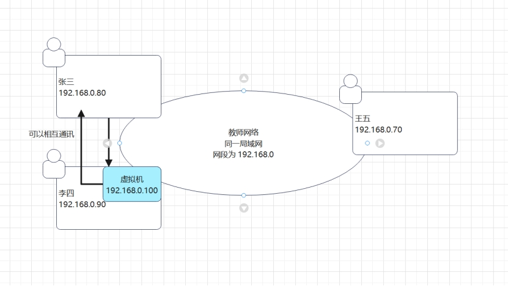
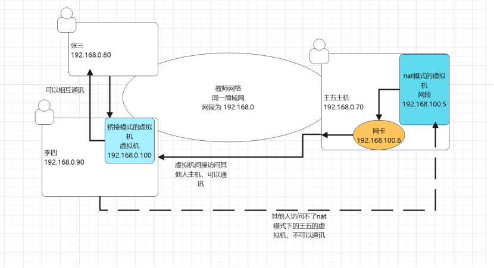

# linux种网络连接的3种模式

## **常识：**

### 1、**网段**  

比如  192.168.0.100  其中  192.168.0  代表一个网段，每个网段 中的ip最多只有255个，也就是说  192.168.0网段下只有  192.168.0.0  -  192.168.0.255

 

### **2、常用地址**

比如 192.168.0.1 一般用作网关，192.168.0.55 一般用作广播地址，也就是说  *.*.*.1 一般用作网关，*.*.*.55 一般用作广播地址

 

## **桥接模式**

虚拟系统可以和外部同一局域网下的系统通讯，但是容易造成ip冲突

 

如果李四有一台虚拟机地址如图所示，使用桥接模式，那么这台虚拟机可以与张三和王五直接通讯，同时张三王五也可以和这台虚拟机直接通讯，但是，如果同一教室里有200人，每个人都在这个网段下，就相当于占用了200个该网段下的ip，常识，一个网段下只能有255个ip，那么如果这200个人都创建一个虚拟机，那么该网段下的ip不够用，因此会造成ip冲突

 

## **NAT模式**

Nat模式就是网络地址转换模式，虚拟地址可以和外部通讯，不造成ip冲突

 

王五使用nat模式创建了一台虚拟机，同时会在主机中虚拟出一张网卡和一个ip，这个ip与虚拟机的ip（这个ip是随机分配的）在同一个网段下（192.168.100网段），此时，该虚拟机与主机可以通讯，同时，该虚拟机通过与主机可以与外部同一局域网下（192.168.0网段）的ip通讯，但是其他们无法与王五的虚拟机通讯

 

## **主机模式**

他就是一个独立的系统，不和外部发生联系，无法与外部通讯