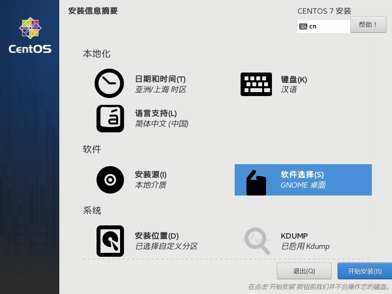
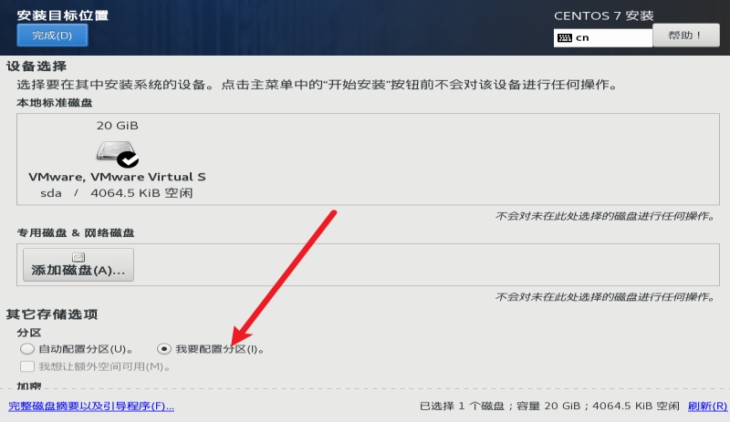
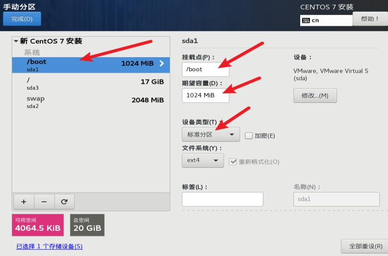
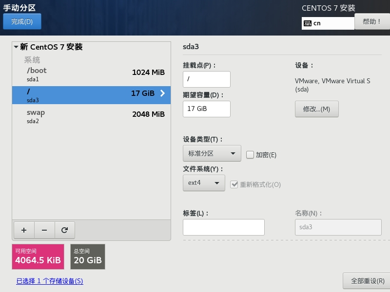
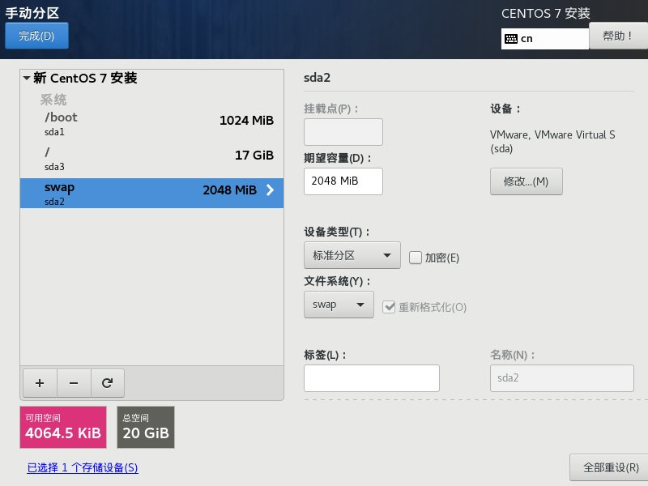
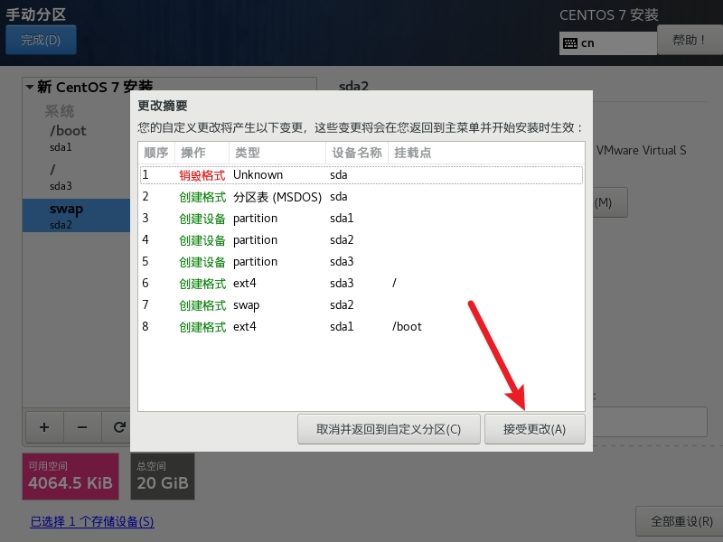
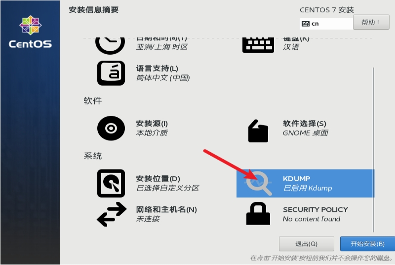
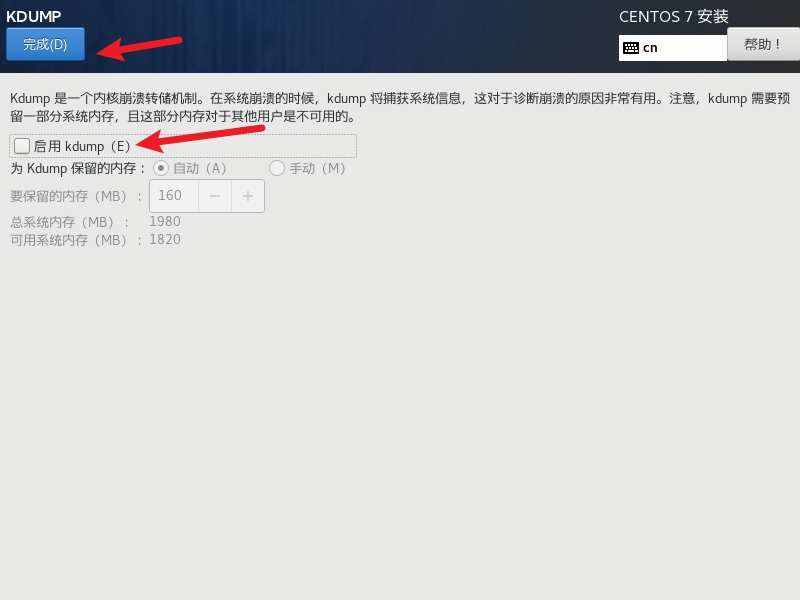
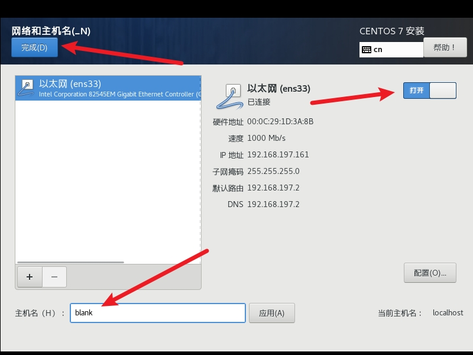

# vm安装linux(centos7)

## 1、**选择nat网络**

## 2、**选择安装软件**

 

 

会安装gcc，java，mysql等开发软件

##  3、**选择安装位置**

 

选择配置分区，点击完成

然后配置分区，分配三大区（共20G） 

1、（/boot（1G）

2、 swap（交换分区 2G）

3、 /根分区（17G））

 

 

 

 

## 4、**点击KDUMP**

(是内核崩溃的转存机制，会占用一部分内存)（生产环境建议开启，学习环境关闭就可以）

 

 

 

 

## 5、**配置网络与主机名**

暂时先打开网络并修改主机名就行，网络后边在配置

 

## 6、**下一步配置root账号密码，重启**

 

 